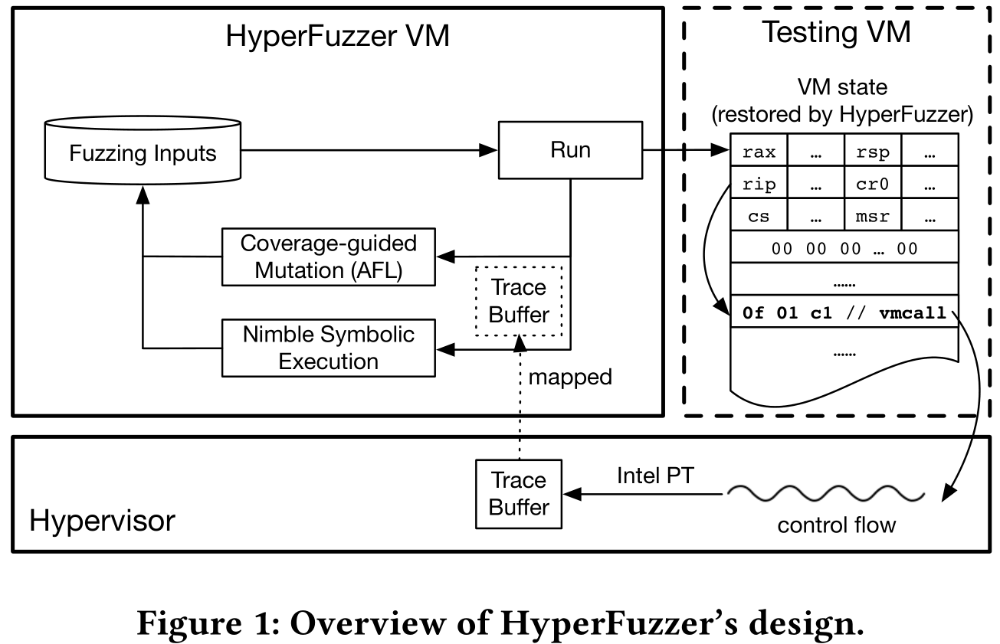
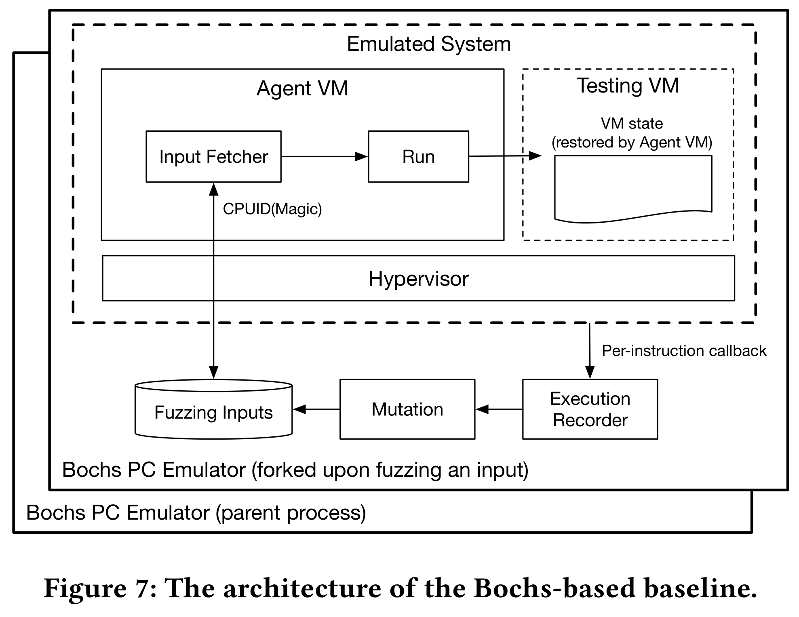
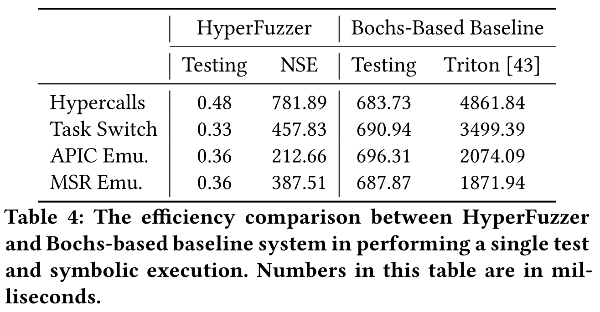
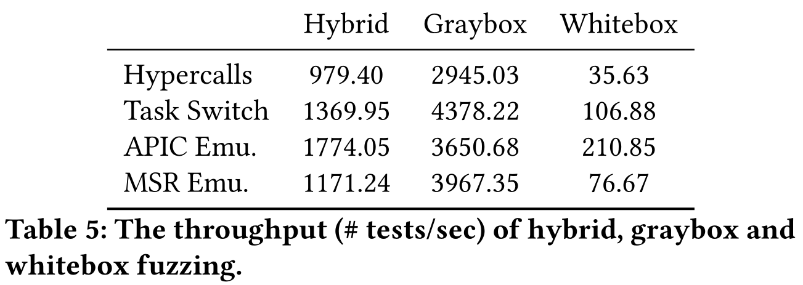
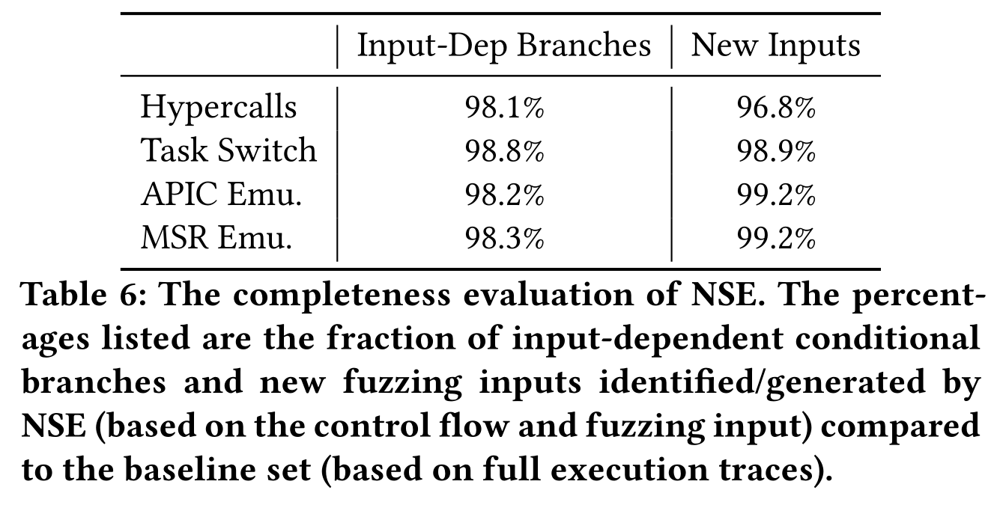
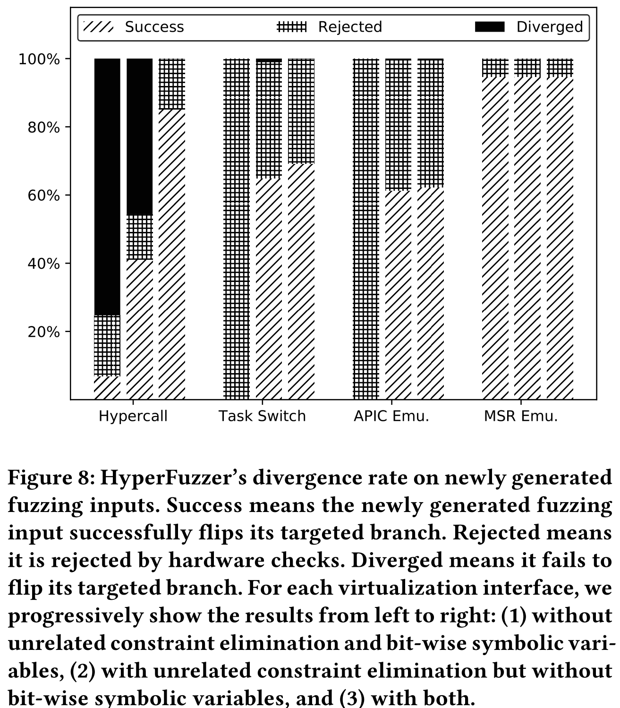
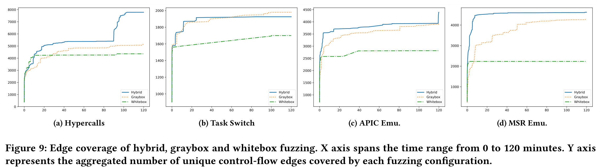

# HyperFuzzer: An Efficient Hybrid Fuzzer for Virtual CPUs

[pdf]([CCS%202021]%20HyperFuzzer%20An%20Efficient%20Hybrid%20Fuzzer%20for%20Virtual%20CPUs.pdf)

文章基于一点观察：vCPU 的执行取决于 VM 状态，使用完整 VM 状态作为 fuzzing 输入。同时设计了一种新的 fuzzing 技术，称为 Nimble Symbolic Execution, NSE 敏捷符号执行。使用硬件记录高效记录控制流，仅从控制流和输入重构近似的执行流程流程，足以实现 vCPU 的精确动态符号执行。

## Introduction

CPU 虚拟化的漏洞很难找，因为搜索空间包含所有可能的架构状态。本文发现的一个漏洞需要以下三个条件全都满足时才能触发：

1. guest 运行在 16-bit 保护模式
2. 要执行一条来自 MMIO 区域的指令
3. 将特定指令放在 gPA 0 处

随机的测试几乎不可能满足所有这些条件来触发漏洞。

黑盒和灰盒测试存在样本生成的问题。Dynamic Symbolic Execution, DSE 动态符号执行用于找到复杂触发条件的漏洞，但现有的白盒 hypervisor fuzzing 吞吐量很低。

Hybrid fuzzing 是将覆盖引导的随机输入变异和由 DSE 派生出的基于路径约束的精确输入生成相结合的自动测试生成技术。

本文的 HyperFuzzer 是第一个针对 vCPU 的高效 hybrid fuzzer。其设计基于一点重要观察：vCPU 的执行取决于 VM 状态，而不是 hypervisor 内部状态。就像物理 CPU 的运行由软件状态驱动，而不是 CPU 内部状态。

基于此，设置了新的 fuzzing 设置。首先将完整的 VM 状态作为 fuzzing 输入，HyperFuzzer 可以改变 VM 执行的指令和执行指令的架构环境。其次，从头构造 VM 状态作为输入，只包含 fuzzing 所需的有效架构状态，小到几百字节。然后，只 fuzz 由输入触发的第一个 VM 陷入的 vCPU 执行，不需要 fuzz 多个 VM 陷入，因为每个后续的陷入都可以通过不同的输入探索。

为保证效率，需要让 hypervisor 运行在物理 CPU 而不是硬件仿真器。看起来矛盾，因为 hybrid fuzzing 通常需要插桩或仿真以记录目标的执行。而 HyperFuzzer 的关键支持技术是一种新的动态符号执行技术，称为 NSE 敏捷符号执行。NSE 使用硬件追踪机制，如 Intel PT，记录 vCPU 执行的完整控制流，开销很低。记录的控制流足够用于覆盖引导的 fuzzing。但是它并不包括寄存器或内存数据，不适用于需要控制流和数据流的 DSE。

为此，NSE 基于 fuzzing 输入和记录的 vCPU 控制流重构了近似的执行跟踪，可以满足高精度 DSE。HyperFuzzer 已经可以生成大部分使用硬件仿真器的 baseline 生成的 fuzzing 输入，且快了几个数量级。

在 Intel PT 的 Hyper-V 上实现原型，通过启动 VM 直接触发 hypervisor 在真实 CPU 上执行，每秒运行数千次测试，比硬件仿真器快了 3 个数量级。NSE 生成了使用完整执行跟踪（控制+数据）的 baseline 96.8% 的输入。找到了 11 个未知的 Hyper-V vCPU 漏洞。

贡献：

1. 首个针对 vCPU，不适用硬件仿真的高效 hybrid fuzzer
2. NSE 技术，仅使用硬件记录的控制就，就对 vCPU 的白盒 fuzzing
3. 原型 HyperFuzzer

## Motivation

以前面提到的，本文发现的一个漏洞为例，描述 bug、揭示原因、讨论 HyperFuzzer 的需求（动机）。

Guest 出于以下状态时，会触发 vCPU bug：运行在禁用分页 16-bit 保护内核模式，企图执行来自 APIC MMIO 区域的指令，映射到了物理内存 0xFEE00000。而所有对 APIC 的访问都会陷入，此时 hypervisor 检测到是 16-bit 模型，就会把 RIP 截断为低 16-bit，导致执行 gPA 0 的指令，最终会导致 hypervisor 崩溃。造成此错误的根本原因是，16-bit 保护模式的 RIP 是 32 位，而这在 SDM 中没有说明。

为了捕获到如上所述的 vCPU bug，HyperFuzzer 必须满足两个要求。首先，HyperFuzzer 必须改变虚拟机的整个状态，而不仅仅是其执行的指令。其次，HyperFuzzer 必须基于动态符号执行实现精确的输入生成。

## Overview

HyperFuzzer 的架构如下：

输入是一个完整的 VM 状态，包括 VM 寄存器和内存，HyperFuzzer 可以修改 VM 执行的指令及其架构环境（IDT、段属性、页表等）。从零开始构造，而不是对传统 VM 进行快照。可以构造只包含构造所需数据的状态，小到几百字节，提高效率。还可以构造不常见但架构有效的 VM 状态，传统的 OS 可能无法达到这样的状态。

对于每个 fuzzing 输入，HyperFuzzer 创建一个专用的测试 VM，并从输入中指定的状态恢复执行，并在第一次陷入时停止虚拟机。利用高效的硬件跟踪，如 Intel PT，记录触发第一个陷入时的控制流。

对于覆盖率引导的 fuzzing，HyperFuzzer 根据记录的控制流计算覆盖率，将信息反馈给 fuzzer，如 AFL，fuzzer 基于此做随机突变。而对于白盒 fuzzint，HyperFuzzer 将整个 VM 状态标记为符号，根据记录的控制流和输入执行 NSE，遍历指令序列，检测 hypervisor 对符号 VM 状态的，跟踪依赖于输入的条件分支的路径约束，通过解决否定约束来翻转分支生成新的输入。NSE 的主要挑战是仅使用控制流做这些步骤。

## Design

下面主要介绍 HyperFuzzer 如何实现对 hypervisor vCPU 的高效动态符号执行。首先是 fuzzing 设置，然后是如何仅基于控制流和输入执行符号执行。

### Fuzzing Setup

将完整 VM 状态作为输入。VM 的绝大多数指令都直接运行在 CPU 上，只有需要进行模拟，如执行特殊指令或访问 MMIO 区域时，才会陷入到 hypervisor。所以说从给定状态恢复执行的 VM 的执行基本就是在 VM 和 hypervisor 之间切换。

但这并不是 DSE 的理想情况，因为 VM 执行也会影响符号 VM 状态，分析两种 CPU 模式带来开销。HyperFuzzer 仅对 hypervisor 进行符号执行，也就是设置 VM 状态，使其恢复执行时立即陷入到 hypervisor，触发 vCPU 执行。HyperFuzzer 仅跟踪第一次陷入的执行，然后就停止虚拟机。

这种设置的优点在于：避免跟踪 VM 中的状态更改，也使得 HyperFuzzer 在很短的一段 vCPU 执行历史上做符号执行，分析高效、精确。

虽然只跟踪单个陷入时的执行，可以通过不同的 VM 状态探索之后的 VM 陷入。

剩下的问题就是如何确保每个 VM 恢复执行时立即陷入到 hypervisor，这在随机突变时难以保证满足条件。HyperFuzzer 单步执行测试 VM，如果触发了单步执行，就表明当前的 VM 状态不会立即陷入，删除输入即可。

### Nimble Symbolic Execution

基于输入和上一步记录的控制流进行动态符号执行，有别于之前的 DSE，这个称为 NSE，强调其效率。NSE 在 hypervisor 访问 VM 状态时引入符号输入和具体值，模拟指令序列更新符号，解决在输入相关分支处的否定路径约束，生成新的输入。

两个挑战：首先，记录的 vCPU 执行可能涉及 hypervisor 内部状态，这部分是未知的。其次，物理 CPU 在陷入是会检查 VM 状态，NSE 也要考虑这些检查。

未知内部状态，有一些是决定内存未知的值，不知道就无法跟踪。还有一些用于路径约束，不知道就无法反转分支。对于前者，可以分配一个任意值，当然，要满足潜在的混叠（aliasing）要求。在 vCPU 开始处理陷入之前 dump 内存，以捕获 vCPU 内部数据结构的混叠关系。当 NSE 模拟访问 vCPU 内部状态的指令时，从 dump 中取值，仅用于输入数据传播。对于后者，占比很小，低于 2%，这里直接忽略。

陷入之后，执行 hypervisor 之前，硬件会对 VM 状态做一系列检查，对 NSE 不可见，无法在路径约束中约束。因此 NSE 生成的输入可能违反某些硬件检查，不会触发 hypervisor 的 vCPU 执行。理想情况下，NSE 应该从 SDM 中找出这些隐式检查并导出路径约束，但这太复杂了（而且因 CPU 而异）。

通过两种技术减少解决约束并缓解隐藏硬件检查问题中不必要的输入改变。首先，按位精度，fuzzing 输入的每一位都有自己的符号变量。否定路径约束时修改尽量少的位。其次，NSE 使用 SAGE 中引入的不相关约束消除技术，从路径中移除不相关的符号变量。

## Implementation

HyperFuzzer 分为三部分：

- fuzzing 控制，运行在 host，负责初始化测试 VM，加载 fuzzing 输入以设置测试 VM，配置 hypervisor 跟踪，并将控制流跟踪传给灰盒和白盒 fuzzing。
- hypervisor 跟踪，使用 Intel PT 记录 hypervisor 控制流，修改 Hyper-V 使每个 vCPU 的控制流跟踪成为可能。为每个 vCPU 分配一个跟踪缓冲区，检测 vCPU 切换历程，以便在将不同的 vCPU 调度到物理 CPU 时交换跟踪缓冲区。在执行进入/离开 hypervisor 时，恢复/暂停 Intel PT 跟踪。
- Nimble 符号执行，为 Intel x86 ISA 实现 NSE，原型支持常见指令，算术、逻辑、访存、AVX 和 分支指令。

## Evaluation

首先实现了一个基于 Bochs 仿真器的 baseline，它可以收集 hypervisor 的完整执行跟踪，包括控制流和数据流。实验回答以下几个问题：

- 效率
  - 运行时间
  - 吞吐量
- 精度
  - 完整性
  - 分歧
- 覆盖率
- 漏洞

### Experimental Methodology

针对四种虚拟化接口：hypercall、硬件任务切换仿真、APIC 仿真和 MSR 仿真。这些接口具有较大的攻击面，或有先前报告的错误。构建初始输入需要人工，所以没有涵盖所有虚拟化接口。

根据 Intel SDM 手动创建了初始输入，然后基于此生成新的输入，其中有一些是白盒符号执行生成的，另一些是灰盒随机突变生成的。保留所有触发新代码覆盖的新输入，称为扩展的 fuzzing 集合。将符号执行生成的输入整合到 AFL 主循环来实现 HyperFuzzer，即 hybrid fuzzing。

基于 Bochs 的 baseline，以此展现 HyperFuzzer 的性能改进，并给出仅用控制流跟踪 NSE 有效性的事实。Bochs 高保真地模拟了 Intel VMX，在 Bochs 中实现每条指令的回调，记录 hypervisor 执行的控制和数据流。

### Efficiency

单个测试的平均运行时间比 baseline 快了 3 个数量级，单个符号执行的运行时间比 baseline 快 4 到 10 倍，约束求解都花费了大量时间。

对 hybrid、灰盒和白盒 fuzzing 对最初的输入进行 120 分钟测试，报告平均每秒的测试速度评估 HyperFuzzer 的吞吐量。白盒的吞吐量高于运行时间计算的数量，因为并非所有输入都传给符号执行。HyperFuzzer 吞吐量比 baseline 快 3 个数量级，只有一小部分代码触发新代码覆盖的输入是用 NSE 测试的。

### Precision

测量可以正确识别后翻转的输入相关条件分支的分数来评估 NSE 精度，前者定义了完整性（completeness），后者通过计算差异来测量。当为执行特定程序路径而生成的新输入实际执行到非预期路径时，就产生了分歧（divergence）。

NSE 可以识别 98.1% 的输入相关的条件分支，生成了 baseline 完整执行跟踪 96.8% 的新输入。hypervisor 将输入和 NSE 未知的内部状态混合到一起，导致 NSE 无法将相关分支识别成依赖于输入的分支，从而错过新输入。

### Divergence

所谓分歧，是指新输入是否成功翻转了目标分支。分歧率主要展示了之前提到的两种最小化输入变化技术：消除不相关约束和按位精度符号变量在缓解隐式硬件检查上是有效的。

### Coverage

覆盖率主要是检查 HyperFuzzer 是否达到比仅灰盒和仅白盒更好的覆盖率。都是用初始输入运行，计算每个配置覆盖的唯一控制流边缘的次数。

### Bug Analysis

HyperFuzzer 找到了 11 个之前未知的 Hyper-V vCPU 漏洞，其中的 6 个可以被恶意的 VM 利用危害 hypervisor。所有的逻辑错误都是需要基于符号执行的输入生成。

## Limitations

HyperFuzzer 依赖于 Intel PT，仅限于 Intel VMX 平台的 hypervisor。NSE 对输入驱动执行的目标效果很好，可能不适用于输入与内部状态纠缠的程序。

## Related Work

HyperFuzzer 是第一个用于 vCPU 的高效 hybrid fuzzer，与先前工作的区别是，不依赖于仿真记录完整程序执行，仅使用硬件控制流跟踪。下面介绍 fuzzing、hypervisor 测试和硬件跟踪方面的工作。

### Hybrid Fuzzing

Fuzzing 是以找漏洞为目标的自动测试生成和执行。

黑盒随机 fuzzing 最简单，要么修改格式化的程序输入，要么直接生成输入，以此测试程序

白盒 fuzzing 结合了动态测试生成，动态执行程序，从执行过程中遇到的条件分支收集对输入的约束，然后用约束求解器否定和解决这些约束。通常可以比其他方法生成执行更多代码的输入，因为更精确。但是设计复杂，吞吐量低。

灰盒 fuzzing 使用白盒扩展了黑盒 fuzzing，消除一些组件降低成本和复杂性。AFL，基于代码覆盖的搜索启发式算法扩展了随机 fuzzing，没有符号执行、约束生产和求解。虽然简单，但是比纯黑盒 fuzzing 效果更好。

Hybrid fuzzing 将灰盒与白盒结合，目标是权衡，以更简单的技术获取良好的代码覆盖，简单技术无法解决时才使用更复杂的技术，如符号执行和约束求解。HFL 通过硬件仿真执行动态符号执行和处理内核特点的挑战，为内核空间带来 hybrid fuzzing。

### Hypervisor Testing

Amit,MultiNyx, PokeEMU, Hyper-Cube, Nyx

### Hardware Tracing

Intel PT 记录完整的控制流，硬件支持，开销低，不需要修改跟踪目标，也可以记录细粒度的时间戳，用于多个场景：fuzzing、指针分析、逆向调试、故障重现。

## Conclusion

HyperFuzzer 是第一个针对 vCPU 的高效 hybrid fuzzer。利用硬件跟踪记录 hypervisor 控制流，兼顾效率和精度。引入新的 Nimble 符号执行技术，仅使用记录的控制流和输入执行精确的符号执行。在为 Hyper-V 实现的原型中，实现了高吞吐量、高识别率，发现了 11 个未知的 vCPU 漏洞。