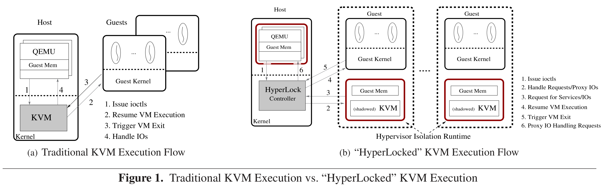
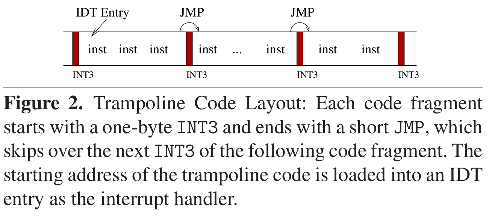
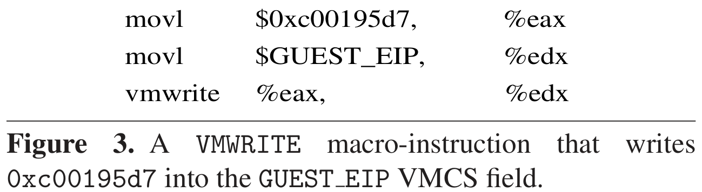

# Isolating Commodity Hosted HVs with HyperLock

[pdf]([EuroSys%202012]%20Isolating%20commodity%20hosted%20hypervisors%20with%20HyperLock.pdf)

宿主型 hypervisor 被攻破后可能威胁 host OS 和所有 guest。本文提出隔离 HV 的 HyperLock，提供安全的 HV 隔离运行时，并为每个 guest 创建单独的 shadow HV。显著缩小 TCB、具有实用性和有效性。

## Introduction

HV 的攻击面大，易受攻击，需要保护 host OS 和 guest 免受被攻破 HV 的攻击。

相关的工作，如 seL4 采用微内核方法构造可形式化验证的系统，但缺乏扩展性，功能也不完整。

HyperLock 通过建立严格的安全边界隔离宿主型 HV。将 HV 的执行封装在安全的 HV 隔离运行时中，有独立的地址空间和受限的指令集。HV 只能通过 HyperLock 提供的接口访问 host。此外，还提出了 HV shadowing 技术，为每个 guest 高效地创建一个独立的 shadow HV。

## Design

攻击者通过恶意 guest 攻击底层的宿主 HV。

下图展示了传统的 KVM 和 HyperLock KVM 的执行流程。HyperLock 有两个关键组件，隔离运行时和控制器。限制 KVM 到隔离运行时，并与特定 guest 绑定。介入 syscall，限制 QEMU 的 syscall 接口和可用资源。HyperLock 作为 KVM 与 QEMU 之间的代理。

### Hypervisor Isolation Runtime

隔离运行时旨在安全地隔离或限制特权宿主 HV，通过两个主要机制实现隔离：内存访问控制和指令访问控制。

#### Memory Access Control

创建独立的地址空间，KVM 执行前切换 CR3，切换相应的页表机制。KVM 页表由 HyperLock 维护，在 KVM 地址空间中映射为只读。将 KVM 内存设置为 W^X，并限制 KVM 执行 guest 代码。确保隔离运行时内的代码无法修改内存布局或修改内存保护设置。

#### Instruction Access Control

限制 KVM 可执行的指令。KVM 不含动态代码，内存访问控制禁止在隔离运行时中新增代码。

对于 KVM 中的特权指令，替换并请求 HyperLock 服务。

仅允许执行明确允许的特权指令，原型中为 vmread 和 vmwrite。对于非预期指令，利用 Native Client, NaCl 编译器，将 KVM 代码组织成等长片段（32字节）。控制流仅允许转移到片段边界。隔离运行时内的所有可执行指令都在编译时已知。

使用跳板安全地加载 CR3、GDT/LDT、IDT 和 TSS 等寄存器以回到 host 执行。KVM 通过软中断 INT 指令执行跳板代码，即中断处理函数，退出隔离运行时。为确保中断处理是唯一的入口，阻止跳转到跳板中间的代码。在跳板的每个代码片段开头放一个 INT3 指令，以捕获非法调用，并在片段末尾用 JMP 指令跳过下一个 INT3。

### HyperLock Controller

HyperLock 在隔离运行时的基础上完成三个任务。

为每个 guest 复制一个 HV，并阻止 HV 间通信。为减小内存占用，提出 HV shadowing 技术，为每个 guest 分配 shadow 副本，物理上共享。HV 之间共享相同的静态代码，可使用 COW 或 memory de-duplication 技术维护单个物理副本，避免内存占用开销。每个副本仅可访问其地址空间内的 guest。

代理 QEMU 和隔离的 KVM 之间的通信。接收 QEMU 发出的 ioctl 命令，通过 RPC 传给 KVM。为需要与 host OS 交互的任务提供运行时服务：map_gfn_to_pfn, update_spt/npt, read_msr, write_msr, enter_guest。

限制 QEMU 的 syscall 接口。获取 QEMU 使用的 syscall 列表，为其定义单独的 syscall 表。仅填充允许的项，并限制参数。

## Implementation

在 32 位 KVM v2.6.36 上实现。

### Memory Access Control

独立的地址空间，三个组件：KVM 本身、guest 内存和跳板。

- KVM 向 HyperLock 请求更新 PTE。
- HyperLock 注册 MMU notifier，接收内存事件。
- 出于安全考虑，禁用 TLB 全局，禁用 CR4.PGE。

### Instruction Access Control

首先使用 NaCl 编译器执行指令对齐。

移除除 vmread 和 vmwrite 的特权指令，脚本扫描并替换为调用运行时服务。

禁止 KVM 访问 VMCS 的 host state 和 VM execution control 部分，允许 KVM 访问 guest state 和 exit info 字段。HyperLock 分配 VMCS 并将物理地址加载到 CPU 之后才进入运行时执行 KVM。为 KVM 提供宏使用 vmread 和 vmwrite，并扫描代码验证字段索引。

KVM 运行时启用中断或异常，跳板包含每个中断/异常处理函数。

为将 KVM 隔离到运行时，重组 KVM。将 KVM 与 QEMU 间的 ioctl 通信替换为通过 HyperLock 的 RPC。将危险 KVM 调用替换为 RPC。修改 vmx.c，避免 KVM 访问 VMCS 的 host state 和 VM execution control 字段。
