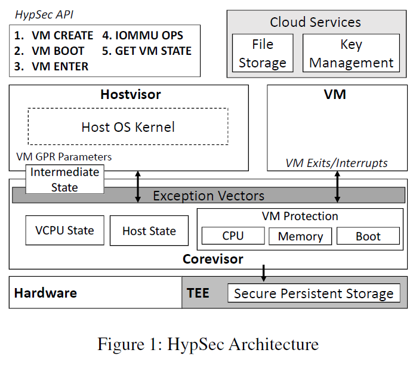
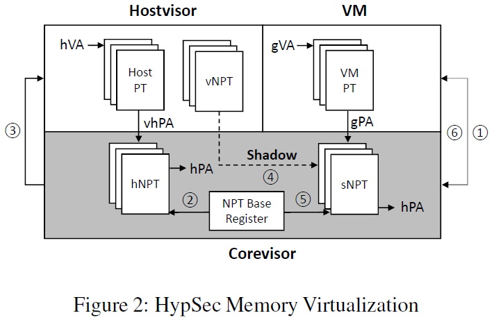
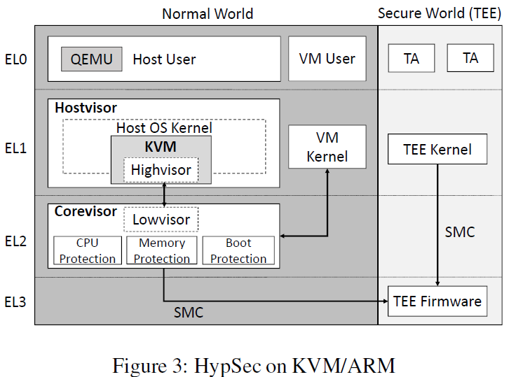
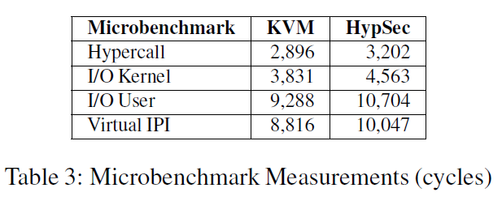
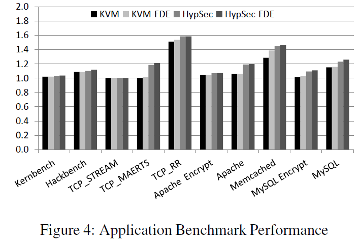
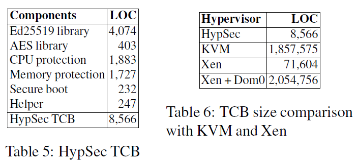

# Protecting Cloud Virtual Machines from Commodity Hypervisor and Host Operating System Exploits

[pdf](%5BUSENIX%202019%5D%20Protecting%20Cloud%20Virtual%20Machines%20from%20Hypervisor%20and%20Host%20Operating%20System.pdf)

HypSec 是一种新的 hypervisor 设计，使用微内核原则改造现有的 hypervisor，缩小可信计算基，同时保护虚拟机的机密性和完整性。HypSec 将虚拟机划分为一个不受信的 host，执行最复杂的 hypervisor 功能而不访问虚拟机数据，和提供对虚拟机数据的访问控制并执行基本 CPU 和内存虚拟化的可信核心。TCB 比 KVM 小很多数量级。仅引入适度的性能开销。

## Introduction

HypSec 采用微内核原则，重组现有的 hypervisor，并进行适度的修改。HypSec 将一个宏内核 hypervisor 划分为一个小的可信核心 corevisor 和一个大的不可信 hostvisor。利用硬件虚拟化支持，将 corevisor 运行在更高特权级，使用访问控制保护 CPU 和内存数据，使用端到端方法保护 I/O 简化设计。

Corevisor 提供基本的 CPU 和内存虚拟化，介入所有异常和中断，确保只有 VM 和 corevisor 能访问 VM CPU 和内存数据。更复杂的操作都委派给 hostvisor。

## Assumptions and Threat Model

假设 Corevisor 作为 TCB，可信，没有漏洞，可以形式化验证。系统初始化是可信的，可以通过 TEE 认证。

攻击者具有 hypervisor 和 VM 的远程访问权限，其目标是破坏 VM 的机密性和完整性。不考虑提供基础设施的云供应商是恶意的。

## Design

HypSec 利用微内核原则将宏内核 hypervisor 划分为一个可信的特权 corevisor 和一个不可信的降权的具有大多数 hypervisor 功能的 hypervisor。

HypSec 仅执行 VM 数据访问控制和需要访问 VM 数据的 hypervisor 功能：安全启动、CPU 虚拟化、页表管理。HypSec 采用端到端方法简化 TCB，并允许 hostvisor 提供 I/O 和中断虚拟化。Hostvisor 也处理不需要访问 VM 数据的复杂功能，包括资源管理（如 CPU 调度和内存分配）。Corevisor 运行在 EL2，hostvisor 和 VM kernel 运行在 EL1 模式。Corevisor 有自己的内存，使用 NPT 实现与 hostvisor、VM 和其自身的内存隔离。

通过 UEFI 和 TEE 支持 corevisor 的安全启动。通过提供的接口支持 VM 启动和初始化过程的机密性和完整性。

### CPU

Hypervisor 通过四个主要功能提供 CPU 虚拟化：处理来自 VM 的陷入、模拟 guest 执行的特权指令、保存和恢复 VM CPU 状态、在物理 CPU 上调度 vCPU。

限制对 VM CPU 状态的访问，将不需要访问 VM CPU 状态就能完成的复杂 CPU 功能委托给 hostvisor，以保持 TCB 尽可能小。由 corevisor 处理来自 VM 的所有陷入、指令仿真以及 VM 和 hostvisor 之间的上下文切换，这些都需要访问 VM CPU 状态。而 VCPU 调度被委派给 hostvisor。

将 hostvisor 降权，确保 hostvisor 无法访问 corevisor 状态。VCPU 状态和 host 状态都只有 corevisor 可以访问。VM Exit 时，corevisor 保存 VM 执行上下文到 VCPU 状态，然后从 host 状态恢复 hostvisor 的执行上下文。

Hostvisor 处理 VCPU 调度，VCPU 调度不需要访问 VM CPU 状态，仅涉及将 VCPU 映射到物理 CPU。

VM 的某些指令要求与 hostvisor 共享寄存器值。Corevisor 确定需要传给 hostvisor 的值，将其复制到 hostvisor 可访问的 VM 状态结构，并在之后将 hostvisor 修改的值复制到 VM 状态。

### Memory

内存虚拟化涉及三个主要功能：内存保护（隔离）、内存分配和内存回收。其他的高级内存管理功能都基于以上功能实现。

限制访问 VM 内存，将不需要访问实际 VM 内存数据的内存管理功能委派给 hostvisor，以保持 TCB 尽可能小。Corevisor 负责内存保护，包括配置 NPT 硬件，而内存分配和回收都委派给 hostvisor。

内存保护：Corevisor 用与 hypervisor 同样的方式使用 NPT 来虚拟化和限制 VM 对物理内存的访问。同时利用 NPT 隔离 hostvisor 访问。Hostvisor 仅管理自己的页表 Host PT，从 hVA 转换到虚拟主机物理地址 vhPA。由 corevisor 维护的主机嵌套页表 hNPT 将 vhPA 转换为 hPA，hNPT 采用一一映射，每个 vhPA 映射到相同的 hPA。Corevisor 通过在 hNPT 中取消映射使 hostvisor 无法访问 corevisor 和 VM 内存。任何 hostvisor 的非法访问都会陷入到 corevisor。物理内存在 hostvisor 和 corevisor 之间静态划分，而在 hostvisor 和 VM 之间进行动态分配。

内存分配：VM 内存分配主要有 hostvisor 完成，可以复用 host OS 内核的功能。HypSec 为每个 VM 管理一个类似的 virtual NPT, vNPT，引入由 corevisor 管理的 shadow NPT, sNPT。sNPT 用于 shadowing vNPT，在 hostvisor 和 VM 切换时，corevisor 在 hNPT 和 sNPT 之间复用硬件 NPT 基寄存器。

下图描述了 HypSec 的内存虚拟化策略。当 guest 想要将 gVA 映射到未映射的 gPA 时，会触发 nested page fault，陷入到 corevisor。如果出错的 gPA 在有效的 VM 内存区域内，就会将 NPT 基寄存器指向 hNPT 并切换到 hostvisor。Hostvisor 分配地址为 vhPA 的页，将其更新到 vNPT 对于的条目。然后陷入到 corevisor，验证 vhPA 是否属于本身或其他 VM（通过唯一的 VMID 标识），将更新复制到 sNPT。然后从 hNPT 中取消映射，hostvisor 就再无法访问分配给 VM 的内存。最后将 NPT 基寄存器指向 sNPT 并返回到 VM。

HypSec 将影子页表用于保护而不是虚拟化，为每个 VM 管理一个影子页表，仅提供 gPA 到 hPA 的转换。

内存回收：VM 内存回收在 hostvisor 上实现。VM 资源释放内存时，corevisor 先清理页面然后将它们映射会 hNPT。HypSec 还可通过内存气球实现内存回收。

HypSec 还支持 guest 显式地使用 GRANT_MEM 和 REVOKE_MEM hypercall 与 hostvisor 共享内存。可用于支持加密数据的半虚拟化 I/O。

HypSec 还支持高级内存虚拟化特性，如 KSM，由 corevisor 负责计算页面哈希，而 hostvisor 根据哈希实施合并算法。KSM 存在信息泄露风险， 默认禁用。

### Interrupts

配置硬件，将所有物理中断和对中断控制器的访问都路由到 corevisor。为精简 TCB，将大多数中断功能委派给 hostvisor，在进入中断处理例程之前，corevisor 会保护 CPU 和内存状态。

### Input/Output

HypSec 假设 VM 使用端到端方法保护 I/O 安全。将 I/O 支持下放到 hostvisor。

HypSec 通用支持三种设备：模拟、半虚拟化和直通。模拟设备的 PIO 和 MMIO 都陷入到 corevisor，并隐藏 I/O 数据以外的 VM 数据，然后由 hostvisor 模拟操作。半虚拟化设备的后端在 hostvisor 中，前端数据被修改为使用 GRAMT_MEM 和 REVOKE_MEM hypercall 标识后端可访问的共享数据结构和缓冲区。直通设备由 guest OS 管理，HypSec 将其中的敏感操作，如 BAR 中的 MSI 配置，陷入到 corevisor。

## Implementation

将 HypSec 用于 KVM/ARM 项目，对 KVM 的改造也证明了 HypSec 支持整个 OS 内核作为 hostvisor 的一部分。

Corevisor 运行在 ARM EL2，hostvisor、host OS 内核和 VM 内核运行在 EL1。

HypSec 硬件要求同样可以满足 Intel x86 架构使用 VMX 和 IOMMU。现有的 x86 hypervisor 可以改造为 corevisor 运行在 VMX root 模式而 hostvisor 运行在 VMX non-root 模式提供资源管理和虚拟 I/O。

## Security Analysis

## Experimental Results

### Microbenchmark Results

量化底层 hypervisor 操作的开销，包括 VM 和 hypervisor 之间转换、启动 VM 到 hypervisor 内核 I/O 请求、QEMU 模拟用户空间 I/O 以及发送虚拟 IPI。结果表明，HypSec 相对引入了 5% 到 19% 的开销。HypSec 未增加陷入数量，而是向现有陷入中添加逻辑以保护数据。而 I/O 和虚拟 IPI 开销较大是因为 I/O 和中断虚拟化确保数据传输安全。

### Application Workload Results

比较 KVM 和 HypSec 在是否附加磁盘加密时的开销，大多数开销都低于 10%。

### TCB Implementation Complexity

TCB 约 8.5K LOC。其中 4.5K LOC 是加密库，剩下 4.1K LOC 是 CPU、内存保护和 KVM 底层部分。在 Linux 4.18 内核中加入 8,695 LOC 代码，其中 4.5K LOC 是加密库。又在 QEMU 中添加了不到 70 LOC 代码，用于支持安全启动和 VM 迁移。

