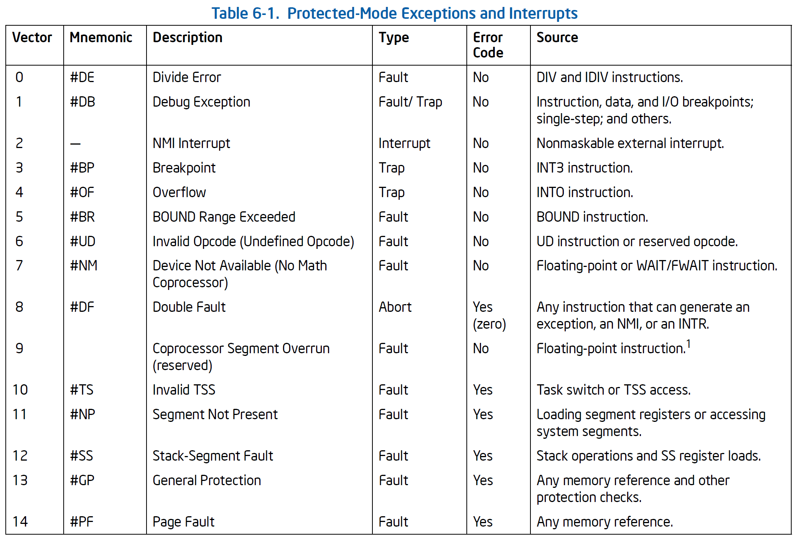
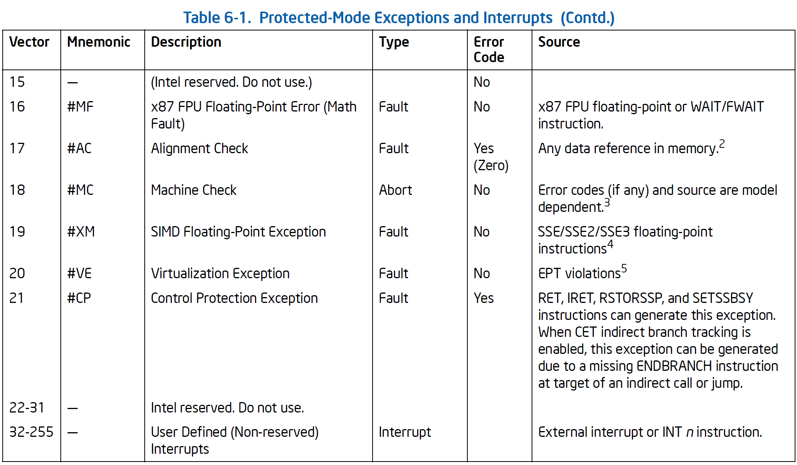

# Interrupt Virtualization

[深度探索 Linux 系统虚拟化：原理与实现](https://book.douban.com/subject/35238691/)

[Intel SDM Vol.3 Chapter 6 Interrupt and Exception Handling]()

## Interrupt overview

!!! todo

    根据 SDM 理解中断和异常。

中断会在程序执行期间随时发生，以响应来自硬件的信号。系统硬件使用中断处理处理器外部的事件，例如外部设备的请求。软件也可以通过 INT n 指令产生中断。

处理器执行指令时检测到错误就会发生异常。处理器检测各种错误条件，包括违反保护、page fault 和机器内部故障。

当接收到中断或检测到异常时，当前正在执行的任务将被挂起，处理器执行中断或异常处理程序。处理程序执行完后，处理器恢复被中断的任务。

每个架构定义的异常和每个需要处理器处理的中断条件都分配一个唯一标识号，成为中断向量。处理器根据向量号作为中断描述符表 IDT 的索引，IDT 提供了异常或中断处理程序的入口点。

### 架构定义的中断和异常





### 中断源

- 外部中断，硬件生成中断，通过处理器引脚或 local APIC 接收。
  - 通过 INTR 引脚或 local APIC 传给处理器的都是可屏蔽硬件中断。
  - INTR 引脚可以接受 0-255 所有向量号，而 LAPIC 只能接受 16-255，其他会被当作非法向量。
- 软件生成中断：INT n 用于生成软件中断，n 可以是 0-255。
  - 但如果用 INT 生成 NMI（不可屏蔽中断），虽然也会跳转到处理函数，但是处理器的 NMI 处理硬件不会激活。
  - INT n 生成的中断不能被 EFLAGS.IF 屏蔽。

### 异常源

- 处理器检测到程序错误：程序执行时，处理器检测到程序错误，会生成异常。
  - 每个处理器检测到的异常都定义了一个向量号。
  - 异常可分为 fault、trap、abort，取决于异常被报告的方式以及引起异常的指令是否可以在不损失程序或任务连续性的情况下重新启动。
    - fault 通常是可以纠正的异常，纠正后，程序可以重新启动而不失去连续性。报告故障时，处理器将机器状态恢复到执行故障指令之前的状态。故障处理程序的返回地址指向故障指令，而不是下一条指令。
      - 一些异常虽然报告为 fault，但是也不可以重新启动。会导致处理器状态丢失，引起此类异常的程序应该由操作系统终止。
    - trap 是在执行陷入指令后立即报告的异常。陷阱允许在不丧失程序连续性的情况下继续执行程序。陷阱处理程序的返回地址指向陷入指令之后要执行的指令。
    - abort 并不总是报告异常指令的精确位置，且不允许重新启动导致异常的程序或任务。中止用于报告严重错误，如硬件错误以及系统表中不一致或非法值。
- 软件生成异常：INTO、INT1、INT3 和 BOUND 指令可以在软件中生成异常。
  - INT n 指令可以在软件中模拟异常，但存在限制。如果 INT n 指定一个架构定义的异常，处理器不会将错误代码压栈，即使对应的硬件生成异常会产生错误码。这就会导致处理函数在 pop 错误码时将返回地址出栈，导致异常处理之后返回到错误的地址。
- 机器检查异常：处理器提供内部和外部检查机制，用于检查内部芯片硬件操作和总线事务。
  - 机器检查错误会生成 #MC 异常，并返回错误码

## PIC Virtualization

8259A 可编程中断控制器

IRR 负责接受并保存来自 IR0-7 的中断请求信号，OS 通过设置 IMR 屏蔽中断。

CPU 响应中断时，向 PIC 发送 INTA 信号，告知开始处理，8259A 在 ISR 中记录正在处理器的中断。处理完成后，CPU 向 PIC 发送 EOI 信号，告知处理完毕，ISR 复位。

响应中断时，CPU 使用中断向量索引 IDT。

KVM 中抽象 8259A 的结构体：

```c
// arch/x86/kvm/irq.h
struct kvm_kpic_state {
	u8 last_irr;	/* edge detection */
	u8 irr;		/* interrupt request register */
	u8 imr;		/* interrupt mask register */
	u8 isr;		/* interrupt service register */
	...
};

struct kvm_pic {
	spinlock_t lock;
	bool wakeup_needed;
	unsigned pending_acks;
	struct kvm *kvm;
	struct kvm_kpic_state pics[2]; /* 0 is master pic, 1 is slave pic */
	int output;		/* intr from master PIC */
	struct kvm_io_device dev_master;
	struct kvm_io_device dev_slave;
	struct kvm_io_device dev_elcr;
	void (*ack_notifier)(void *opaque, int irq);
	unsigned long irq_states[PIC_NUM_PINS];
};
```

1. 虚拟设备向 vPIC 发送中断请求，通过 vPIC 提供的 API
2. vPIC 将中断记录到 IRR，设置一个变量 output
3. KVM 在 Vm Entry 之前会检查这个变量 output
4. 中断评估，待处理的中断是否被屏蔽，优先级是否比 CPU 正在处理的中断优先级高（固定优先级、循环优先级）
5. 完成中断评估，准备向 guest 注入中断前，KVM 向 vPIC 执行确认状态的操作，IRR 复位，非 AEOI 模式下要在 ISR 中记录正在处理的中断
6. 中断处理完成后，非 AEOI 模式下，要向 vPIC 发送 EOI，复位 ISR
7. VM Entry 之前，如果需要注入中断，就将中断信息写入 VMCS 的 VM-entry interruption -information 字段，VM Entry 后，CPU 检查该字段

注入只能在 VM Entry 前进行，会带来延迟：

- CPU 运行在 guest 模式，等待下一次 VM Exit。多处理器下的典型情况，目标 CPU 在运行 guest，KVM 通过向目标 CPU 发送一个 IPI 中断使其陷入到 host。
- vCPU 线程可能在睡眠，线程挂起。要唤醒线程，使其进入就绪队列，多处理器下还要向目标 CPU 发送一个重新调度的 IPI，使其尽快调度。

书中的代码结构（仅供参考）：

```
vDevice:
	ioctl --irq--> KVM
KVM:
	kvm_pic_set_irq --> vPIC
vPIC:
	kvm_pic_set_irq
		pic_set_irq1 			// IRR 置位
		pic_update_irq
			pic_irq_request		// output
				kvm_vcpu_kick	// wakeup & IPI --> CPU VM Exit & VM Entry
VM Entry KVM:
	vmx_vcpu_run
		vmx_intr_assist
			kvm_cpu_has_interrupt 			// check output
			vmx_inject_irq(vcpu, 
				kvm_cpu_get_interrupt)
					kvm_pic_read_irq
						pic_get_irq			// 中断评估
							get_priority	// 循环优先级算法
						pic_intack			// 中断 ACK，ISR 置位，IRR 复位
				vmcs_write32				// 中断注入
```


## APIC Virtualization

为满足多处理器系统的需求，设计了 APIC，分为 LAPIC 和 I/O APIC。

LAPIC 在处理器上，接受来自 I/O APIC 的中断，以及处理器之间收发核间中断 IPI；I/O APIC 在南桥上，响应外部设备的中断，并发送给 LAPIC，LAPIC 再转发给对应的 CPU。

I/O APIC 有 24 个寄存器对应 24 个中断管脚，组成中断重定向表，每个表项 64 位，内容包括目标 CPU（组）、中断向量等。中断发生时，I/O APIC 根据中断请求号查询重定向表，将中断发往相应的目的 CPU。LAPIC 接受中断后的操作与 PIC 类似。

1. 系统初始化时，设置 I/O APIC 中断重定向表（写 I/O APIC 的寄存器，使用两个寄存器 IOREGSEL 和 IOWIN 间接访问，前者指定目标寄存器，后者为数据），guest 内核的填充请求发送给 vI/O APIC 后，将信息记录到中断重定向表。
2. 虚拟设备通过 vI/O APIC 提供的 API 向其发送中断请求，vI/O APIC 收到中断请求后，以管脚号为索引，从中断重定向表中索引具体的表项，提取中断向量、目的 CPU、触发模式等信息并发送给目的 CPU 的 vLAPIC（也是通过 API）。vLAPIC 的逻辑与 vPIC 基本相同，通过寄存器记录中断状态、中断注入等。
3. LAPIC 上有一个 4KB 大小的页，所有寄存器都存在这个页上，guest 通过 MMIO 的方式写入 LAPIC 寄存器，陷入到 KVM 的 vLAPIC。guest 发送核间中断，vLAPIC 确定目的 CPU，向目的 CPU 的 vLAPIC 发送核间中断，由目的 vAPIC 完成中断注入，guest 写入 LAPIC 的 ICR 寄存器即表明要向另一个 CPU 发送核间中断。
4. PIC 和 APIC 都支持小于 16 的中断，而 KVM 不知道 guest 系统支持哪个，就要同时调用两个虚拟芯片。引入 IRQ routing 方案，构造一个路由表，每个表项包括管脚号和函数指针等信息。当外设请求到来时，KVM 遍历表，匹配管脚号，调用对应的函数发送中断。对于小于 16 的管脚号会创建两个表项，函数指针分别为 vPIC 和 vI/O APIC 的接口。

## MSI(X) Virtualization

Message Signaled Interrupt, MSI

支持 MSI 的设备绕过 I/O APIC，直接通过系统总线与 LAPIC 连接（即将 I/O APIC 的功能扩展到设备自身）。

在 PCI 配置空间的 Capabilities List 添加 MSI 结构，MSI-X 增加 table 以支持多个中断，使用 table offset 和 BIR 确定 table 地址，表项包括消息地址和消息数据。发送中断消息即向指定地址写中断信息（主要是中断向量）。

初始化设备时，如果设备支持 MSI 且配置启用 MSI 支持，则内核将组织 MSI Capability 结构，通过 MMIO 的方式写入到 PCI 设备配置空间中。内核先将 table offset 和 BIR 指定的地址映射到虚拟地址空间，之后就通过 MMIO 的方式访问。

guest 内核写入 PCI 设备的配置空间时会导致 VM Exit，进入虚拟设备。虚拟设备将内核设置的 MSI Capability 信息记录到设备的结构体中。

guest 内核的驱动通知虚拟设备配置 IRQ routing 信息，虚拟设备从 MSI Capability 结构中提取中断信息，向内核发起请求，建立 MSI 的表项。

虚拟设备启用 MSI 后，直接从 MSI Capability 结构中提取目的 CPU 等信息，向对应的 vLAPIC 发送中断请求，而 vLAPIC 的操作与之前 APIC 虚拟化完全相同。

使用 IRQ routing 后，KVM 收到虚拟设备中断请求不需要区分是 PIC、APIC 还是 MSI，而是调用统一的接口，遍历 IRQ routing 表，调用所有管脚号匹配的函数发起中断。

## Hardware Support for Interrupt Virtualization

基于软件的虚拟中断芯片方案，向 guest 注入中断的时机都是在 VM Entry 之前。因此要注入中断就需要触发一次 VM Exit，这就是中断虚拟化的主要开销。

为了避免 host 和 guest 模式的切换，Intel 在硬件层面提供了以下几方面的支持。

物理 LAPIC 有一个 4K 页保存寄存器值，称为 APIC-access page，Intel 使用 virtual-APIC page 代替 APIC-access page，guest 读寄存器时直接读 virtual-APIC page，写寄存器时（可能会伴随一些副作用，如发送 IPI）还需要触发 CPU 状态切换。

VMCS 的字段 VIRTUAL_APIC_PAGE_ADDR 指定了 virtual-APIC page 的地址，VM Entry 之前由 KVM 设置字段。此特性需要配置 VMCS Secondary Processor-Based VM-Execution Control 的标志位 APIC-register virtualization。

没有硬件层面的中断评估等逻辑支持时，中断注入必须发生在 VM Entry 之前，只有在 VM Entry 时，guest CPU 才会评估是否有中断需要处理。而当 VM Entry 时 guest 关中断或正在执行不能被中断的指令，就可能导致中断延时较大。这就需要一旦 guest 开中断或没有执行不能被中断的指令，CPU 就立刻从 guest 陷入到 host 模式，就能在下一次 VM Entry 时注入中断。

为此，VMX 提供了特性 Interrupt-window exiting。在任何指令执行之前，如果 RFALGS.IF 置位，即 guest 能处理中断，并且没有运行任何阻止中断的操作，如果此时 Interrupt-window exiting 置位，则 CPU 会触发 VM Exit。

每次 VM Entry，KVM 执行中断注入时，如果中断窗口关闭（无法注入中断），就需要设置 Interrupt-window exiting，告知 CPU 有中断在等待处理，一旦 CPU 能处理中断，就会马上退出到 host。

guest 支持中断评估后，guest 模式的 CPU 不仅在 VM Entry 时才能进行中断评估，guest 模式的 CPU 一旦识别出中断，即可在 guest 模式自动完成中断注入，无需触发 VM Exit。

guest 模式的 CPU 中断评估借助 VMCS 的 guest interrupt status 字段。当  CPU 能处理中断时，会检查该字段是否有中断需要处理，有则会调用 guest 内核中断处理函数。字段长 16 位，低 8 位保存中断评估后待处理的中断向量 RVI，高 8 位表示 guest 正在处理的中断。启用 guest 模式 CPU 的中断评估支持后，KVM 注入中断注入时需要将注入的中断信息更新到 guest interrupt status 字段。这样即使 guest 在 VM Entry 一刻不能处理中断，那么等到 guest 模式可以处理中断时，就可以直接处理字段中的中断。开启 guest 模式下的 CPU 中断评估需要置位 virtual interrupt delivery。

### Posted Interrupt

guest 模式 CPU 支持中断评估后，中断注入无需经历 VM Exit，Intel 设计了 posted-interrupt processing。当虚拟中断芯片需要注入中断时，将中断信息更新到 posted-interrupt descriptor，然后向 CPU 发送一个通知 posted-interrupt notification（IPI），guest CPU 收到中断后，直接在 guest 模式响应中断。

posted-interrupt descriptor 长度为 64 bytes，低 256 位每一位对应一个中断向量，置位表示有中断请求，bit-256 指示是否有中断需要通知。其地址记录在 VMCS posted-interrupt descriptor address 字段，同时 posted-interrupt notification 的中断向量也记录在 VMCS 中。

posted-interrupt processing 机制的核心就是完成两件事：一是向 posted-interrupt descriptor 写入中断信息，二是通知 CPU 处理中断。设置完描述符后，如果 CPU 在 guest 模式，就发送专用的 posted-interrupt 中断向量，而如果 CPU 不在 guest 模式，就发送一个重新调度的 IPI，在 VM Entry 后马上处理中断。

## 总结

KVM 中模拟中断芯片，利用处理器支持实现 non-root 模式下的中断注入。

APIC 虚拟化的详细部分要看 Intel SDM 的 APIC Virtualization 部分。

VT-d 支持中断重映射和 posted interrupt，与处理器的 posted interrupt 有何区别？

