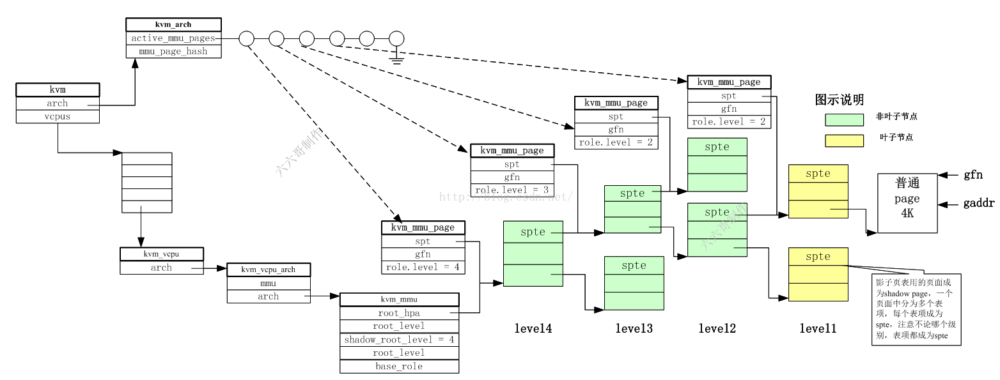
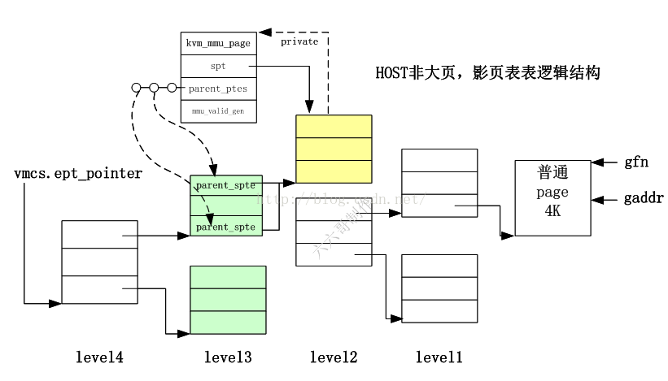

# KVM Code Analysis

[AMDESE/linux sev-es-5.6-v3](https://github.com/AMDESE/linux/tree/sev-es-5.6-v3)

## 查看相关源码文件

根据 *arch/x86/kvm/Makefile* 文件内容，可获取 KVM 相关的源码文件。

```makefile
# SPDX-License-Identifier: GPL-2.0

ccflags-y += -Iarch/x86/kvm
ccflags-$(CONFIG_KVM_WERROR) += -Werror

KVM := ../../../virt/kvm

kvm-y			+= $(KVM)/kvm_main.o $(KVM)/coalesced_mmio.o \
				$(KVM)/eventfd.o $(KVM)/irqchip.o $(KVM)/vfio.o
kvm-$(CONFIG_KVM_ASYNC_PF)	+= $(KVM)/async_pf.o

kvm-y			+= x86.o emulate.o i8259.o irq.o lapic.o \
			   i8254.o ioapic.o irq_comm.o cpuid.o pmu.o mtrr.o \
			   hyperv.o debugfs.o mmu/mmu.o mmu/page_track.o

kvm-intel-y		+= vmx/vmx.o vmx/vmenter.o vmx/pmu_intel.o vmx/vmcs12.o vmx/evmcs.o vmx/nested.o
kvm-amd-y		+= svm.o pmu_amd.o

obj-$(CONFIG_KVM)	+= kvm.o
obj-$(CONFIG_KVM_INTEL)	+= kvm-intel.o
obj-$(CONFIG_KVM_AMD)	+= kvm-amd.o
```

## KVM VM 和 vCPU 创建流程

[Using the KVM API](https://lwn.net/Articles/658511/)

[kvmtest.c](./kvmtest.c)

从以上一个最简单的 KVM API 使用示例可知 KVM 中的 VM 和 vCPU 创建流程：

1. 打开 /dev/kvm 文件，获取 kvmfd，以便使用 ioctl 与 KVM 通信；
2. 通过 ioctl kvmfd 从 KVM 获取 API 版本信息；
3. 通过 ioctl kvmfd 创建一个 VM，返回一个 vmfd，可用于控制 VM 的内存、vCPU 等；
4. 为虚拟机分配内存，并将 VM 要执行的代码加载到内存，然后通过 ioctl vmfd 告知 KVM VM 的内存信息；
5. 通过 ioctl vmfd 创建一个 vCPU，返回一个 vcpufd，可用于控制 vCPU 运行等；
6. 每个 vCPU 都有一个 struct kvm_run 结构体，用于在 KVM 和用户态程序之间共享 vCPU 相关信息，因此需要将其映射到用户空间，同时关联 vcpufd，以便 KVM 能够访问；
7. 通过 ioctl vcpufd 设置寄存器值 kvm_regs 和 kvm_sregs；
8. 在循环中，通过 ioctl vcpufd 运行配置好的 vCPU；
9. 当 vCPU 退出时，从 run->exit_reason 获取退出原因，进行相关处理。

下面将根据以上流程分析 KVM 中的 ioctl 相关代码。

SVM KVM 模块初始化时，创建 /dev/kvm 设备，其中注册 ioctl 处理函数为 kvm_dev_ioctl。

```c
// arch/x86/kvm/svm.c
svm_init ->
  // virt/kvm/kvm_main.c
  kvm_init(&svm_x86_ops, sizeof(struct vcpu_svm), __alignof__(struct vcpu_svm), THIS_MODULE) ->
    // arch/x86/kvm/x86.c
    kvm_arch_init
    // virt/kvm/eventfd.c
    kvm_irqfd_init
    // arch/x86/kvm/x86.c
    kvm_arch_hardware_setup
    ... 
    misc_register(&kvm_dev)
    

static struct file_operations kvm_chardev_ops = {
	.unlocked_ioctl = kvm_dev_ioctl,
	.llseek		= noop_llseek,
	KVM_COMPAT(kvm_dev_ioctl),
};

static struct miscdevice kvm_dev = {
	KVM_MINOR,
	"kvm",
	&kvm_chardev_ops,
};
```

用户程序通过 ioctl kvmfd 创建虚拟机时，首先会调用 kvm_create_vm 创建虚拟机实例，即对应的 kvm 结构体，由 kvm_arch_alloc_vm 最终调用架构相关的 svm_vm_alloc 分配结构体空间。kvm_alloc_memslots 为虚拟机分配内存槽。kvm_arch_init_vm 负责初始化 kvm 结构体中的 kvm_arch 结构体成员，最终会调用架构相关的 svm_vm_init。hardware_enable_all 会在启动第一个虚拟机时对每个 CPU 调用 hardware_enable_nolock，最终会调用架构相关的 svm_hardware_enable。kvm_init_mmu_notifier 会注册一个 MMU 通知事件，当 Linux 内存子系统进行页面管理时会调用这里注册的回调函数。最后会将创建的虚拟机挂到以 vm_list 为头节点的链表上。

kvm_coalesced_mmio_init 负责合并 MMIO 的初始化，所谓 [合并 MMIO](https://patchwork.kernel.org/project/kvm/patch/1307130668-5652-1-git-send-email-levinsasha928@gmail.com/) 是指为避免在每次 MMIO 写操作时都要陷入，将 MMIO 写操作合并到一个 ring buffer，当其他时间产生或 buffer 满了之后会陷入，进行 MMIO 批处理 。

anon_inode_getfile 会创建一个匿名文件，其文件操作设置为 kvm_vm_fops，私有数据就是创建的虚拟机。经过 fd_install 将文件对应的 vmfd 返回给用户程序，表示一台虚拟机，用户程序就可以通过 ioctl vmfd 进行虚拟机操作。在这之前，kvm_uevent_notify_change 会将 kvm->userspace_pid 设置为 current->pid。

```c
// virt/kvm/kvm_main.c
kvm_dev_ioctl(kvmfd, KVM_CREATE_VM, 0) ->
  kvm_dev_ioctl_create_vm(0) ->
    kvm_create_vm ->
      // arch/x86/include/asm/kvm_host.h
      kvm_arch_alloc_vm -> 
        kvm_x86_ops->vm_alloc() -> svm_vm_alloc 
      kvm_alloc_memslots
      kvm_arch_init_vm ->
        kvm_x86_ops->vm_init(kvm) -> svm_vm_init
      hardware_enable_all ->
        on_each_cpu(hardware_enable_nolock) ->
          kvm_arch_hardware_enable ->
            kvm_x86_ops->hardware_enable() -> svm_hardware_enable
      kvm_init_mmu_notifier
      list_add(&kvm->vm_list, &vm_list)
    kvm_coalesced_mmio_init
    anon_inode_getfile("kvm-vm", &kvm_vm_fops, kvm, O_RDWR)
    kvm_uevent_notify_change
    fd_install()

static const struct mmu_notifier_ops kvm_mmu_notifier_ops = {
	.invalidate_range_start	= kvm_mmu_notifier_invalidate_range_start,
	.invalidate_range_end	= kvm_mmu_notifier_invalidate_range_end,
	.clear_flush_young	= kvm_mmu_notifier_clear_flush_young,
	.clear_young		= kvm_mmu_notifier_clear_young,
	.test_young		= kvm_mmu_notifier_test_young,
	.change_pte		= kvm_mmu_notifier_change_pte,
	.release		= kvm_mmu_notifier_release,
};

static int kvm_init_mmu_notifier(struct kvm *kvm)
{
	kvm->mmu_notifier.ops = &kvm_mmu_notifier_ops;
	return mmu_notifier_register(&kvm->mmu_notifier, current->mm);
}


static struct file_operations kvm_vm_fops = {
	.release        = kvm_vm_release,
	.unlocked_ioctl = kvm_vm_ioctl,
	.llseek		= noop_llseek,
	KVM_COMPAT(kvm_vm_compat_ioctl),
};
```

用户程序为虚拟机分配内存后，通过 ioctl vmfd 将内存信息注册到 KVM。这部分可见 [QEMU/KVM 内存虚拟化](./memory_virtualization.md#虚拟机物理地址设置)。

用户程序通过 ioctl vmfd 创建一个 vCPU，首先调用 kvm_vcpu_init 进行初步的初始化。kvm_arch_vcpu_create 进行 vcpu ，kvm_mmu_create 设置 kvm_vcpu->kvm_vcpu_arch 结构体中的 mmu 相关值。kvm_create_lapic 负责创建 local APIC 工作。架构相关的 svm_create_vcpu 负责初始化 vcpu_svm 结构体。后续的 vcpu_load 负责把当前 vCPU 状态加载到物理 CPU 上，而 vcpu_put 负责将当前的物理 CPU 上运行的 vCPU 调度出去时的状态保存。kvm_init_mmu 负责 KVM 内存虚拟化的初始化。

create_vcpu_fd 会创建一个 vcpufd，返回给用户程序，表示一个 vCPU，用户程序可通过 ioctl vcpufd 进行 vCPU 操作。

```c
// virt/kvm/kvm_main.c
kvm_vm_ioctl(vmfd, KVM_CREATE_VCPU, vcpu_id) ->
  kvm_vm_ioctl_create_vcpu(kvm, id) ->
    kvm_vcpu_init
    kvm_arch_vcpu_create ->
      kvm_mmu_create
      kvm_create_lapic
      kvm_x86_ops->vcpu_create(vcpu) -> svm_create_vcpu
      vcpu_load -> 
        kvm_x86_ops->vcpu_load(vcpu, cpu) -> svm_vcpu_load
      kvm_vcpu_reset ->
        kvm_x86_ops->vcpu_reset(vcpu, ) -> svm_vcpu_reset
      kvm_init_mmu ->
        init_kvm_tdp_mmu
      vcpu_put ->
        kvm_arch_vcpu_put ->
          kvm_x86_ops->vcpu_put(vcpu) -> svm_vcpu_put
    create_vcpu_fd ->
      anon_inode_getfd(name, &kvm_vcpu_fops, vcpu, O_RDWR | O_CLOEXEC)


static struct file_operations kvm_vcpu_fops = {
	.release        = kvm_vcpu_release,
	.unlocked_ioctl = kvm_vcpu_ioctl,
	.mmap           = kvm_vcpu_mmap,
	.llseek		= noop_llseek,
	KVM_COMPAT(kvm_vcpu_compat_ioctl),
};
```

用户程序获取 vcpufd 后，要分配与 KVM 的共享内存（kvm_run 结构体等信息），首先通过 ioctl kvmfd 获取要分配的内存区域大小。然后在 vcpufd 上调用 mmap，对应的处理函数为 kvm_vcpu_mmap，仅分配了虚拟地址空间，并设置对应的 fault 回调函数为 kvm_vcpu_fault。当用户程序首次访问这段共享内存时，触发 page fault，在 kvm_vcpu_fault 中就会将虚拟地址与对应的数据联系起来。访问第一个页对应 kvm_vcpu->kvm_run，第二个页对应 kvm_vcpu->kvm_vcpu_arch.pio_data，第三个页会访问到 kvm_vcpu->kvm->coalesced_mmio_ring。

```c
static const struct vm_operations_struct kvm_vcpu_vm_ops = {
	.fault = kvm_vcpu_fault,
};

static int kvm_vcpu_mmap(struct file *file, struct vm_area_struct *vma)
{
	vma->vm_ops = &kvm_vcpu_vm_ops;
	return 0;
}
```

用户程序通过 ioctl vcpufd 设置 vCPU 寄存器值。准备完毕后，就可以通过 ioctl vcpufd KVM_RUN 运行配置好的 vCPU，vcpu_run 主体是一个循环，进行一系列判断后，准备进入虚拟机。vcpu_enter_guest 处理各种请求，调用 kvm_mmu_reload 完成内存虚拟化设置，最终调用架构相关的 svm_vcpu_run 进入虚拟机执行。

当 vCPU 退出时，ioctl 返回，用户可以通过读取共享内存中的 exit_reason 信息进一步处理。

```c
// virt/kvm/kvm_main.c
kvm_vcpu_ioctl(vcpufd, KVM_RUN, NULL) ->
  // arch/x86/kvm/x86.c
  kvm_arch_vcpu_ioctl_run(vcpu, vcpu->run) ->
    vcpu_run(vcpu) ->
      vcpu_enter_guest ->
        kvm_mmu_reload
        kvm_x86_ops->run(vcpu) -> svm_vcpu_run

```

## 内存虚拟化

[KVM MMU EPT 内存管理](https://www.daimajiaoliu.com/daima/610695f3d49c802)

[The x86 kvm shadow mmu](https://www.kernel.org/doc/html/latest/virt/kvm/x86/mmu.html)

KVM MMU 内存虚拟化中关键数据结构关系如下图。



- kvm->kvm_arch 结构体中有链表 active_mmu_pages 和哈希链表 mmu_page_hash 成员，可以通过 GFN 快速索引 kvm_mmu_page。
- kvm_mmu 结构体中的 kvm_mmu_role 成员中设置了创建 kvm_mmu_page 时采用的基本 page role，同时包含一些硬件特性。
- kvm_mmu_page 结构体中的 kvm_mmu_page_role 表示该页表页的角色，如 level 表示在 NPT 中的等级。

在 [QEMU/KVM 内存虚拟化](./memory_virtualization.md) 中分析了 QEMU 在用户空间申请虚拟内存，把地址信息注册到 KVM 的过程。

下面将从如何拆分 NPT 相关功能的角度，分析 SVM NPT 相关代码。

在 AMD 手册中找到 VMCB 中 NPT 基地址的相关字段为 N_CR3，对应源码中的 vmcb->vmcb_control_area.nested_cr3，KVM SVM 中设置此字段的函数为 set_tdp_cr3。下面根据此函数的调用链分析虚拟机启动过程中的 NPT 设置。

上节分析到的虚拟机 vCPU 创建中，先是调用 kvm_mmu_create 初步设置 kvm_vcpu->kvm_vcpu_arch 中的 kvm_mmu 类型的指针。在创建 vCPU 的末尾，由 kvm_init_mmu 初始化 KVM 内存虚拟化。对于硬件辅助的内存虚拟化，init_kvm_tdp_mmu 负责初始化 NPT，即设置 kvm_vcpu->kvm_vcpu_arch->kvm_mmu 结构体中的具体值，包括注册 page_fault 回调函数 kvm_tdp_page_fault，以及注册 set_cr3 函数为 set_tdp_cr3。

```c
// arch/x86/kvm/mmu/mmu.c
kvm_mmu_create(vcpu) ->
  vcpu->arch.root_mmu.root_hpa = INVALID_PAGE;
kvm_init_mmu(vcpu, reset_root) ->
  init_kvm_tdp_mmu(vcpu)
```

虚拟机运行前，需要调用 set_cr3 设置 VMCB N_CR3 字段。而在前面的内存虚拟化初始化过程中，将 kvm_mmu 中的 root_hpa（即要填入 N_CR3 字段的值）设置为 INVALID_PAGE。因此 kvm_mmu_load 中要设置 root_hpa。

mmu_topup_memory_caches 负责初始化 kvm_vcpu->kvm_vcpu_arch 中的三个 kvm_mmu_memory_cache 类型的成员 mmu_pte_list_desc_cache、mmu_page_header_cache 和 mmu_page_cache，分别负责 pte_list_desc、kvm_mmu_page 和 kvm_mmu_page.spt（实际页表页）。而前两者有对应的 kmem_cache，mmu_pte_list_desc_cache 和 mmu_page_header_cache，在 KVM 模块初始化时通过 kmem_cache_create 创建。当这两个 cache 中缓存的 object 数目不够时，通过 mmu_topup_memory_cache 从对应的 kmem_cache 获取。对于 mmu_page_cache，则是通过 mmu_topup_memory_cache_page 直接调用 __get_free_page 获取页。mmu_topup_memory_caches 初始化函数会在 tdp_page_fault、kvm_mmu_load 和 kvm_mmu_pte_write 中调用，保证三个缓存中有充足空间，加速运行中的分配。

mmu_alloc_roots 调用 mmu_alloc_direct_roots 初始化，调用 kvm_mmu_get_page 分配 kvm_mmu_page 结构体和对应的 spt 页，并设置 root_hpa 指向分配的 spt，最后调用架构相关的 set_tdp_cr3 设置 VMCB N_CR3 字段。对于多 vCPU 的 VM，仅在创建第一个 vCPU 时，kvm_mmu_get_page 才会分配新的 kvm_mmu_page 结构体，后面的虚拟机创建，都会通过 GFN 索引哈希表从而找到第一个 vCPU 创建的 kvm_mmu_page，从而实现多 vCPU 共享 NPT。

kvm_mmu_get_page 这个函数在后面 __direct_map 构建 NPT 的时候还要用到。

```c
// arch/x86/kvm/x86.c
vcpu_enter_guest(vcpu) ->
  // arch/x86/kvm/mmu.h
  kvm_mmu_reload(vcpu) ->
    // arch/x86/kvm/mmu/mmu.c
    kvm_mmu_load(vcpu)->
      mmu_topup_memory_caches(vcpu) ->
        mmu_topup_memory_cache(&vcpu->arch.mmu_pte_list_desc_cache, pte_list_desc_cache, ...)
        mmu_topup_memory_cache_page(&vcpu->arch.mmu_page_cache, ...)
        mmu_topup_memory_cache(&vcpu->arch.mmu_page_header_cache, mmu_page_header_cache, ...)
      mmu_alloc_roots(vcpu) ->
        mmu_alloc_direct_roots(vcpu) ->
          kvm_mmu_get_page(vcpu, 0, 0, vcpu->arch.mmu->shadow_root_level, 1, ACC_ALL)
          vcpu->arch.mmu->root_hpa = __pa(sp->spt)
      kvm_mmu_sync_roots(vcpu)
      // arch/x86/kvm/mmu.h
      kvm_mmu_load_cr3(vcpu) ->
        vcpu->arch.mmu->set_cr3(vcpu, vcpu->arch.mmu->root_hpa) -> set_tdp_cr3
      kvm_x86_ops->tlb_flush(vcpu, true) -> svm_flush_tlb
```

创建完 NPT 的顶级页表并将其地址填入 VMCB 后，运行虚拟机。此时尚未创建 NPT，因此虚拟机会触发 NPF，陷入到 KVM，在 NPF 的处理过程中完成 NPT 创建过程。

NPF 处理由之前注册的 kvm_tdp_page_fault 完成，首先计算 max_level 值，即 NPT 中将哪一级作为叶子节点（4K 页就是 max_level=1，2M 大页就是 max_level=2）。direct_page_fault 中，先调用前面提到过的 mmu_topup_memory_caches 为三个 cache 分配空间。fast_page_fault 判断能否快速处理 NPF，仅适用于 NPF 存在且是写保护产生 NPF 的情况。

try_async_pf 尝试对 NPF 进行异步处理，适用于 NPT 建立好后，host 将 VM 的物理内存换出而产生 NPF 的情况。kvm_vcpu_gfn_to_memslot 根据 GFN 查找对应的 kvm_memory_slot。__gfn_to_pfn_memslot 中，__gfn_to_hva_many 根据 slot 的 userspace_addr 成员就可以计算出 HVA。hva_to_pfn 则通过 get_user_pages 相关函数获取 HVA 对应的 PFN，并把内存 pin 住。[KVM 异步 page fault](https://terenceli.github.io/%E6%8A%80%E6%9C%AF/2019/03/24/kvm-async-page-fault) 的流程之后有时间再看。总之，如果可以异步处理，KVM 直接返回，并通知 VM 调度其他进程，以提高效率。否则，try_async_pf 会分配一个物理页，并计算对应的 GFN。

__direct_map 是 NPT 构建过程中的关键函数，其功能就是填充 NPT。首先会根据大页设置相关信息调整 level，即最终的 NPT 用哪一级作为叶子节点。然后就进入 for_each_shadow_entry 循环，通过 kvm_shadow_walk_iterator 迭代器结构体遍历 NPT，最终索引到 NPT 叶子节点中的 SPTE（NPTE），得到 PFN。迭代器的成员 addr 是 GPA，shadow_addr 指向当前遍历到的 NPT，sptep 指向当前页表中的 SPTE，level 记录当前的 NPT 等级，index 则是当前 SPTE 在当前 NPT 中的索引。

shadow_walk_init 进行遍历初始化，设置迭代器中的 GPA 和 level，将 shadow_addr 指向 NPT root_hpa。shadow_walk_okay 用于判断是否要继续遍历，计算迭代器中的索引并设置 SPTE 指针。shadow_walk_next 则在处理完当前级别页表后，从当前页表项中取出下一级页表的地址。可以看到，遍历的逻辑非常简单。

遍历过程中，如果没有中间的某级页表，kvm_mmu_get_page 会分配下一级页表，link_shadow_page 将其基地址填入当前的页表项，同时还要将当前页表项的地址加入到下一级页表的 kvm_mmu_page->parent_ptes 链表中。遍历到最终的叶子节点时，mmu_set_spte 设置 SPTE 指向 PFN、刷新 TLB、将 SPTE 加入 GFN 对应的 kvm_memory_slot->kvm_arch_memory_slot.rmap （gfn_to_rmap 找到 rmap 链表，然后将 SPTE 插入链表）。rmap 用于通过 GFN 快速找到对应的 SPTE，如要把 VM 物理页换出。

```c
// arch/x86/kvm/x86.c
vcpu_enter_guest ->
  kvm_mmu_reload
  kvm_x86_ops->run(vcpu) -> svm_vcpu_run 
  // When VM Exit 
  ...
  kvm_x86_ops->handle_exit(vcpu, exit_fastpath) -> handle_exit
    // arch/x86/kvm/svm.c
    npf_interception(vcpu_svm) ->
      // arch/x86/kvm/mmu/mmu.c
      kvm_mmu_page_fault ->
        handle_mmio_page_fault
        kvm_mmu_do_page_fault ->
          kvm_tdp_page_fault ->
            direct_page_fault ->
              mmu_topup_memory_caches
              fast_page_fault
              try_async_pf
                kvm_vcpu_gfn_to_memslot
                __gfn_to_pfn_memslot ->
                  __gfn_to_hva_many
                  hva_to_pfn                  
              __direct_map(vcpu, gpa, ...) ->
                for_each_shadow_entry(vcpu, gpa, it)
                  kvm_mmu_get_page
                  link_shadow_page ->
                    mmu_spte_set ->
                      __set_spte
                    mmu_page_add_parent_pte
                mmu_set_spte ->
                  set_spte

struct kvm_shadow_walk_iterator {
	u64 addr;             // gpa
	hpa_t shadow_addr;    // current spt base hpa
	u64 *sptep;           // current spte
	int level;            // current level
	unsigned index;       // index in current spt
};

#define for_each_shadow_entry(_vcpu, _addr, _walker)            \
	for (shadow_walk_init(&(_walker), _vcpu, _addr);	\
	     shadow_walk_okay(&(_walker));			\
	     shadow_walk_next(&(_walker)))
```

回过头来看 kvm_mmu_get_page，它负责创建 KVM MMU 中最重要的结构体 kvm_mmu_page，用于描述 NPT 页表页，关系如下图。



kvm_mmu_page 中的 spt 成员指向其描述的 NPT 页表页，同时该页的 page 结构体中的 private 指向了管理它的 kvm_mmu_page。parent_ptes 链表保存了指向该页表页的所有页表项。当分配完一个 kvm_mmu_page 结构时，会用其管理的 GPA 空间的起始 GFN 为 key 计算一个哈希值，并将其添加到 kvm->kvm_arch.mmu_page_hash 链表中，以便快速通过 GFN 找到对应的页表页。同时，所有激活的页表页，也会加入 kvm->kvm_arch.active_mmu_page 链表中。

kvm_mmu_get_page 中，首先要设置该页表页的角色，如 level。for_each_valid_sp 循环就是利用 GFN 检索哈希链表，快速查找是否存在有效的页表页，如果有则在一系列判断之后直接返回。如果没有就需要调用 kvm_mmu_alloc_page 分配新的页表页和管理结构，将其加入哈希链表，并通过 clear_page 清空其中的所有 SPTE。

```c
// arch/x86/kvm/mmu/mmu.c
kvm_mmu_get_page ->
  role.level = level;
  for_each_valid_sp(vcpu->kvm, sp, gfn)
  kvm_mmu_alloc_page
  clear_page

#define for_each_valid_sp(_kvm, _sp, _gfn)				\
	hlist_for_each_entry(_sp,					\
	  &(_kvm)->arch.mmu_page_hash[kvm_page_table_hashfn(_gfn)], hash_link) \
		if (is_obsolete_sp((_kvm), (_sp))) {			\
		} else
```

__direct_map 建立 NPT 到叶子节点时，调用 mmu_set_spte，其中就会设置反向映射。反向映射表结构存储在 kvm_arch_memory_slot.rmap 中，其中的每个元素是一个 pte_list_desc + 权限位。

__gfn_to_rmap 就是通过 GFN 计算相对起始 GFN 的索引，作为 rmap 的索引获取 rmap_head。pte_list_add 将本次映射得到的 SPTE 插入到 rmap_head 中。如果 rmap_head->val 的 bit-0 未置位，则表明它仅指向此链中唯一一个 SPTE。否则，(rmap_head->val & ~1) 指向 pte_list_desc 结构体，包含更多的 SPTE。

```c
// arch/x86/kvm/mmu/mmu.c
mmu_set_spte ->
  rmap_add(vcpu, spte, gfn) ->
    gfn_to_rmap(vcpu->kvm, gfn, sp) ->
      __gfn_to_memslot
      __gfn_to_rmap ->
        return &slot->arch.rmap[level - PT_PAGE_TABLE_LEVEL][idx]
    pte_list_add(vcpu, spte, rmap_head)

struct kvm_rmap_head {
	unsigned long val;
};
 
struct pte_list_desc {
	u64 *sptes[PTE_LIST_EXT];
	struct pte_list_desc *more;
};
```