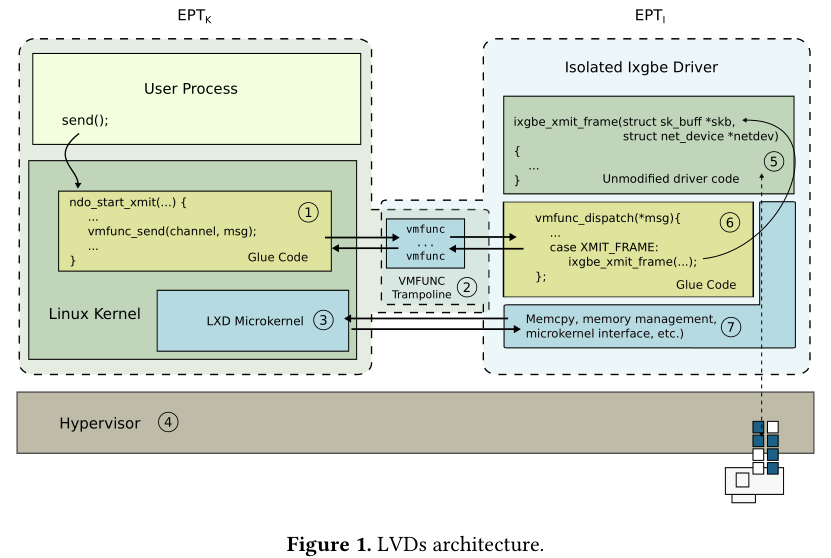

# Lightweight Kernel Isolation with Virtualization and VM Functions

[pdf]([VEE%202020]%20Lightweight%20kernel%20isolation%20with%20virtualization%20and%20VM%20functions.pdf)

内核空间缺乏有效的隔离。以往的硬件隔离原语开销大。最近的工作通过 EPT switching VMFUNC 和 MPK 提供内存隔离，开销近似系统调用。而这两种方案都未提供 ring 0 内核代码的隔离架构支持，即控制特权指令和定义明确的入口点以安全地恢复隔离域之间的系统状态。本文实现了轻量级内核特权代码隔离，将系统放到 VT-x non-root 模式，利用 EPT switching VMFUNC 实现隔离边界。定义了一组不变量，针对复杂的内核执行模型提供组内核组件隔离，如提供可抢占的并发中断处理程序隔离。支持跨隔离域的不退出中断传递。通过开发设备驱动的隔离版本评估。

## Introduction

宏内核缺乏隔离是威胁其安全的主要因素。内核扩展和设备驱动越来越多，是内核漏洞的主要来源。虽然存在一些安全机制，如 stack canary、ASLR、DEP、SMAP 和 SMAP，但很大一部分漏洞仍是可利用的。即使是更高级的防御机制，如代码指针完整性 CPI 和安全堆栈进入主线内核，仍存在仅数据攻击。

在内核中引入隔离方案，对开销有严格要求。硬件隔离原语，EPT switching 和 MPK 提供了内存隔离和跨域调用，开销接近系统调用。然而二者都没有对 ring 0 特权代码隔离的支持，特权代码通过执行特权指令可以轻松逃脱隔离。为了控制特权指令的隔离，以往的内核子系统隔离要退出到 ring 3，带来 0.35-6.3 倍的开销。

本文提出 Lightweight Virtualized Domains, LVD，结合硬件辅助虚拟化和 EPT switching 实现特权内核代码隔离机制。使用一个延迟启动的小型 hypervisor，透明地将系统降权到 VT-x non-root guest。用跨域调用特权级变更的开销交换执行特权指令时陷入到 hypervisor 的开销。实验表明，对隔离机制开销要求最严格的 I/O 密集型覆盖中，特权指令引起的陷入次数比跨域调用数量少得多。

内核子系统，如设备驱动遵循复杂的执行模型，运行在用户和内核线程、中断、软中断 IRQ 的上下文中。大多数驱动代码都是可重入的。VMFUNC 不提供在跨越隔离边界时保护系统状态。为此，定义了一组安全不变量，并开发了一组机制确保在内核的复杂执行环境下保持隔离。

中断退出仍是虚拟化环境的主要开销来源，开发了一个中断传递机制，在隔离域中重建系统正确状态，同时处理潜在不可信状态的中断，而不陷入到 hypervisor。

为评估方法的实用性，隔离了几个内核的性能关键的设备驱动。利用现有的设备驱动隔离框架 LXD，评估了网络和块设备的开销。

## Background and Motivation

## LVDs Architecture

LVD 的设计目的是阻止发现内核子系统中的可利用漏洞的攻击者攻击内核的其他部分，即通过读取内核数据结构或代码、劫持控制流或覆盖敏感的内核对象来获得额外的特权。

