# 内存释放测试

测试 Linux 下进程释放内存后是否会被清零。

根据 [Linux进程分配内存的两种方式--brk() 和mmap()](https://www.cnblogs.com/vinozly/p/5489138.html)，进程调用 malloc 申请（虚拟）内存，底层实现为 brk 和 mmap。

- 小于 128K 的内存将由 brk 在堆上分配；
- 大于 128K 的内存将由 mmap 在堆和栈之间分配。

使用 test_mem 程序申请两段内存 buf 和 bigbuf，大小为 4K 和 256K，向其中写入关键字，输出对应的 VA 和 PA。

```c
// test_mem.c
#include <stdio.h>
#include <stdlib.h>
#include <string.h>
#include <unistd.h>
#include <stdint.h>
#include <fcntl.h>
#include <errno.h>

#define PAGE_SIZE 0x1000

void print_page(uint64_t address, uint64_t data)
{
  printf("0x%lx : 0x%lx : pfn %lx : soft-dirty %ld file/shared %ld "
         "swapped %ld present %ld\n",
         address,
         ((data & 0x7fffffffffffff) << 12) | (address & 0xfff), // PA
         data & 0x7fffffffffffff,
         (data >> 55) & 1,
         (data >> 61) & 1,
         (data >> 62) & 1,
         (data >> 63) & 1);
}

void print_address(uint64_t address)
{
  char filename[BUFSIZ];
  // snprintf(filename, sizeof filename, "/proc/%d/pagemap", getpid());
  snprintf(filename, sizeof filename, "/proc/self/pagemap");

  int fd = open(filename, O_RDONLY);
  if (fd < 0)
  {
    perror("open");
    return;
  }
  uint64_t data;
  uint64_t index = (address / PAGE_SIZE) * sizeof(data);
  if (pread(fd, &data, sizeof(data), index) != sizeof(data))
  {
    perror("pread");
    return;
  }
  close(fd);

  print_page(address, data);
}

int main()
{

  char *buf = malloc(PAGE_SIZE);         // 4K
  char *bigbuf = malloc(1024 * PAGE_SIZE); // 256K
  for (size_t i = 0; i < 10; i++)
  {
    strcpy(buf + i * 7, "KEYWORD");
  }

  for (size_t i = 0; i < 4 * 1024 * 1024 / 7; i++)
  {
    strcpy(bigbuf + i * 7, "KEYWORD");
  }

  printf("buf: %p\n", buf);
  printf("bigbuf: %p\n", bigbuf);

  uint64_t start_address = (uint64_t)bigbuf;
  uint64_t end_address = start_address + 4 * 1024 * 1024;

  for (uint64_t i = start_address; i < end_address; i += 0x1000)
  {
    print_address(i);
  }

  print_address((uint64_t)buf);
  print_address((uint64_t)bigbuf);

  getchar();

  free(buf);
  free(bigbuf);

  printf("buffer free");

  getchar();

  return 0;
}
```

使用 [fmem](https://github.com/NateBrune/fmem) 工具读取物理内存。

```shell 
$ sudo dd if=/dev/fmem of=<output_name> ibs=1 skip=$((<pa_in_hex>)) count=<read_count>
```

## 非虚拟化环境测试

测试 Linux 内核是否会进行清零。

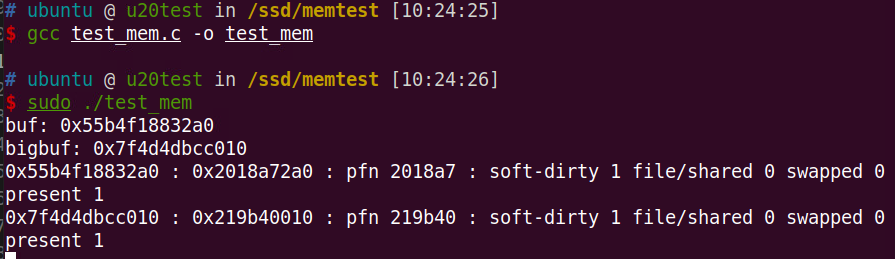

释放内存前，查看物理内存内容，能看到写入的关键字：

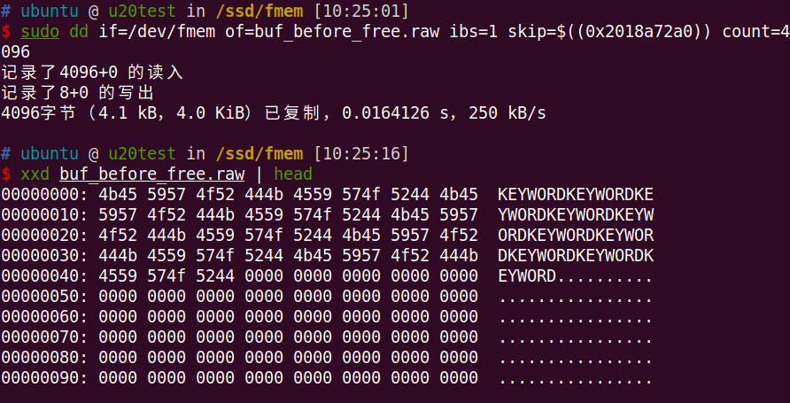

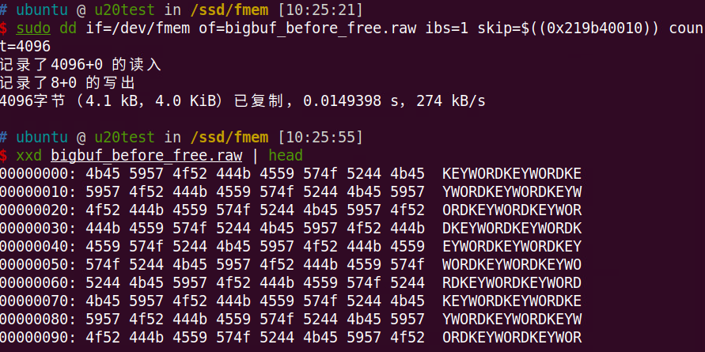

释放内存后，查看物理内存内容：

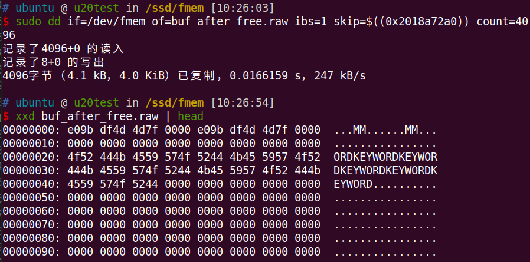

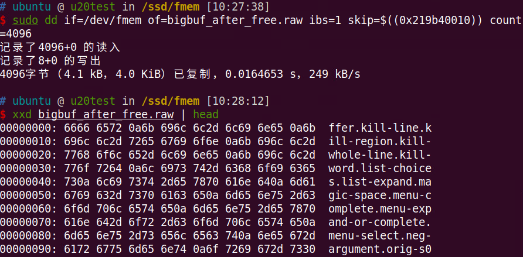

可以看到 buf 的前 32B 被清除，而 bigbuf 的物理内存已经被分配给其他进程。

## 虚拟化环境测试

测试 KVM/QEMU 是否会进行清零。

使用 virsh qemu-monitor_command 的 gpa2hva 获取 gPA 对应的 hVA，然后用 pagemap 工具获取对应的 hPA。

```shell 
$ sudo virsh qemu-monitor-command ubuntu20.04 --hmp gpa2hva <gpa>
$ sudo ./pagemap <vm_pid> <hva>
```

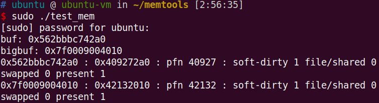

释放前，物理内存内容：

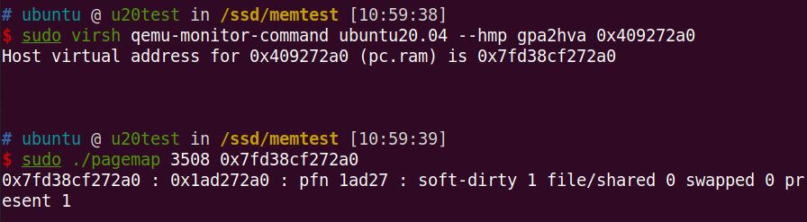

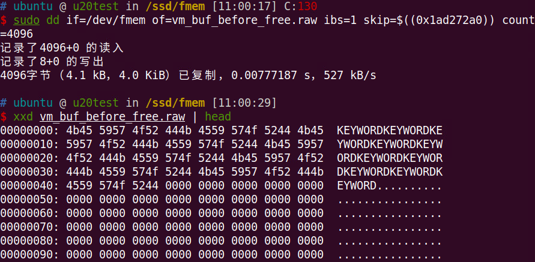

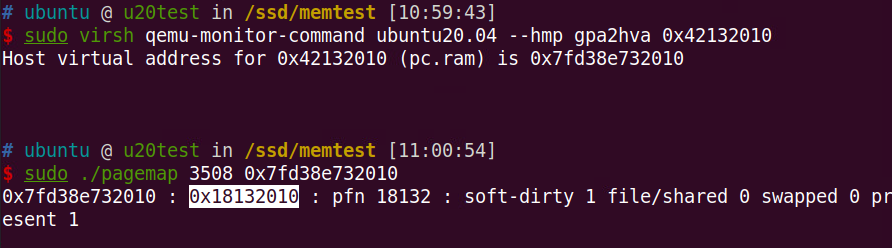

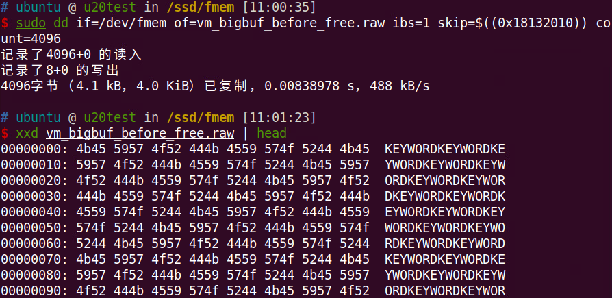

释放后，物理内存内容：

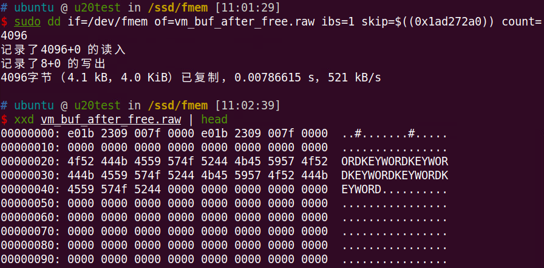

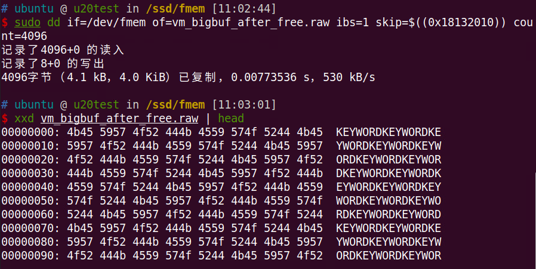

可见，进程释放内存后，buf 还是被清除前 32B，而 bigbuf 未被清零也没有被分配给其他进程。

虚拟机关闭后，物理内存内容：

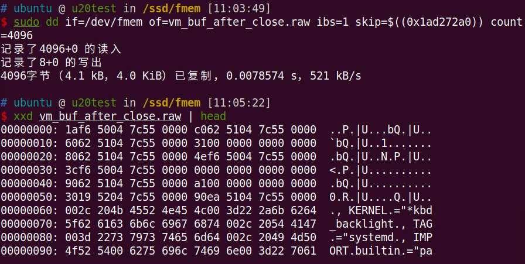

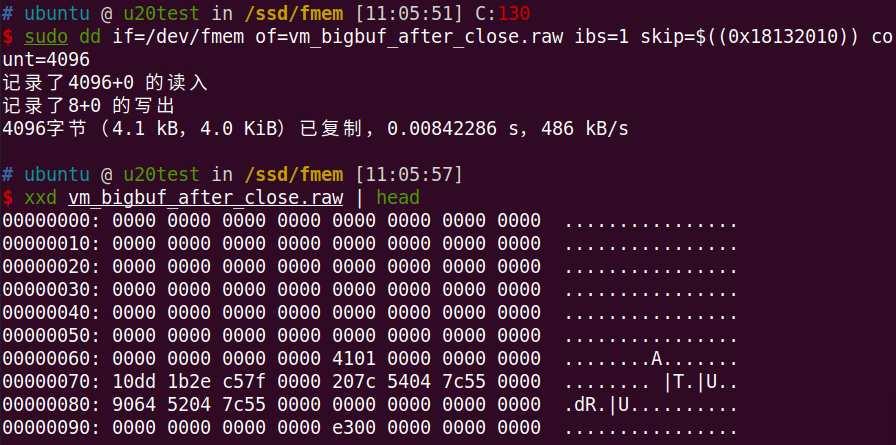

虚拟机关闭后，物理内存都被分配给其他进程。

## 内存再分配测试

测试被释放的内存被分配给其他进程后的内容。

使用 system_search_mem 程序分配所有的空闲物理内存，搜索内存中的关键字。

```c
// system_search_mem.c
#define _GNU_SOURCE
#include <sys/types.h>
#include <sys/wait.h>
#include <stdio.h>
#include <stdlib.h>
#include <sched.h>
#include <signal.h>
#include <unistd.h>
#include <stdio.h>
#include <stdlib.h>
#include <string.h>
#include <unistd.h>
#include <stdint.h>
#include <fcntl.h>
#include <errno.h>

#define PAGE_SIZE 0x1000

// print physical address
void print_address(uint64_t address)
{
    char filename[BUFSIZ];
    // snprintf(filename, sizeof filename, "/proc/%d/pagemap", getpid());
    snprintf(filename, sizeof filename, "/proc/self/pagemap");

    int fd = open(filename, O_RDONLY);
    if (fd < 0)
    {
        perror("open");
        return;
    }
    uint64_t data;
    uint64_t index = (address / PAGE_SIZE) * sizeof(data);
    if (pread(fd, &data, sizeof(data), index) != sizeof(data))
    {
        perror("pread");
        return;
    }
    close(fd);

    printf("0x%lx, ", ((data & 0x7fffffffffffff)));
}

int mem_num = 0;
static int singlemem = 4 * 1024;
#define BUFFERSIZE 512
#define MEM_PART "/proc/meminfo"

struct mem_info
{
    char MemTotal[20];
    char MemFree[20];
};

typedef struct mem_info MEM_info, *pMEM_info;

int get_file_line(char *result, char *fileName, int lineNumber)
{
    FILE *filePointer;
    int i = 0;
    char buffer[BUFFERSIZE];

    if ((fileName == NULL) || (result == NULL))
    {
        return 0;
    }

    if (!(filePointer = fopen(fileName, "rb")))
    {
        return 0;
    }

    while ((!feof(filePointer)) && (i < lineNumber))
    {
        if (!fgets(buffer, BUFFERSIZE, filePointer))
        {
            return 0;
        }
        i++;
    }

    strcpy(result, buffer);

    if (0 != fclose(filePointer))
    {
        return 0;
    }

    return 1;
}

int get_mem_info(pMEM_info mem)
{
    char buffer[300];
    if (NULL == mem)
    {
        printf("\nget_mem_info:param null!\n");
        return 0;
    }
    memset(mem, 0, sizeof(MEM_info));
    if (1 != get_file_line(buffer, MEM_PART, 1)) //读取第一行
    {
        return 0;
    }

    sscanf(buffer, "%*s %s", mem->MemTotal);

    if (1 != get_file_line(buffer, MEM_PART, 2)) //读取第二行
    {
        return 0;
    }
    sscanf(buffer, "%*s %s", mem->MemFree);

    return 0;
}

// keyword input
// memory
int main(int argc, char **argv)
{

    char *input_keyword = NULL;
    int num = 0;
    int i = 0;
    int j = 0;
    int loop_num = 0;

    if (argc < 2)
    {
        printf("please input memory keyword.\n");
        return -1;
    }

    printf("mem malloc unit is 4M.\n");

    input_keyword = argv[1];
    char *testmem = NULL;

    printf("the input memory keyword is %s.\n", input_keyword);

    MEM_info mem;
    get_mem_info(&mem);
    int total_mem = atoi(mem.MemTotal);
    int free_mem = atoi(mem.MemFree);

    printf("Total memory is %d(MB), free memory is %d(MB).\n", total_mem / 1024, free_mem / 1024);
    printf("Total memory is %d(KB), free memory is %d(KB).\n", total_mem, free_mem);

    // malloc all free memory
    // one virtual memory block can only search one physical page
    // free_mem(KB)/ 4KB
    loop_num = free_mem / 4;
    printf("loop_num: %d\n", loop_num);

    for (i = 0; i < loop_num; i++)
    {
        if (i % 10000 == 0)
        {
            printf("cnt: %d\n", i);
        }

        testmem = (char *)malloc(singlemem * 1024);

        if (NULL == testmem)
        {
            printf("%d malloc mem failed.\n", mem_num);
            break;
        }

        // only the first virtual page has its physical page
        for (j = 0; j < 0x1000; j++)
        {
            if (!strncmp(input_keyword, testmem + j, strlen(input_keyword)))
            {
                printf("find the keyword: %s, the memory unit num is %d_%d.\n", input_keyword, mem_num, j);
                return 1;
            }
        }

        // [DEBUG INFO] print physical address
        // print_address(testmem);

        mem_num++;
    }

    printf("\ndo not find the keyword: %s \n", input_keyword);

    // do not exit
    getchar();

    return 0;
}
```

以上的程序虽然能遍历所有空闲物理内存，但无法搜索到其他进程写入的关键字。

由于 malloc 分配的是虚拟内存，分配之后仅第一个页被映射到物理内存，而后续的页都只是虚拟页。在读访问后，未映射的页会映射到一个共同的物理地址，其内容为 0，采用 COW 机制。在写访问后，后续页才会被映射到各自的物理内存页，且这些页的初始值都为 0。

在 system_search_mem 程序中输出访问前后的地址映射：

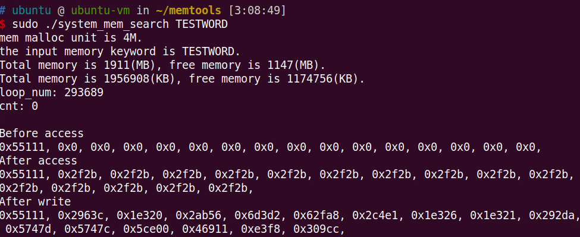

读物理页帧 0x2f2b，其内容为全零，证实以上对于分配内存页的处理。