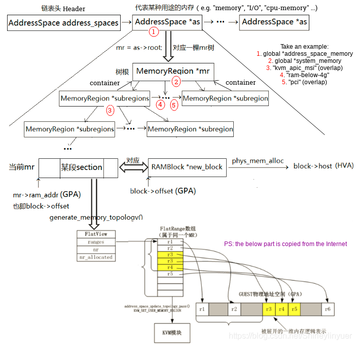
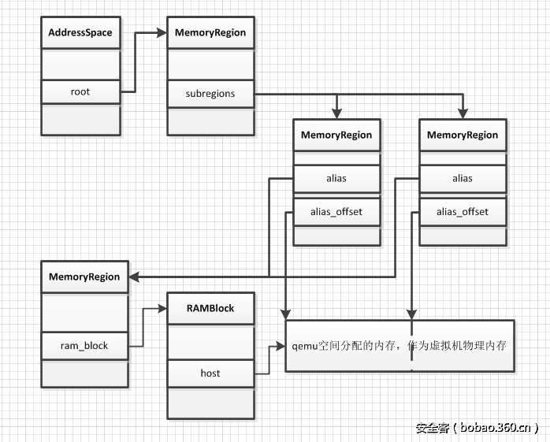
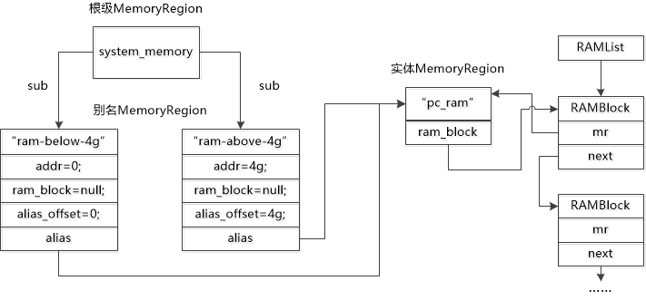
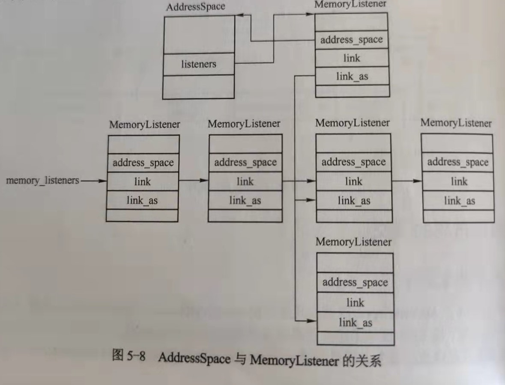
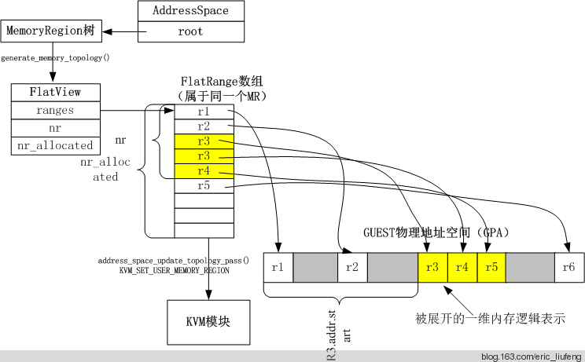
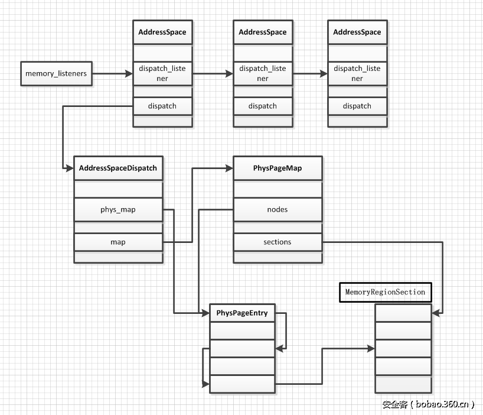
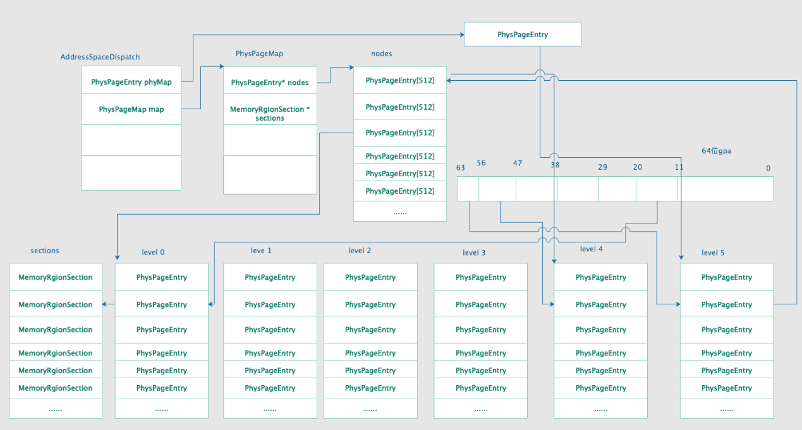
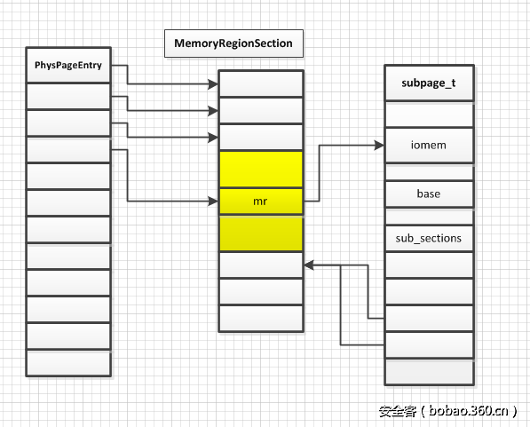
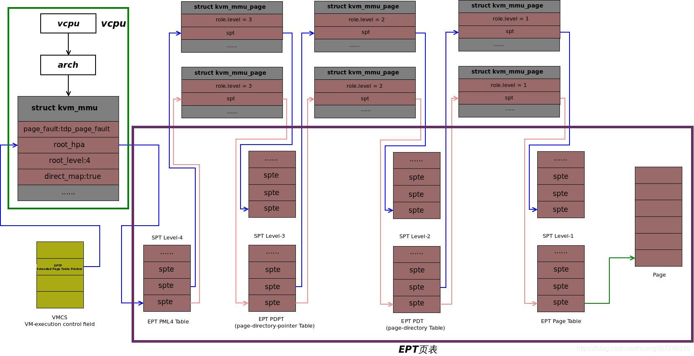
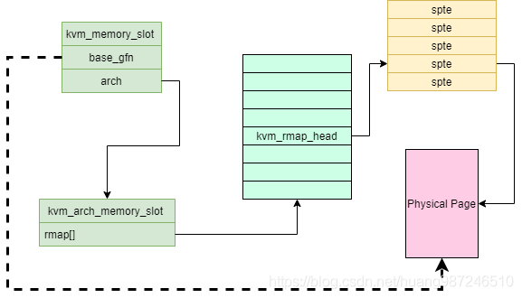

# QEMU/KVM Memory Virtualization

[qemu-kvm 内存虚拟化的原理及其流程](https://blog.csdn.net/hzj_001/article/details/108267914)

[Qemu内存管理主要结构体分析：MemoryRegion/AddressSpace/FlatView](https://blog.csdn.net/Shirleylinyuer/article/details/83592614)

[QEMU 虚拟机内存管理](https://www.cnblogs.com/ccxikka/p/9477530.html)

[QEMU 内存管理——扁平视图](https://blog.csdn.net/huang987246510/article/details/105645279)

[QEMU 注册内存到 KVM 流程](https://blog.csdn.net/huang987246510/article/details/105744738)

[QEMU 学习笔记——内存](https://www.binss.me/blog/qemu-note-of-memory/)

[内存虚拟化软件基础——KVM SPT](https://blog.csdn.net/huang987246510/article/details/105645656)

[QEMU/KVM 源码解析与应用](http://terenceli.github.io/%E6%8A%80%E6%9C%AF/2020/09/11/book)

!!! tldr

    结合源码学习 QEMU/KVM 虚拟化栈中的内存虚拟化原理与实现。

    先看书，捋清大概流程，然后再看源码。

QEMU 在用户空间申请内存，然后把地址信息注册到 KVM，KVM 维护虚拟机相关的 slot，slot 记录了 HVA、页面数和 GPA 等信息。

## QEMU 内存初始化

### 基本结构

QEMU 中主要结构体关系图：



AddressSpace 表示虚拟机的一段地址空间，如内存、I/O 地址空间。AS 将几个内存相关的结构体联系到一起，root 成员指向根 MR，current_map 指向该地址空间的 FlatView。所有 AS 链接起来形成链表，链表头为 address_spaces。

MemoryRegion 表示虚拟机的一段内存区域，其中的 ram_block 表示实际分配的物理内存，container 指向上一级 MR。MR 可分三类：

- 根 MR：没有自己的内存，通过 subregion 字段管理子 MR。
- 实体 MR：有自己的内存，从 QEMU 地址空间分配，如 ram_memory(pc.ram)、pci_memory(pci) 等。
- 别名 MR：没有自己的内存，表示实体 MR 的一部分，alias 成员指向实体 MR，alias_offset 为其在实体 MR 中的偏移。

AS 和 MR 的关系如下图：




```c
struct AddressSpace {
    /* All fields are private. */
    struct rcu_head rcu;
    char *name;
    MemoryRegion *root;
    int ref_count;
    bool malloced;
    /* Accessed via RCU.  */
    struct FlatView *current_map;
    int ioeventfd_nb;
    struct MemoryRegionIoeventfd *ioeventfds;
    struct AddressSpaceDispatch *dispatch;
    struct AddressSpaceDispatch *next_dispatch;
    MemoryListener dispatch_listener;
    QTAILQ_HEAD(memory_listeners_as, MemoryListener) listeners;
    QTAILQ_ENTRY(AddressSpace) address_spaces_link;
};
struct MemoryRegion {
    Object parent_obj;
    /* All fields are private - violators will be prosecuted */
    /* The following fields should fit in a cache line */
    bool romd_mode;
    bool ram;
    bool subpage;
    bool readonly; /* For RAM regions */
    bool rom_device;
    bool flush_coalesced_mmio;
    bool global_locking;
    uint8_t dirty_log_mask;
    RAMBlock *ram_block;
    ...
    const MemoryRegionOps *ops;
    void *opaque;
    MemoryRegion *container;
    Int128 size;
    hwaddr addr;
    ...
    MemoryRegion *alias;
    hwaddr alias_offset;
    int32_t priority;
    QTAILQ_HEAD(subregions, MemoryRegion) subregions;
    QTAILQ_ENTRY(MemoryRegion) subregions_link;
    QTAILQ_HEAD(coalesced_ranges, CoalescedMemoryRange) coalesced;
    ...
};
```

### 虚拟机内存初始化

下面结合 QEMU 6.2.0 源码分析虚拟机内存初始化流程。

首先是全局的 AS 和 MR 的创建。

```c
// softmmu/main.c
main => 
  qemu_init =>
    qemu_create_machine =>
      cpu_exec_init_all =>
        io_mem_init
        memory_map_init
```

首先调用 cpu_exec_init_all 进行初始化操作，其中调用两个内存相关的函数：io_mem_init 和 memory_map_init。前者创建了 io_mem_unassigned MR。后者则创建了 address_space_memory 和 address_space_io 两个 AS，代表虚拟机的内存和 I/O 地址空间。其对应的根 MR 分别为 system_memory 和 system_io。这两对 MR 和 AS 都是全局变量。

!!! info

    本来想基于比较新的 6.2.0 分析，但发现新版代码[将分配内存的 memory_region_allocate_system_memory 移除，改为使用 memdev backend](https://gitlab.com/qemu-project/qemu/-/commit/f0530f14c7c35d4050fd5da11f97dae3cd48d842)。没太多时间去看 memdev，下面将按照旧的代码继续分析内存虚拟化流程。

```c
pc_init1 / pc_q35_init =>
  pc_memory_init =>
    memory_region_allocate_system_memory
    memory_region_init_alias(ram_below_4g)
    memory_region_init_alias(ram_above_4g)
    pc_system_firmware_init
    memory_region_init_ram(pc.rom)

```

在初始化 VM 的过程中，调用 pc_init1 / pc_q35_init，其中会创建 PCI 地址空间的 MR，然后将调用 pc_memory_init 进行内存初始化。

pc_memory_init 首先调用 memory_region_allocate_system_memory 分配虚拟机的实际物理内存 pc.ram。然后创建内存小于 4G 的部分 ram_blow_4g MR，将其设置为子 MR。如果总内存大于 4G，还会创建对应的 ram_above_4g MR。接下来调用 pc_system_firmware_init 进行固件初始化，调用 memory_region_init_ram 并为 pc.rom 创建 MR 并分配内存。最周创建 fw_cfg 设备，将相关数据添加到 fw_cfg 中。

### 虚拟机内存分配

实际的内存分配是由 memory_region_init_ram 系列函数完成的，包括 memory_region_init_ram[_from_file|_ptr|_resizeable_ram]。这些函数分别调用对应的 qemu_ram_alloc 系列函数，最终调用 qemu_ram_alloc_internal 分配一个 RAMBlock 结构。RAMBlock 表示虚拟机中的一块内存条，记录内存基本信息，如所属 MR、HVA、页大小、已使用大小等。所有的 RAMBlock 组成链表，链表头为 ram_list.blocks 全局变量。qemu_ram_alloc_internal 调用 ram_block_add 将新内存添加到全局链表种，如果新建的 RAMBlock 中的 host 字段（HVA）为空，ram_block_add 会调用 phys_mem_alloc（最终为 qemu_anon_ram_alloc）通过 mmap 分配内存，将 HVA 赋值给 RAMBlock.host。

MR 和 RAMBlock 的关系如下图：



```c
struct RAMBlock {
    struct rcu_head rcu;
    struct MemoryRegion *mr;
    uint8_t *host;
    ram_addr_t offset;
    ram_addr_t used_length;
    ram_addr_t max_length;
    void (*resized)(const char*, uint64_t length, void *host);
    uint32_t flags;
    /* Protected by iothread lock.  */
    char idstr[256];
    /* RCU-enabled, writes protected by the ramlist lock */
    QLIST_ENTRY(RAMBlock) next;
    int fd;
    size_t page_size;
};
```

## 内存布局提交

### 内存更改通知

QEMU 通过 AddressSpace、MemoryRegion、RAMBlock 等结构管理虚拟机的内存布局，为让 EPT 正常工作，需要将虚拟机的内存布局通知 KVM，并且每次变化都需要通知 KVM 进行修改。这个过程是通过注册 MemoryListener 实现的。

MemoryListener 中有大量回调函数，在虚拟机内存拓扑更新时会被调用。想要接收内存修改的模块都可以注册自己的 MemoryListener。ML 中的 link 字段将所有 ML 链接成链表，表头为 memory_listeners。同一个 AS 中的 ML 通过 link_as 链接起来。

AS 和 ML 的关系如下图：



注册函数 memory_listener_register 将 ML 绑定到 AS，当此 AS 地址空间的拓扑结构发生变化时就会调用其链表上的所有 listener，从而调用相关回调函数。在 kvm_init 中，调用 kvm_memory_listener_register 为 KVM 注册 ML。

当修改虚拟机内存布局或属性时，就要通知每个 listener，这个过程称为 commit，通过 memory_region_transaction_commit 函数实现。其中会调用 memory_listeners 中所有 listener 的 begin 函数，进行初始化工作。然后对 address_spaces 上的所有 AS 调用 address_space_update_topology，更新 AS 的内存视图，其中可能会设计 ML 的一些回调函数。最后调用所有 ML 的 commit 函数，将内存布局更新通知给所有的 ML。

### 虚拟机内存平坦化

KVM 的 ioctl KVM_SET_USER_MEMORY_REGION 用于设置 QEMU HVA 到 GPA 的映射，其中 GPA 空间是平坦的线性空间。而上述的 QEMU 虚拟机内存管理是通过 AS 中的 MR 树结构管理的。虚拟机内存的平坦化过程就是将 AS 中根 MR 表示的虚拟机内存地址空间转换为平坦的线性地址空间。每段线性空间的属性与对应 MR 一致，并与 GPA 空间相关联。

以 AS 为单位，以根 MR 为起点，将整个树转换为平坦模式，用 FlatView 和 FlatRange 结构表示。AS 中的 current_map 成员指向该地址空间对应的平坦视图 FV，MR 展开后的内存拓扑由 FR 表示，每个 FR 表示 AS 中的一段空间。FR 中的 mr 指向对应的 MR，offset_in_region 表示其在 MR 中的偏移，addr 表示地址和大小。

平坦化流程化和结构体关系如下图：



平坦化函数为 generate_memory_topology，首先调用 render_memory_region，将一个 MR 展开并把数据记录到 FV 中，递归调用子 MR，直到实体 MR。然后调用 flatview_simplify，合并 FV 中能合并的 FR。每次虚拟机内存提交之前，address_space_update_topology 都会调用 generate_memory_topology 生成当前的平坦表示。

```c
struct FlatView {
    struct rcu_head rcu;
    unsigned ref;
    FlatRange *ranges;
    unsigned nr;
    unsigned nr_allocated;
};
```

### 向 KVM 注册内存

在 memory_region_transaction_commit 中，对 address_spaces 上的所有 AS 调用 address_space_update_topology 以更新该 AS 的内存布局，并把内存拓扑同步到 KVM。

address_space_update_topology 中，获取新旧平坦视图，调用 address_space_update_topology_pass，遍历新旧视图中的 FR，如果有变化，就调用 AS 的 listeners，调用回调函数。分三种情况：

1. FR 在旧视图而不在新视图中，或也在新视图中但属性变化。调用 region_del 从旧视图中删除 FR。
2. FR 同时在新旧视图中，且属性未变，仅判断 dirty_log_mask 是否变化。调用 log_start 或 log_stop 相应地开始或停止 log（记录内存访问情况）。
3. FR 仅在新视图中有。调用相关的 region_add 函数。

更新操作都是通过 MEMORY_LISTENER_UPDATE_REGION 完成的，首先根据 FR 创建一个 MemoryRegionSection，然后通过 MEMORY_LISTENER_CALL 宏顺序或逆序（listener 按照优先级从低到高排列）调用 MemoryListener 相应的函数。例如，传入 callback 参数 region_add，对于 KVM，会调用初始化时注册的 kvm_region_add。该函数通过调用 kvm_get_phys_mem 完成工作。

kvm_get_phys_mem 中先计算 GPA 和 HVA，GPA start_addr 由 MRS 中的 offset_within_address_space 加上页对齐修正得到，而 HVA userspace_addr 通过该 MRS 所属的 MR 的起始 HVA 加上 MRS 的 offset_within_region 和页对齐修正得到。根据以上信息构造 KVMSlot 结构，然后调用 kvm_set_user_memory_region 完成最后的设置，将 QEMU 中的 KVMSlot 转换为 kvm_userspace_memory_region 结构体，最后调用 ioctl KVM_SET_USER_MEMORY_REGION 设置 KVM 中的虚拟机内存信息。

```c
struct MemoryRegionSection {
    MemoryRegion *mr;
    AddressSpace *address_space;
    hwaddr offset_within_region;
    Int128 size;
    hwaddr offset_within_address_space;
    bool readonly;
};
```

## 内存分派

QEMU 内存分派是指给定一个 AS 和一个地址时，能快速地找出其所在的 MRS，从而找到对于的 MR。AS 中的 dispatch 成员指向 AddressSpaceDispatch 结构体，记录了该 AS 的分派信息。内存分派过程类似地址转换过程，ASD 中的 map 成员就是多级页表，phys_map 成员类似于 CR3。

### 内存分派表的构建

页表由 PhysPageMap 结构体实现，主要包含两类数据，sections 相关和 Node 相关。sections 成员是 MRS 的动态数组，nodes 成员是 Node 的动态数组，两个动态数组都有对应的结构体成员来表示有效个数。Node 定义为 PhysPageEntry 的数组，即页目录表。PPE 中的 ptr 成员在非叶子节点的情况会索引 nodes 中的项，再由地址本身的一些位索引 Node 中的 PPE，类似地址转换过程，最终的叶子节点 PPE 的 ptr 用来索引 sections 数组，得到地址对应的 MRS，PPE 的 skip 成员用于标识是否为叶子节点（是否为 0）。

内存分派过程中的结构体关系如下图：



```c
struct AddressSpaceDispatch {
    struct rcu_head rcu;
    MemoryRegionSection *mru_section;
    /* This is a multi-level map on the physical address space.
     * The bottom level has pointers to MemoryRegionSections.
     */
    PhysPageEntry phys_map;
    PhysPageMap map;
    AddressSpace *as;
};

struct PhysPageEntry {
    /* How many bits skip to next level (in units of L2_SIZE). 0 for a leaf. */
    uint32_t skip : 6;
     /* index into phys_sections (!skip) or phys_map_nodes (skip) */
    uint32_t ptr : 26;
};
```


下面介绍具体的过程。在 AS 的初始化函数 address_space_init 中，调用 address_space_init_dispatch 函数，注册 dispatch_listener。前面分析，虚拟机内存更新时 memory_region_transaction_commit 会调用 ML 的 begin、add 和 commit 回调函数。dispatch_listener 的回调分别是 mem_begin、mem_add 和 mem_commit。

mem_begin 中会分配并初始化 ASD 结构。mem_add 在添加虚拟机内存时调用，给定一个 MRS，mem_add 会创建地址到 MRS 的映射，添加到对应的 ASD 中。如果要添加的地址区间为页对齐，且长度为页的整数倍，则调用 register_multipage，否则调用 register_subpage。register_multipage 中，会将当前的 MRS 添加到 ASD.map.sections 中，调用 phys_page_set 分配页目录项，最终递归调用 phys_page_set_level 填充页表。QEMU 使用 6 级页表，格式为 7+5*9+12。递归到末级页表项，设置页表项指向 MRS 在 sections 中的索引。

QEMU 中的页表结构如下：



在 I/O 地址空间中往往要注册不到一页的 MRS，这时会调用 register_subpage，创建 subpage_t 结构，类似一个分发器，在其中创建新的 MR 作为 subpage 所在页的 MRS 的 MR，然后在 subpage_t 的 sub_sections 保存该页的每个地址对应的 MRS。subpage_t 的总体思路就是为处于同一个页的所有地址统一注册一个 MRS，其对应的 MR 设置为 subpage_t 的 iomem 成员，subpage_t 通过 sub_sections 保存这一页上所有地址在 MRS 数组上的索引。

MRS 与 subpage_t 的关系如下：



### 页表简化

mem_commit 用于页表简化，PPE 的 skip 域表示需要前进的页表数目，在页表创建过程中，非叶子节点的 skip 设为 1，表示查看下一级页表。而如果第 5 级页表项只有一个，那么从顶级页表到 5 级页表项也只有一个，那么直接可以 pt1->index，将 skip 设成 5 表示越过 4 级页表。mem_commit 调用 phys_page_compact_all，最终递归调用 phys_page_compact 实现页表简化。遍历页目录表，设置当前的 valid_ptr 和 valid，如果当前页表项 skip 不为 0，则需要找下一级页表，递归调用 phys_page_compact。如果发现当前级的页目录表 valid 不是 1，说明不能越过这一级，函数返回。p->skip 表示调用 phys_page_compact 到下一级跳过的页表，p[valid_ptr].skip 表示下一级页目录表继续寻找要跳过的页表，二者相加就得到从开始到下一级的跳转数。

### 地址分派

应用层如何根据地址查找对应的 MRS，进而找到 MR。以 MMIO 为例，虚拟机退出后，返回到 QEMU 执行，kvm_exit_reason 为 KVM_EXIT_MMIO。调用链为： address_space_rw->address_space_write->address_space_translate->address_space_translate_internal->address_space_lookup_region。最后的函数 address_space_lookup_region 用于查找地址在 ASD 中对应的 MRS。首先读取缓存，缓存中没有则调用 phys_page_find，遍历页表，最终找到目标 MRS 在 sections 中的索引，然后判断是否正确。判断成功后，就找到了虚拟机访问的物理地址对应的 MRS 和 MR。

## KVM 内存虚拟化

VMCS 中的 secondary processor-based VM-execution control 字段的 bit-1 用于标识是否开启 EPT。KVM 根据 MSR IA32_VMX_PROCBASED_CTLS2 设置 VMCS。KVM 中由变量 enable_ept 标识是否开题 EPT，默认为 1，在 hardware_setup 中会根据硬件支持判断是否要取消 EPT。

### 虚拟机 MMU 初始化

```c
kvm_vm_ioctl_create_vcpu ->
  kvm_arch_vcpu_create ->
    vmx_create_vcpu ->
      kvm_vcpu_init ->
        kvm_arch_vcpu_init ->
          kvm_mmu_create
  kvm_arch_vcpu_setup ->
    kvm_mmu_setup ->
      init_kvm_mmu ->
        init_kvm_tdp_mmu
```

KVM 在创建 VCPU 的过程中会创建虚拟机 MMU，设置一些初始值。然后在 VCPU 初始化时会调用 kvm_mmu_setup 进行虚拟机 MMU 的初始化。最终调用 init_kvm_tdp_mmu 初始化 kvm_mmu 结构体，设置回调函数，如 tdp_page_fault，用于处理 EPT 的页错误。kvm_mmu 中的 root_hpa 相当于 CR3，direct_map 标识是否为直接映射。还会根据 VCPU 状态设置 nx、gva_to_gpa 等回调函数。



### 虚拟机物理地址设置

QEMU 部分介绍过，虚拟机的物理内存由 QEMU 通过 ioctl KVM_SET_USER_MEMORY_REGION 向 KVM 注册。

用户态传入的参数类型为 kvm_userspace_memory_region，表示虚拟机的一段物理内存。通过这个结构可以将虚拟机物理地址对应到 QEMU 进程的虚拟地址。

```c
/* for KVM_SET_USER_MEMORY_REGION */
struct kvm_userspace_memory_region {
    __u32 slot; /* AddressSpace ID and slow ID */
    __u32 flags; /* Memory attributes */
    __u64 guest_phys_addr;
    __u64 memory_size; /* bytes */
    __u64 userspace_addr; /* start of the userspace allocated memory */
};
```

ioctl 调用 kvm_set_memory_region 建立映射关系。首先进行一些检查，检查 flags 是否合法，检查内存区域是否页对齐，QEMU 虚拟地址是否可读等。然后将表示 ID 的 slot 转换为索引，查找 kvm->mem_slots[as_id]。然后根据该 slot 之前的情况与新传入的 slot 的情况来判断当前要进行创建内存、修改属性还是删除内存。

以创建内存为例，首先会遍历 mem_slots，检查是否有重合。（以下功能在新版代码中由 kvm_set_memslot 实现）然后复制创建一个新的 slot，然后调用 update_memslots 更新 slot，实际是根据 gfn 排序，以便根据 gfn 通过二分查找找到 slot。最后调用 kvm_arch_commit_memory_region 提交内存。

### EPT 页表的创建

下面要做的就是构建 EPT。

初始化过程中注册了 EPT page fault 的处理函数 tdp_page_fault。当 GPA 到 HPA 的转换发生 page fault，会触发 EPT violation 陷入，由 handle_ept_vioaltion 处理，首先读取陷入信息，根据 exit_qualification 信息判断异常原因。然后调用 kvm_mmu_page_fault，该函数调用 kvm_mmu 的 page_fault 回调函数 tdp_page_fault。

tdp_page_fault 是 EPT page fault 处理的核心函数，调用 fast_page_fault 判断是否能快速处理，仅当 EPT 页表存在且是由写保护产生的 EPT violation 时才会快速处理。对于 host 将 guest 内存交换到硬盘上的情况，使用异步方式处理，KVM 直接返回，通知虚拟机调度其他进程，提高 VCPU 效率。最终，调用 __direct_map 建立 GPA 到 HPA 的映射，即填充 EPT。

填充页表的核心代码是一个循环，遍历 MMU 管理的 SPT 页表，进行一系列操作。首先，level 表示末级页表是哪一级，对应关系为 4K:1, 2M:2, 1G:3，正常未使用大页的末级页表就是 1 级。遍历是从顶级页表开始，当到达末级页表时，会填充页表项。而对于其他的上级页表，如果页表项对应的页表页不存在，则调用 kvm_mmu_get_page 分配 MMU 内存页，然后调用 link_shadow_page 将其地址填入上一级的页表项。

```c
for_each_shadow_entry(vcpu, (u64)gfn << PAGE_SHIFT, iterator) {
  if (iterator.level == level) {
    mmu_set_spte(vcpu, iterator.sptep, ACC_ALL,
      write, &emulate, level, gfn, pfn,
      prefault, map_writable);
  }
  
  if (!is_shadow_present_pte(*iterator.sptep)) {
    u64 base_addr = iterator.addr;

    base_addr &= PT64_LVL_ADDR_MASK(iterator.level);
    pseudo_gfn = base_addr >> PAGE_SHIFT;						
    sp = kvm_mmu_get_page(vcpu, pseudo_gfn, iterator.addr,
          iterator.level - 1, 1, ACC_ALL, iterator.sptep);

    link_shadow_page(iterator.sptep, sp);                 
  }
}
```

从顶级页表开始遍历，逐级创建下一级页表，到达末级页表时，调用 mmu_set_spte 将末级页表项指向 PFN 对应的物理页，调用 set_spte 进行各种检查，然后设置 spte 中的位，最终调用 mmu_spte_update 设置页表项。之后还会填充 rmap 数组，建立 GFN 到对应页表项的映射。rmap 名字是反向映射，但其实是正向的，比直接遍历 EPT 快。rmap 主要用于页面回收或换出时，如 host 要把 guest 某个物理页换出，可以根据 HVA 计算 GFN 找到并修改对应的 spte。

