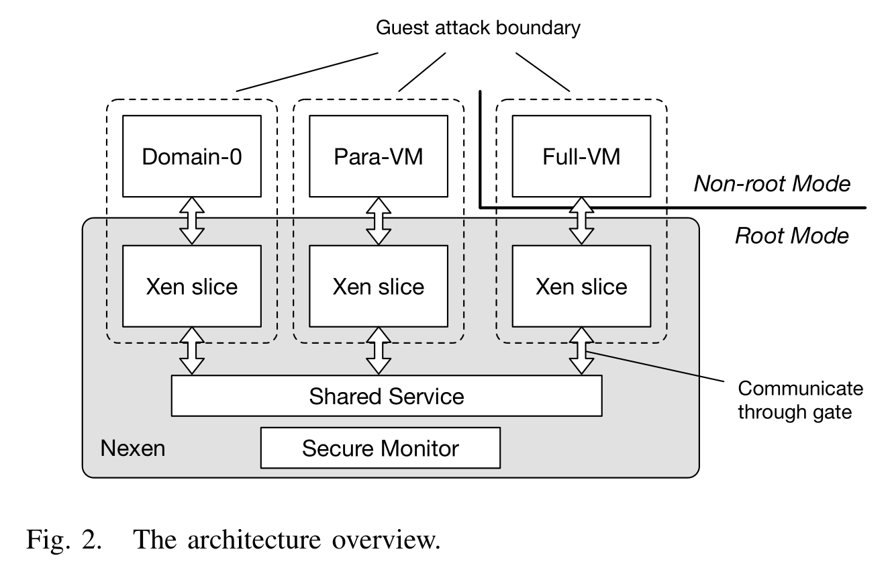
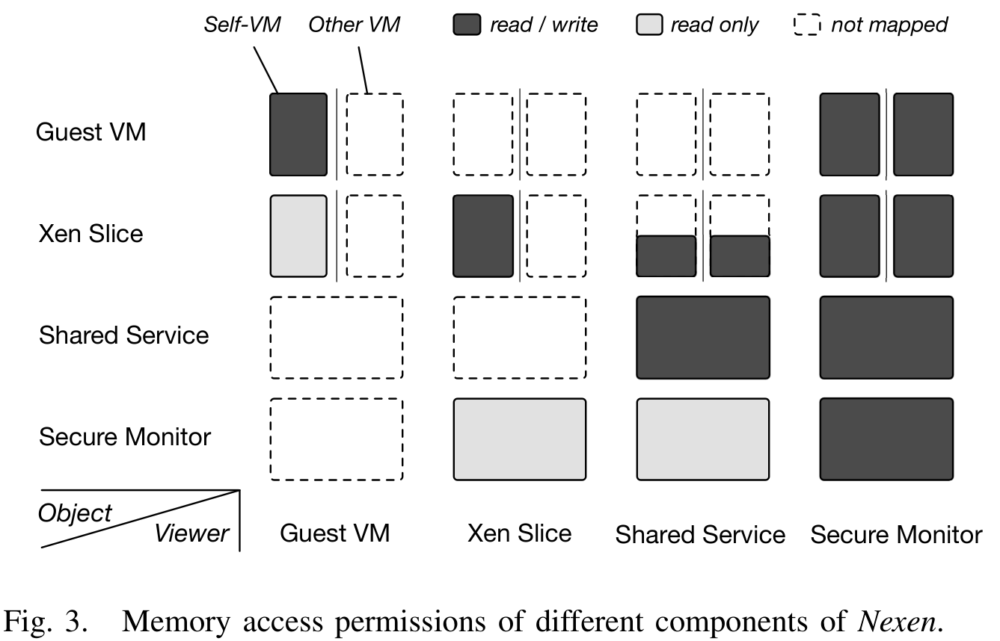
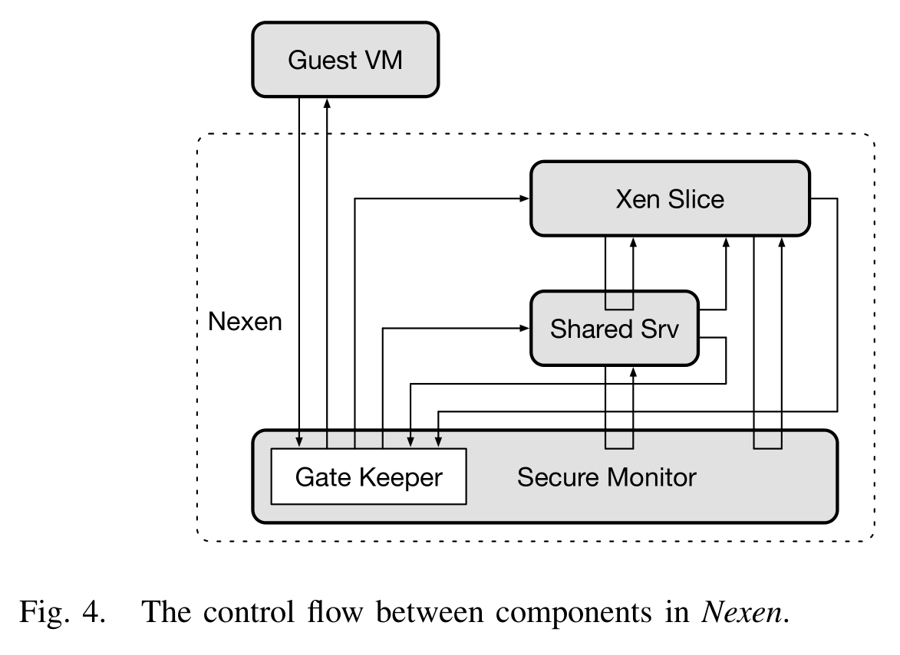
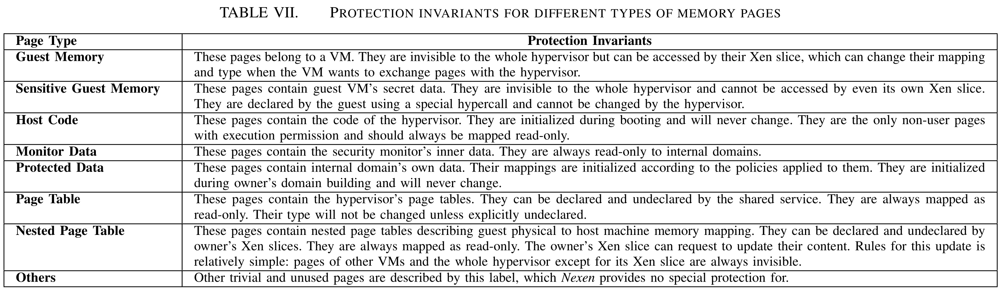
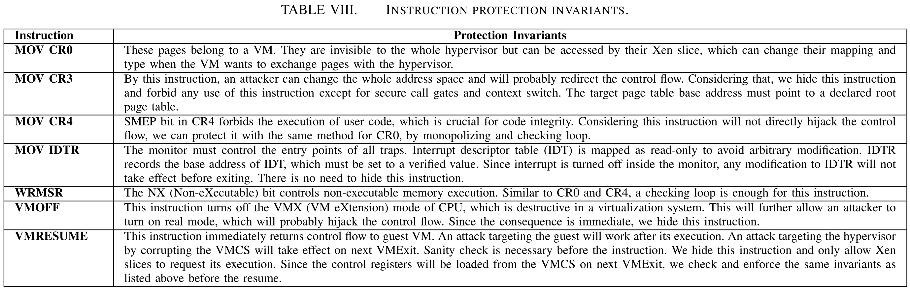

# Deconstructing Xen

[pdf]([NDSS%202017]%20Deconstructing%20Xen.pdf)

通过对 Xen 已有漏洞的分析，提出解构方法 Nexen，将 Xen 分为一个安全监控器、一个共享服务域和 per-VM 分片。Nexen 实现并扩展了嵌套内核。

## Introduction

Nexen 对 Xen 的新型解构和重组，分离并限制 hypervisor 操作。遵循最小特权原则，将 Xen 划分为一个特权的安全监控器、一个共享服务域和多个 per-VM 分片。

Nexen 通过同特权级内存隔离实现高效划分。参考嵌套内核架构构建安全监控器，隔离和控制 MMU。同时扩展了嵌套内核，提供安全私有内存分配器、多分片支持、安全控制流转换和数据控制。分片就类似于轻量级进程。

## Design

Nexen 的首要目标是对 Xen 安全增强，而挑战是 Xen 已经运行在系统最高特权级。Nexen 的关键思想是将 Xen 在一个硬件特权级内分离出遵循最小权限原则的保护域。

### Nexen Overview

Nexen 架构如下图。所有域都运行在系统最高特权级 Root ring 0，核心挑战是防篡改保护机制。方法就是利用嵌套内核架构，控制所有 MMU 更新以隔离出安全监控器。

然后要考虑的问题就是如何设计有价值的 Xen 解构。将 Xen 拆分为 per-VM 分片，分片沙箱化，与其他组件分离。分片共享代码而数据隔离。

然而如果要把所有功能都分离到分片会导致频繁的跨特权边界交互，带来较高性能开销。为此，创建一个稍高特权级的共享服务域。关键是决定将哪些功能划分到 per-VM 分片和共享域中。

Xen 分片和共享域都不属于系统 TCB。

### Isolating the Monitor

监控器是 Nexen 中最基本的元素。监控器需要在不带来较大开销或对 Xen 有较大改动的前提下实现防篡改。

嵌套 MMU 虚拟化（嵌套内核）：

- 监控所有虚拟到物理映射的修改，将所有到页表页（PTP）的映射配置为只读。
- 显式地从非特权组件删除 MMU 修改相关指令，控制分页的 CR0、控制地址空间的 CR3。
  - 将类似操作的实例从非特权的 Xen 代码中删除
  - 通过二进制扫描确保不存在相关指令
  - 通过控制页表确保无法注入代码

将 MMU 控制限制到监控器，显著减小了内存管理和隔离服务的 TCB。

### Intra-Domain Slicing

Nexen 扩展监控器，提供一组列安全创建、管理和允许域间交互的基础功能。

支持两种内部域，全局的共享服务域和 per-VM 分片。调度和域管理相关的组件放在共享域，而只与一个 VM 相关的功能如代码仿真和 nPT 管理放在分片。

为共享域提供 API 以管理分片，接口仅向共享域开放以创建新域。使用内存映射隔离，每个域都有自己的地址空间。

Nexen 中的内存访问权限如下图。其中，监控器与所有内部域共享地址空间。共享域和分片有自己的地址空间，共享域有自己的代码和数据，分片之间共享代码而数据隔离。

特权指令是指可能违反内存访问策略的指令。Nexen 限制内部域可执行的指令集，内部域无法直接执行特权指令，只能请求监控器服务。监控器会执行检查阻止未授权的指令滥用。

为支持域间交互，Nexen 提供调用门。调用门有以下特性：

- 不可绕过
- 不可伪造：调用门与返回地址绑定
- 原子性

有一小块代码称为 gate keeper 控制 VM Exit 和 VM Entry。负责分发 VM Exit 处理，并在 VM Entry 时检查 VM 状态。共享域负责分发和处理中断。

### Decomposing into Slices

解构策略是应用最小特权原则，最小化每个域的权限，最小化跨域交互。还要根据漏洞分析结果，将最可能被攻击的功能放入 per-VM 分片。

解构三原则：

- 避免将危险功能放入共享域
- 避免运行时通信
- 将机制与策略分离：复杂操作可由不可信代码处理，而最后的安全敏感操作必须由可信代码执行

重要组件决定：

- 调度器、内存管理和事件通道等全部或部分放到共享域。
- 代码仿真和 I/O 等复杂且易出漏洞的组件划分到分片。
- 调度器
  - 不与 guest 交互，VM 间共享，放到共享域。
  - 提供 API 供分片让出、休眠和唤醒 vCPU。
- 事件通道
  - 每个 VM 有自己的事件桶，放到 per-VM 分片。
  - 跨 VM 事件由共享域以开放接口的形式代理。
- 内存管理
  - 内存分配器，用于启动和创建域，放入共享域。
  - 内存映射更新，分配管理其对应 VM 的内存映射更新，做出更新决定后，向监控器请求更新
- 代码仿真和 I/O
  - 分片可访问对应 vCPU 状态

共享服务域内容：

- 调度器
- 内存分配器
- 中断处理
- 创建域
- 事件传递

## Nexen Implementation

在 x86 的 Xen 上实现 Nexen 原型。

三个主要挑战：

- 执行域间隔离和内存访问策略
- 控制特权指令
- 监控 hypervisor 和 VM 间的交互

### Isolation between Internal Domains

基于内存映射的隔离机制，介入内存映射更新，执行一系列不变量。

- 控制内存映射更新：设置 PTPs 只读，启用 WP，禁用中断，内部域中所有内存映射更新操作都替换为调用监控器接口。
- 执行内存不变量：映射更新前，监控器进行安全检查以执行不变量。不变量基于内存页类型和所有者。

- 执行内存隔离策略：监控器内部的分配器，指定多种策略。
- 安全调用门：关中断保证原子性，检查函数返回地址，所有门都放在固定地址。

### Confining Privileged Instructions

控制敏感指令执行，两种方法降权：独占和隐藏。

独占的指令只有监控器代码内的一个实例，指令仍对内部域可见，攻击者可能劫持控制流直接跳转到指令执行，如果指令的不良后果不是执行后立刻发生，那么监控器可以通过安全检查弥补滥用。

隐藏是在独占的基础上，将指令取消映射。只有需要使用操作并通过安全检查时，才会映射页。 执行后，指令会被立刻取消映射避免滥用。如果指令执行会立刻禁用隔离而且控制流不流向监控器，那么指令就应该隐藏。

通过二进制扫描确保指令不存在于非预期的代码区域。通过完整性保护阻止生成新的特权指令。同时避免用户代码执行。

### Interposition between VM and Xen

监控器以 gate keeper 的身份介入 VM 和 hypervisor 之间的所有交互。

VM 陷入时，会先陷入到监控器。由监控器检查陷入原因，分发事件到适当的内部域。处理完成后，要返回到监控器才能恢复 VM 执行。

如果陷入处理函数需要访问虚拟机数据作为辅助信息，需要调用监控器接口。
