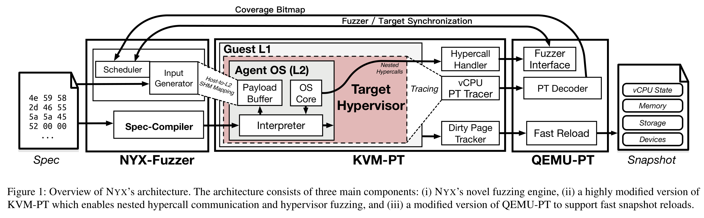
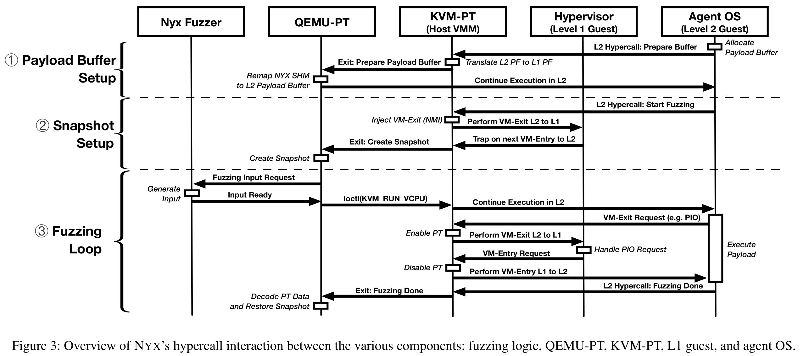
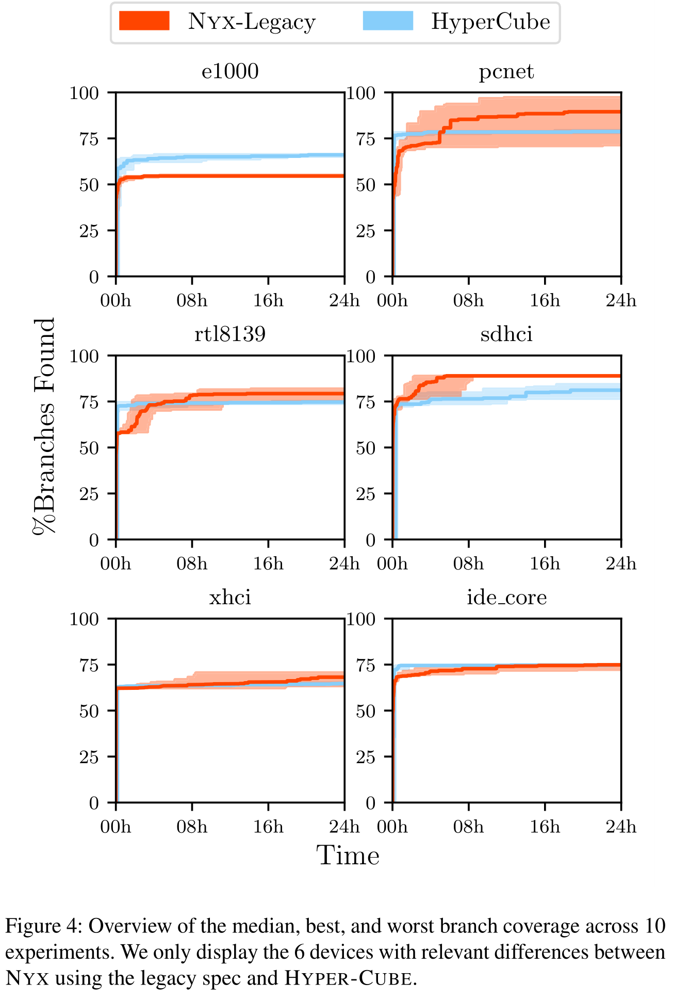
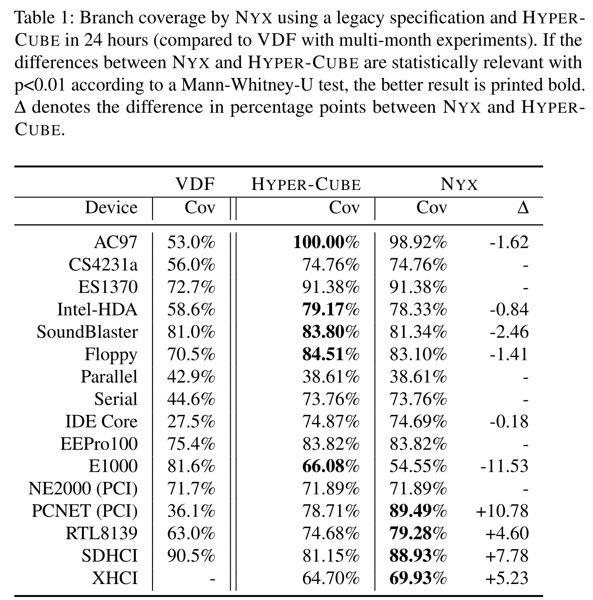
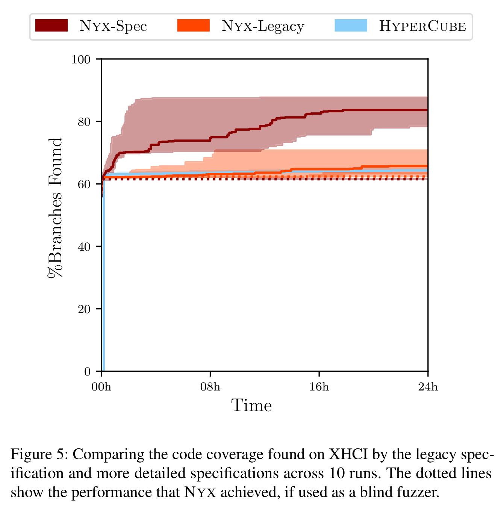

# NYX: Greybox Hypervisor Fuzzing using Fast Snapshots and Affine Types

[pdf]([USENIX%202021]%20Nyx%20Greybox%20Hypervisor%20Fuzzing%20using%20Fast%20Snapshots%20and%20Affine%20Types.pdf)

NYX 是一个高度优化、覆盖率指导的 hypervisor fuzzer。快速快照恢复机制，每秒重载目标系统数千次。基于自定义字节码程序的突变引擎，编码为有向无环图 DAG 和仿射类型，提供表达复杂交互所需的灵活性。测试表明，虽然 NYX 吞吐量低于最先进的 fuzzer，在简单目标上，几分钟就可以实现相同的测试覆盖率，在复杂设备上，显著胜过现有工作。发现了 44 个新漏洞，22 个 CVE。结果表明，覆盖率指导是有价值的，即使是盲测。

## Introduction

之前的 hypervisor fuzzer 有 VDF 和 HyperCube，前者将 QEMU 设备驱动隔离到可被 AFL fuzzing 的 harness 中，而后者仅是盲测，不使用覆盖率反馈。然而，后者却优于 VDF，主要是因为 VDF 中的设备仿真太慢。盲测对吞吐量的增加超过了覆盖率反馈的优势。

现有的 fuzzer 要么将 hyperviosr 代码隔离到独立的 ring-3 程序（harness）中，以获得代码覆盖反馈，或者根本不适用覆盖率反馈指导。前者无法扩展到不同的 hypervisor 实现，同时也可能引入漏洞误报，甚至漏报。为此，必须小心地重现设备仿真器的原始环境。此外，这种方法还无法测试难以被提取出来的组件。对于后者，如果给定预期行为的精确生成器，盲测是很有效的。但是，无法发现复杂的设备和接口中的有趣（安全关键的）行为。因此需要使用覆盖率指导 fuzzing。覆盖率指导可以大幅提升找漏洞的能力。

本文提出的 NYX，是一个覆盖率指导的 hypervisor（实际可以是任何 x86 软件）fuzzer。在复杂设备上显著优于 HyperCube，实验表明，即使覆盖率指导的吞吐量降低，仍在盲测基础上有显著提升。

不依赖手动创建的 harness 而实施覆盖率指导的 hypervisor fuzzing 引入一系列挑战。通常很难用自定义编译器编译所有组件以获得代码覆盖率。此外，即使存在内存损坏和崩溃，也需要能运行目标。最后，需要与各种接口交互。

为了处理崩溃并有效执行自省，使用嵌套虚拟化，多个组件同时运行：host OS + host hypervisor，guest OS + target hypervisor，agent OS。涉及三个 OS 和两个 hypervisor，每个组件都有大量状态和不确定行为，引入复杂性相关问题。

为应对以上挑战，文章提出了基于现有的两个 fuzzing 项目特性的新设计。使用 Intel PT 获取 host hypervisor 中运行的代码的覆盖率，类似 KAFL。此外，还使用了修改后的 HyperCube 自定义 OS 运行在目标 hypervisor 中。基于此，构造了覆盖率引导的 NYX，有两个主要特性。首先，为处理复杂系统中的固有状态和不确定性，开发了快速快照恢复机制，每秒可以恢复数千次 host hypervisor 中的 VM 映像。其次，为了生成多种接口的有效输入，设计了使用用户提供的规范的突变引擎。突变引擎生成的输入可以有效地表达高度有害的多重交互测试剧本。这些输入都是自定义字节码程序，编码为有向无环图 DAG，用户可以向 fuzzer 提供描述字节码语义和生成图形状的规范。此外，使用仿射类型的概念，确保每个值最多使用以此。允许规范正确处理在测试期间释放和关闭资源的情况。这种高度灵活的方法，使得 fuzzer 可以适用于多个目标。首先为仿真设备实现通用 fuzzing 规范，为展示方法的强度和灵活性，还为更复杂的设备构建了更精确的规范，甚至证明可以针对 VirtIO 设备。

实验表明，NYX 始终优于覆盖率指导和盲测的最先进工作。评估过程中，在已经由最先进 fuzzer 测试过的 hypervisor 中又找到了 44 个新漏洞.

三个主要贡献：

- 设计并实现 NYX，一个覆盖率引导的全系统 hypervisor fuzzing 工具。
- 展示了高度优化的完整虚拟机重载机制，每秒重载整个虚拟机映像数千次显著加速 fuzzing。
- 介绍了仿射类型的结构化突变引擎概念，展示这种突变的优点和灵活性。

## Technical Background

### Challenges for Fuzzing Hypervisors

Hypervisor 运行在高特权级，难以获取代码覆盖率信息以及处理崩溃。此外，hypervisor 是高度有状态的，因为它保留了每个 guest VM、其本身和模拟硬件的所有状态，fuzzing 过程很难隔离单个输入的效果，之前的测试用例会影响后续的测试用例结果。Fuzzer 需要确保硬件状态不受先前测试用例的影响。最后，hypervisor 提供各种不同接口进行交互，其中一些需要 guest 在内存中设置复杂的数据结构。现有的通用 fuzzer 旨在针对使用单个二进制字符串的程序。下面一一讨论这些挑战。

#### Code Coverage and Handling Crashes

对于高特权级代码，fuzzer 通常利用虚拟化创建隔离的外部控制环境。如 kAFL，使用修改过的 hypervisor（KVM-PT），跟踪 VM 内部允许的代码。使用 QEMU-PT，利用硬件辅助跟踪特性（如 Intel PT）来跟踪执行并获取覆盖率信息。这种 fuzzer 可以完全控制 VM 及其内部运行的任何代码，因此也可以处理组件的崩溃。而如果要 fuzz hyervisor，就需要嵌套虚拟化，Intel VMX 或 AMD SVM 硬件都未提供嵌套虚拟化，需要软件实现。

KVM 中的嵌套虚拟化是通过仿真实现的，hypervisor 拦截所有 VMX 指令并在 L0 模拟。嵌套 guest 的开销较大，通过多种技术加速，NYX 使用 KVM 作为 host hypervisor。

#### Fuzzing Stateful Applications

很多应用都是有状态的，测试用例的执行并不独立。Hypervisor 的上下文中的大量状态存储在仿真设备中，且通常与仿真设备的行为相关。对于可重复的测试用例，需要在执行开始是控制 hypervisor 的完整状态。以往的工作，大多数盲测 fuzzer 会启动到受控状态，然后执行单个较长测试用例，但不适用于覆盖率引导的 fuzzer。有些 fuzzer 可能会因为禁用设备而卡住，之后的交互无法进行。VDF 在 ring-3 的 QEMU 中测试小部分 hypervisor，通过重启重置设备状态，但这明显不适用于 hypervisor 的大型攻击面。

本文使用另一种方法，为整个 VM 实现类似 fork 的机制。有诸多有点，独立于目标工作，适用于用户空间程序、内核组件以及嵌套的 hypervisor。另外，重置 VM 也就重置了仿真设备。

#### Fuzzing Interactive Interfaces

大多数 fuzzer 为目标应用程序提供了一个非结构化字节数组，这种方法比较适合文件格式解析器或类似程序。而并不适用于遵循某种输入模式的交互程序。Hypervisor 支持多种不同的可交互接口，每个都有不同格式。类似地，大多数内核通过 syscall 和 ioctl 等接口提供了大量不同的交互点。即使是普通的 ring-3 程序，也需要复杂的输入格式。

考虑一个简单的 API，先创建资源，然后执行任意数量操作，最后释放资源，之后不得使用。大多数交互接口都有类似的模式。如果 fuzzer 生成的输入会释放不存在的对象，或访问尚未创建的对象，则大多数输入都无效，生成和运行的时间都浪费了，甚至还可能导致误报崩溃。为此，fuzzer 应该在输入生成过程中了解创建、使用和销毁资源的时间关系。

基于语法的 fuzzer 使用上下文无关文法来近似描述有这种关系的输入。然而，无法表达时间属性（如创建、使用、删除、不再使用的约束）。上下文无关文法只能产生树形数据结构，而多个交互的数据流根本上创建了有向无环图。另一个例子是 SYZKALLER，通过系统调用 fuzz 内核。但通常是为了特定用例设计的格式规范，不能表示时间属性。

### Affine Types

无法表达之后不重用以关闭的资源在某些情况下会导致误报崩溃。NYX 通过仿射类型解决这个问题，仿射类型系统可确保每个值最多使用一次，引起可以确保资源关闭后不会被重用。

本文设计了一种基于仿射类型的新形势，允许针对多功能性来表达各种类型的约束。每个操作码代表一个函数调用，可以接受任意数量的参数并返回任意数量值。参数可以使用也可以借用。一旦一个值被使用，fuzzer 确保它不会在未来的操作码中使用。因此可以有效地指定仿射类型函数调用序列。类似于 Rust 的 move 和 borrow 语义。这种方法指示告诉我们应该避免哪些选项，可以大幅缩小搜索范围，以实现更大的覆盖范围，更快地找到错误。

## Design

下面介绍 NYX 的设计和背后的原理。从一个 hypervisor 安全的非正式威胁模型开始，并基于此描述 fuzzing 方法。

威胁模型：要攻击其他用户的 VM，攻击者要做的就是从自己的 VM 中逃逸到 hypervisor。一旦获得 hypervisor 特权，攻击者就可以完全控制在同一物理主机上运行的所有其他 VM。假设攻击者运行自己的内核，并试图利用 hypervisor 中的软件漏洞。

### Architecture Overview

为了高效找 hypervisor 漏洞，需要解决许多当前的 fuzzer 无法解决的挑战。需要一种方法探索多个交互的复杂接口，同时维护一个确定性和受控的环境以便观测覆盖率。基础架构是基于虚拟机自省 VMI 的 fuzzer，使用与 HyperCube 类似的自定义操作系统作为代理组件。使用多种技术使覆盖率引导 fuzzing 适用于高度交互的目标。NYX 架构如下图。

### High Performance, Coverage-Guided Fuzzing

广义上，有两种方法可以获取执行反馈引导的覆盖率信息：编译时插桩和仅基于二进制的方法。NYX 使用二进制覆盖率跟踪，因为要 fuzz 特权模式代码，常用选项如动态二进制插桩也被排除，因此选择使用基于 Intel PT 的硬件跟踪方式获取覆盖率信息。

为了在特权模式从崩溃恢复，将目标软件运行在 KVM VM 中，fuzzer 在 VM 外部，可以在 VM 崩溃后恢复到之前的状态。此外，目标 hypervisor 和 OS 都维护了大量状态，会产生非常大的覆盖率跟踪噪声。为此，扩展了 QEMU-PT 和 KVM-PT，执行快速 VM 重载，完整地恢复模拟硬件的状态，包括所有设备状态。

KVM 通过使用硬件加速机制 Page Modification Logging, PML 高效地确认哪些页需要重置。维护了一个原始状态的完整拷贝和一个脏页跟踪器，每次只快速地重置脏页。类似地，规避 QEMU-PT 中一般性设备加载代码以加速设备状态重置。由此，克服了大多数不确定性问题。最后，修改了 HyperCube 中自定义 OS，在目标 hypervisor 中运行一个 agent，与使用 hypercall 绕过目标 hypervisor 直接通过 KVM-PT 而与 fuzzer 通信。

为 L2 VM 提供直接到 KVM-PT 的 hypercall，根据嵌套虚拟化实现，hypercall 先传给 KVM-PT，然后在转发到目标 hypervisor。因此可以让一些特殊的 hypercall 不转发给目标 hypervisor。此外，fuzzer 和 agent 通过共享内存传递输入。

### Generic Fuzzing of Interactive Targets

Fuzzing agent 使用字节码作为输入，字节码描述了与目标 hypervisor 的交互操作。使用用户提供的规范描述字节码格式，类似基于语法的 fuzzer，相比之下字节码规范有效，可以恰当地引用现有的和初始化的变量。类似的设计已被用在 js fuzzer 上。此外，开发了一个更通用的描述机制，而不是高度专业化的格式。允许表达类型和时间使用模式。因此 NYX 也可直接用于其他目标，如内核或 ring-3 程序。

为允许交互系统的通用 fuzzing，为用户提供了一个简单的机制来描述语法。目标是尽可能通用，建立一个像上下文无关文法一样通用的机制。具体来说，要表达带有与时间相关的创建、删除、不再重用等约束的交互。使用自定义编译器，从字节码规范生成 C 代码。每个输入用一个 DAG 表示，每个节点是一个函数调用，每条边函数返回并传递给下一个函数的值。参数分传值和传引用，前者要确保不会被其他节点使用。每个函数还会有一个额外的 data 参数，包含任意树状数据结构。Fuzzing 过程中，会突变树状 data（其结构由规范描述），fuzzer 不会修改或使用边生成的值。

## Implementation Details

实现细节，后端包括获取覆盖率信息、提供快速快照重载以及协助 fuzzer 和 agent 通信，前端包括生成和突变仿射类型字节码程序。

### Backend Implementation

快速覆盖率，基于 Intel-PT。

需要重载 VM 的三个组件：vCPU、内存、QEMU 模拟设备（包括磁盘）。

快速内存重置：增量快照，agent 在测试开始时通过 hypercall 通知 fuzzer 创建快照。在 KVM-PT 中实现脏页记录，KVM 自带的脏页需要遍历位图，扩展为记录直接记录地址以加速恢复过程。同时，被设备修改的内存也要重置，所以也要在 QEMU-PT 中记录。

快速设备重置：重置设备状态更复杂，QEMU 管理各种设备，为每个设备提供了序列化（转换成 json）和反序列化机制，用于保存运行时 VM 的快照。每个设备模拟器以特定数据结构提供其状态规范。QEMU 迭代数据结构识别字段、整数、数组等。QEMU 的设备快照和恢复比较慢，因为要确保快照可以在不同机器上加载。为提升性能，NYX 忽略设备结构规范，而是记录执行过程中的所有写入，得到设备使用的内存列表。以此可以重置设备内存。一些设备需要在重置后执行自定义代码，对于这些设备需要调用原始的反序列化例程。要注意的是，直通的设备不可能重置。

快速磁盘重置：QEMU 对磁盘的处理不同于其他设备。磁盘存在 qcow 文件中，为了处理对磁盘的写入，在 QEMU 的 qcow 处理之上新增了一层。执行过程中使用 hashmap 存储修改过的扇区内容。读磁盘时先检索 hashmap，再去 qcow 检索。对一个测试用例能写入的扇区设置上限。重置磁盘就是清空 hashmap。

嵌套虚拟化通信，首先是 hypercall。通过 VMCALL 时的 RAX 值判断此 hypercall 是由 KVM-PT 还是目标 hypervisor 处理。然后要设置 fuzzer 和 agent 之间的共享内存，首先在 L2 中分配，然后通过 hypercall 将分配的物理地址传递给 KVM-PT。KVM-PT 将 L2 gPA 转换为 QEMU-PT 的 hVA，然后创建共享内存映射。过程如下图中 1，这段共享内存就用于后续通信和传递生成的输入。在 fuzzing 开始前，agent 还要发送 hypercall 通知创建快照。KVM-PT 处理这个 hypercall，然后在下次 VM Entry 恢复到 agent 之前由 QEMU-PT 创建快照，过程如下图中 2。Fuzzer 生成新输入后，恢复快照，继续执行 L2 的 agent，每次从 L2 陷入到 L1 时就开启 Intel PT 记录目标 hypervisor 的控制流，过程如下图中 3。

### Frontend

前端用于生产候选输入并传递给 agent。使用 Rust 实现，专门设计用于生产和更改字节码输入。

## Evaluation

关注以下几个问题：

1. NYX 与最先进的方法的比较，HyperCube、VDF
2. 覆盖率引导能否提升生成式 fuzzing 效果
3. 结构化突变引擎带来多少性能提升
4. 快速重载对性能的影响
5. NYX 能否找到未知漏洞

NYX-Legacy，使用与 HyperCube 操作类似的规范。覆盖率显著优于 VDF，对于简单设备，与 HyperCube 类似，耗时更短。对于复杂设备，覆盖率指导的优势显现出来，NYX 显著优于 HyperCube。

NYX-Spec，研究 Intel XHCI 标准，为设备构建规范，显著提升性能。同时还测试了带有规范的非覆盖率指导的 NYX 的效果，发现没有覆盖率指导，效果极度下降。

量化快速 VM 重载对性能的影响，通过 fuzz 一个简单的 ring-3 程序测试效率。与 AFL-Fork 比较，随着脏页数量增加，性能差距缩小，远快于 QEMU 默认的快照恢复。

## Discussion

NYX 再次证明了覆盖率指导 hypervisor fuzzing 可行性。现有的 fuzzer 需要面对诸多挑战：获取特权代码的覆盖率、快速重载以应对不确定性、输入的交互性质。

创建规范中工作量最大的是理解复杂的设备规范。

## Conclusion

NYX 其实是一个通用的 fuzzer，快速 VM 重载和交互式的结构化 fuzzing 对现有的 fuzzer 都适用。虽然盲测吞吐量更高，但是很难充分测试。