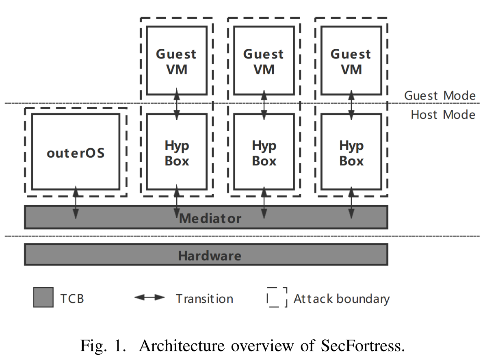
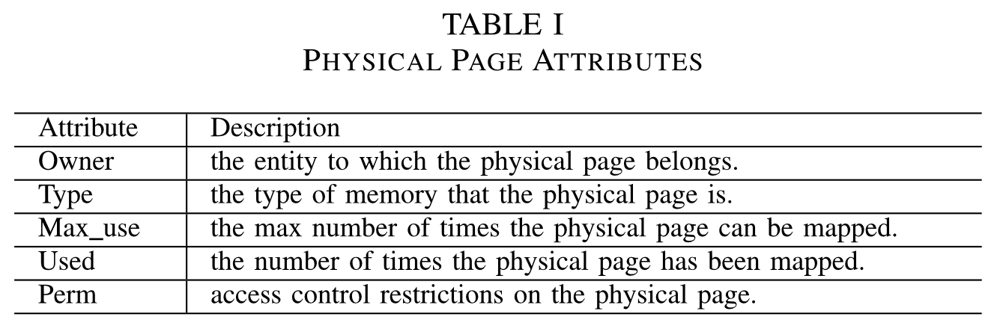
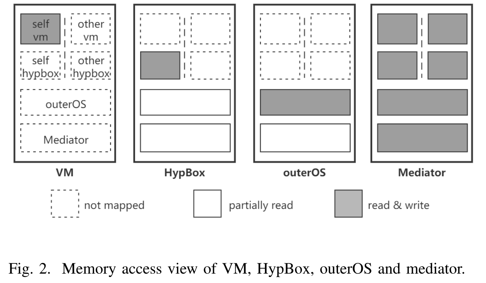
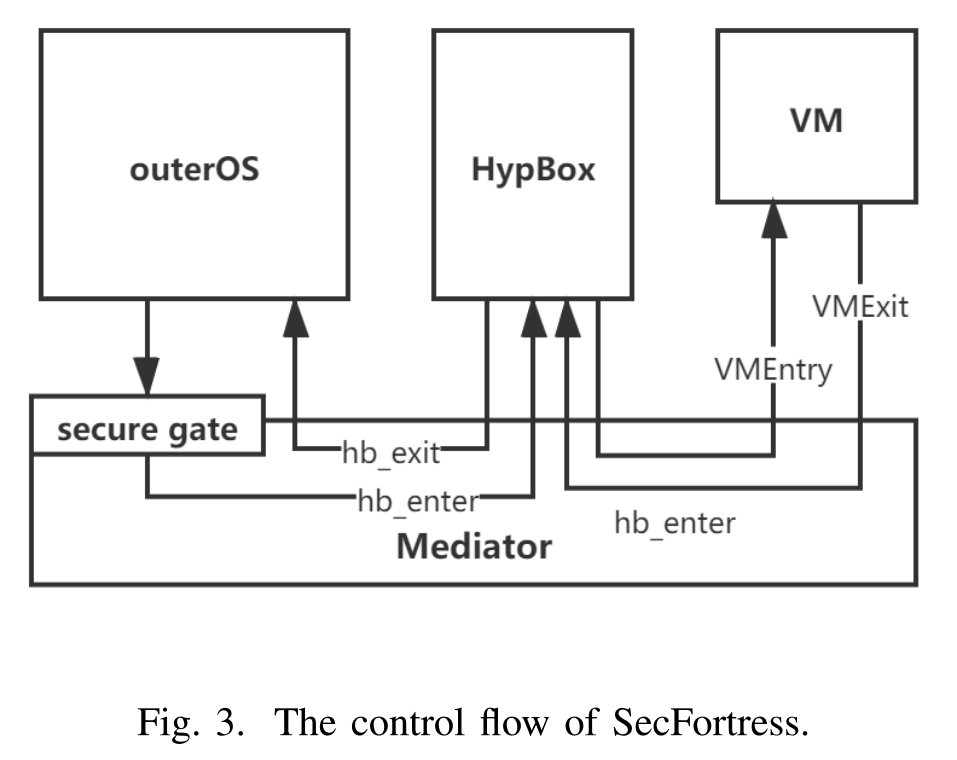
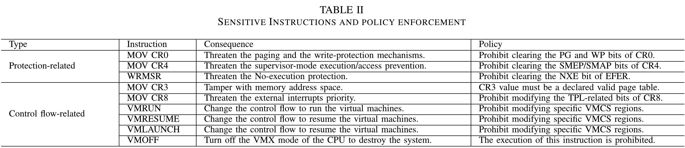
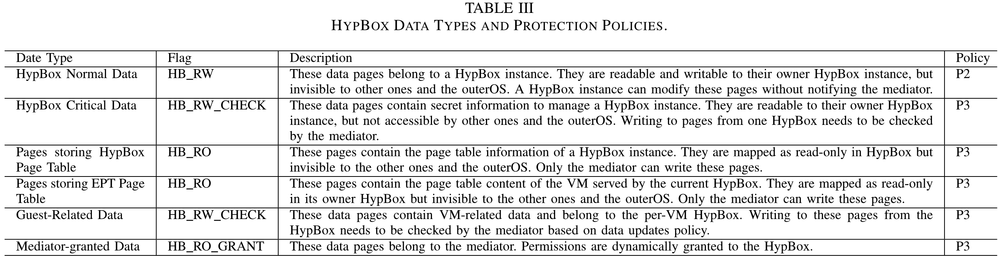

[toc]

# SecFortress: Securing Hypervisor using Cross-layer Isolation

保护 hypervisor 面临挑战，两点原因：hypervisor 通常被整合到特权的 OS 中，带来较大的攻击面；多个虚拟机共享一个 hypervisor。可靠的 hypervisor 设计 Secfortress，通过跨层隔离方法，将虚拟化层解耦为一个 mediator，一个 outerOS 和多个 HypBox。扩展了 nested kernel 方法，使 outerOS 无法访问 mediator 的内存，并创建独立的 hypervisor 实例 HypBox，限制不可信的 VM 的影响。

## Introduction

现有解决两个问题的方法是增强和隔离。前者通过 CFI、最小化和分解 hypervisor，但存在两个局限：不能彻底消除漏洞、以及移除基本功能后不可用。后者则利用隔离或加密内存来剥夺 hypervisor 管理虚拟机资源的权限，如嵌套虚拟化、基于 TEE、加密 VM。而隔离通常涉及额外的 VM Exit 或内存上下文切换，导致显著的性能开销。

SecFortress 是一个基于最小特权原则的跨层隔离机制，显著缩小了虚拟化平台的 TCB。具体来说，将虚拟化层分为小的特权 mediator（TCB）、大的 outerOS 和多个 HypBox 实例。Mediator 是一个防篡改、隔离的上下文，负责控制系统资源和 MMU，以介入所有内存映射更新，确保 outerOS 和 HypBox 之间的强隔离。Mediator 通过添加安全服务（内存保护、指令保护和控制流保护）扩展 nested kernel。为每个 VM 创建一个分离的 hypervisor 实例 HypBox，通过 mediator 限制其操作。每个 HypBox 包含当前实例的私有数据和复制的 hypervisor 代码。Mediator 通过监控所有内存操作来控制每个 HypBox 的内存布局。

## Overview

同时考虑来自 host 和 guest 的攻击，设计可靠的跨层隔离机制。

### Threat Model

假定攻击者通过漏洞利用控制 host OS，劫持 hypervisor 控制流以破坏 VM 机密性和完整性。攻击者可以部署恶意 VM 攻击 hypervisor 或 host OS。攻击者还可以完全控制正常 VM 中的应用。假设云提供商可信，虚拟化平台在启动时可信，但在运行过程中可能被攻破。

### System Overview

SecFortress 架构如上图，将虚拟化层划分为 mediator、outerOS 和多个 HypBox，将虚拟化平台的 TCB 最小化为硬件和 mediator（2K LOC）。Mediator 通过虚拟 MMU 机制与 outerOS 隔离。通过内存访问控制和显示地指令执行控制，阻止 outerOS 访问 hypervisor 内存或篡改控制流。所有 HypBox 共享相同的代码，但每个都有自己的私有数据，实现隔离机制限制 HypBox 实例的控制流，通过策略限制内存访问。

## Design

首先通过创建隔离的 mediator 将宏内核的 outerOS 移出 TCB，然后使用 mediator 部署 outerOS 与 HypBox 之间，各个 HypBox 之间的跨层隔离机制。

### Mediator

#### 防篡改保护

通用的方法是将 mediator 放在硬件或软件附加的抽象层运行，但通常会带来较高的性能开销。为此，使用 nested MMU（nested kernel），通过虚拟化 MMU 创建内存保护域，在相同特权级监控系统内所有内存映射更新。同时，nested MMU 显式地从非 TCB 组件中删除所有可能修改 MMU 的指令。

SecFortress 在系统初始化阶段将所有内核**页表页**配置为只读，并开启 CPU 的**写保护 WP** 机制。每次 outerOS 要更新内核页表页时，会触发 WP 错误陷入到 mediator，并执行基于预定义策略的安全检查。此外，所有可以访问 MMU 的操作必须由 mediator 独占，包括对页表和分页机制的修改。SecFortress 将这些操作的所有实例从 outerOS 移除，不论是否对齐指令边界。因为 mediator 控制所有页表更新，所以可以阻止代码注入和数据执行。

!!! info

    From AMD Manual Vol2 5.6.4: 
    
    A **page-fault exception (#PF)** occurs if software attempts to write (at any privilege level) into a readonly page while write protection is enabled.

将 MMU 控制限制在 mediator 中可以显著缩小虚拟化层的 TCB，在此基础上，mediator 提供一系列的安全服务，用于跨层隔离。

#### 安全服务

Mediator 通过三个安全服务为跨层隔离提供支持：内存保护、指令保护和强制控制流。

**内存保护** Mediator 通过控制 MMU 监控所有组件的内存布局，提供安全内存分配、内存访问控制和内存更新控制以保护私有数据。

安全内存分配：mediator 内部的分配器负责分配受保护数据，同时分配一个内部内存池用于记录每个已分配或可用内存的物理页属性。下表展示了根据策略用于控制内存访问和更新的属性。

内存访问控制：下图展示了 SecFortress 中每个组件的内存视图。

内存更新控制：内存映射和敏感数据更新。当 outerOS 向更新其页表时，需要显示地通过安全调用门进入 mediator。Mediator 根据内存池中的属性信息决定此次更新是否有效。如 outerOS 要更新页表，仅当目标页表页为末级页表，且此页已被分配给 outerOS 时才会生效，同时还要检查标志位。对于敏感数据更新，仅动态数据才能修改，mediator 也要检查页属性。

**指令保护** 两类指令：保护相关和控制流相关。前者用于启用或禁用保护机制，后者可能会劫持控制流或切换上下文。将这些指令作为敏感指令，禁止在 mediator 外执行，通过指令检查、取消映射和指令硬编码的方式限制。

指令检查：在执行保护相关的指令之后，根据策略执行检查（sanity check），检查特定标志位是否启用。

取消映射：利用动态指令映射方法，在指令执行前映射，并在执行后取消映射。具体地，mediator 为每条指令分配一个内部 4K 页，并确保每条指令在物理页上只有一个实例。映射指令之前，会检查保护机制和参数（如在映射 MOV CR3 之前，要检查参数是否是有效的页表基地址）。

指令硬编码：强制非 TCB 组件中所有指令调用的入口点进行硬编码，在系统启动期间确定调用这些指令的地址。使用二进制扫描器确保在非预期的代码区域没有此类指令。

**强制控制流** 组件需要更新内存映射、修改敏感数据或执行敏感指令时，必须先切换到 mediator。而 mediator 为切换提供了安全门。首先关中断，然后关闭 WP，还会切换到安全栈上执行，执行完相关操作后，重新启用 WP 后返回到原上下文。非 TCB 组件中所有调用安全门的地址都要显式地硬编码，并在启动阶段加载，使非 TCB 组件只能通过门进入 mediator。

#### 策略执行

Mediator 规定了一些策略来执行指令和内存保护。

下表为 mediator 为敏感指令指定的策略，在指令执行后，根据策略执行检查（sanity check），确保指令未被滥用。

根据不同的安全要求，对某个内存页，有以下四个等级的内存保护策略：

1. 非 TCB 组件的所有者可读可写，在其他非 TCB 组件中映射为只读。
2. 非 TCB 组件的所有者可读可写，不映射到其他非 TCB 组件。
3. 非 TCB 组件的所有者可读，不映射到其他非 TCB 组件。
4. 不映射到所有非 TCB 组件。

此外，所有代码段页都开启写保护，所有数据页都不可执行。

### Cross-layer Isolation

#### OuterOS 和 HypBox 之间的隔离

每个 HypBox 实例都有自己的页表，独立的地址空间。下表展示了 HypBox 的六种数据类型，每种通过不同的策略保护。HypBox 申请内存分配时可以指定类型。

所有敏感指令实例都从 outerOS 中移除，保护相关指令通过指令检查，控制流相关指令通过取消映射。

VM Exit 会进入 mediator，然后传输到相关的 HypBox。如果需要访问物理资源或 outerOS 的功能，HypBox 调用 mediator 接口，再将事件传输到 outerOS。返回时，outerOS 先调用安全门回到 mediator，验证结果后才切换回 HypBox。

#### HypBox 实例之间的隔离

每个 HypBox 可以完全访问自己的内存，不能访问其他实例的。在 HypBox 的地址空间强制执行 W^X。

## Implementation

### HypBox Management

Mediator 为 HypBox 安全管理提供三种接口：创建和销毁 HypBox 实例；上下文转换，用于进入和退出 HypBox；分配或释放 HypBox 内存。

### Components Isolation

SecFortress 通过内存访问控制和分页机制限制 outerOS 访问 HypBox。OuterOS 中负责管理物理内存的主页表为 `swapper_pg_dir`。SecFortress 将 `swapper_pg_dir` 相关的页在 outerOS 中映射为只读，设置 PTE.RW=0 且 CR0.WP=1。HypBox 申请的内存分配后，将从 `swapper_pg_dir` 中取消映射。

HypBox 在两种情况下需要切换到 outerOS。首先是 EPT violation，VM 运行过程中，当 EPT 中不存在 GPA-to-HPA 的映射时，会触发 EPT violation，陷入到 KVM。KVM 会将 GPA 转换为 HVA，然后在 host 页表中搜索 HVA-to-HPA 映射，如果不存在，则由 Linux Kernel 使用 `swapper_pg_dir` 处理 host page fault。而在 SecFortress 中，由 mediator 完成 host page fault 的处理。

另一种情况是处理设备 I/O。KVM 使用 QEMU 支持 I/O 虚拟化，SecFortress 使用陷入后模拟的方法处理 PIO 和 MMIO。为了安全的 DMA，mediator 控制 IOMMU，使用页属性跟踪 PCI 设备的物理页。

### Intervention between HypBox and VM

Mediator 介入 HypBox 和 VM 之间的控制流。VM 陷入时控制流转移到 mediator，由后者转发事件到特定的 HypBox。如果 HypBox 需要访问 VM 数据，会调用 mediator 检查权限。

## Security Analysis

### Against the Mediator

**代码篡改** 系统启动阶段，使用安全启动确保 mediator 完整性。启动后，mediator 度量系统代码的完整性，并将所有代码设置为写保护。此外，mediator 禁止为 outerOS 或 HypBox 映射新的可执行内存，以防御代码注入攻击。

**绕过保护** 敏感指令直接在非 TCB 组件中执行可能会绕过保护机制。为此，SecFortress 动态检查并将这些指令从非 TCB 组件中取消映射。对于 ROP 攻击，SecFortress 会在恶劣后果发生之前检查指令执行结果。此外，使用二进制扫描器确保在非预期代码段不存在 ROP gadget。

**DMA 攻击** SecFortress 通过控制 IOMMU 防止攻击者通过 DMA 访问敏感内存区域。

### Against Other Components

机密性：分离的页表；完整性：控制内存映射更新和内容访问权限。

