# SEIMI: Efficient and Secure SMAP-Enabled Intra-process Memory Isolation

[pdf]([S&P%202020]%20SEIMI%20Efficient%20and%20Secure%20SMAP-Enabled%20Intra-process%20Memory%20Isolation.pdf)

内存损坏攻击（如代码复用和仅数据攻击）的各种防御措施（如 CFI、CPI 和代码随机化）需要一个安全原语，提供进程内敏感数据（如 CFI 影子堆栈和 CPI 安全区）的机密性和完整性保护。本文提出的 SEIMI 是一种高效的进程内内存隔离技术，可用于保护进程内敏感数据。其核心是 Supervisor-mode Access Prevention, SMAP 硬件机制。SEIMI 创造性地在特权模式执行用户代码，还开发了多种技术确保用户代码的安全升级。实验表明，SEIMI 提供了安全的内存隔离，且性能优于现有的隔离机制，包括基于 MPK 和 MPX 的方案。

## Introduction

针对内存损坏攻击的防御措施，包括控制流完整性、代码指针完整性、细粒度代码随机化和数据布局随机化都需要一个安全原语：有效的进程内敏感数据机密性和完整性保护，免受可能被攻击的代码的危害。防御机制的有效性很大程度依赖于敏感数据的完整性和/或机密性。

信息隐藏 IH，将敏感数据分配到随机地址，安全性高度取决于随机化熵。基于地址的内存隔离，对每次访存做边界检查，Intel MPX。基于域的隔离，将敏感数据存放到受保护的内存区域，Intel MPK。现有方案开销较大。

SMAP-Enabled Intra-process Memory Isolation, SEIMI 高效的基于安全域的内存隔离。关键思想是在特权模式允许用户代码，将敏感数据存到用户空间。为了防止用户代码破坏内核并滥用特权资源，将用户代码放到 VMX non-root ring 0 中运行。类似于 Dune，但是它要求代码安全可信，而 SEIMI 为了支持运行不可信代码，将特权数据结构（如页表）保存在 VMX root 模式，同时设置过滤并使特权指令陷入。

部署 MPX、MPK 和 SEIMI 方案以保护四种防御机制：O-CFI、Shadow Stack、CPI、ASLR-Guard，事实证明，SEIMI 更高效，性能开销更低。

三点贡献：

- 新的基于域的隔离机制，创造性地逆向使用 SMAP。
- 在特权模式运行用户代码存在的威胁以及解决方案。
- 使用 SMAP 的域隔离可用且高效，在特权模式运行用户代码可以高效地访问特权硬件。

## Backgroud

### Intra-process Memory Isolation

进程内内存隔离，保护内存损坏攻击防御措施使用的敏感数据，主要分三类：

- 仅机密性，敏感数据是控制传输的有效随机化的目标地址。
- 仅完整性，敏感数据包括如返回地址和函数指针等控制数据，需要在运行时更新。
- 完整性和机密性，敏感数据包含需要运行时更新的随机化代码地址。

现有的内存隔离机制：

- 基于地址隔离，边界检查。Intel MPX 提供专用的寄存器和指令以实现高效边界检查。
- 基于域隔离，当可信代码访问敏感数据时关闭访问限制，访问后再恢复。Intel MPK 将内存分为 16 个域，通过 PKRU 寄存器控制读写权限，使用指令 WRPKRU 修改寄存器。

### SMAP in Processors

Supervisor-mode Access Prevention, SMAP

内存页根据页表项的 U/S 标志位分为特权和用户模式页。SMAP 开启后，特权模式的代码无法访问用户模式页。特权模式代码可以通过设置 RFLAGS.AC 标志位启用或关闭用户页访问。处理器提供两个 ring 0 特权指令 STAC 和 CLAC 用于置位和清零。另外，ring 0-2 的 POPFQ 指令也可以修改 AC 标志位。测量几个指令延迟，发现 STAC/CLAC 比 WRPKRU 小很多，即切换 SMAP 比切换 MPK 快得多。

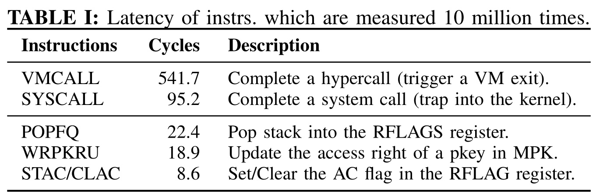

## Overview

### Threat Model

SEIMI 与传统的内存损坏防护机制威胁模型类似。SEIMI 的目标是为内存损坏防御机制所需的安全内存区提供进程内隔离。假设目标程序存在内存损坏漏洞，攻击者利用漏洞可以实现任意读写。同时假设程序开发者是善意的。假设防御机制本身是安全的，攻击防御机制的先决条件是打破 SEIMI 提供的隔离。SEIMI 有效时，攻击者无法执行代码注入和代码复用攻击，目标防御机制和 SEIMI 互相保护。假设目标 OS 是安全可信的。

### High-Level Design

现有的进程内内存隔离都是用用户模式硬件支持，而 SEIMI 使用特权模式的硬件特性 SMAP，切换 SMAP 比切换 MPK 更快，可以推测使用 SMAP 的域内存隔离性能会更好。

隔离内存区域分配为用户页，其他页都是特权页。用户程序运行在 ring 0（STAC 和 CLAC 都只能在 ring 0 使用）。默认开启 SMAP，可信代码通过执行 STAC 禁用 SMAP 以访问隔离内存，访问完成后，可信代码执行 CLAC 重新启用 SMAP 阻止不可信代码访问。尽管此机制暴露了 SMAP 禁用的时间窗口，但不会影响其他线程，因为 RFLAGS 寄存器是线程私有的，仅在当前线程有效。

将目标进程放到 VMX non-root，OS 内核放到 VMX root 模式。

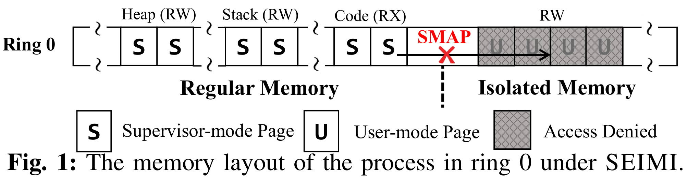

### Key Challenges

1. 区分 SMAP 读和写，某些敏感数据可能只需要保护完整性，就不需要限制读操作。而 SMAP 并不区分读写操作。
2. 阻止特权数据结构泄露或被篡改，如页表、IDT 等。
3. 阻止特权硬件功能的滥用，如修改控制寄存器。

### Approach Overview

针对挑战 1，提出基于共享内存的 SMAP 读写划分。为隔离内存区的物理地址空间分配两个虚拟地址空间，一个设置为用户页可读可写，另一个设置为只读特权页。可信代码通过用户页修改敏感数据，而如果只需要读敏感数据，就从特权页读。

针对挑战 2，将特权数据结构及相关操作放到 VMX root 模式。通常，当进程通过系统调用、异常和中断等方式访问内核时才设计特权数据结构操作。利用 VT-x 拦截并强制这些事件触发 VM Exit，在 VMX root 模式执行相关操作。

针对挑战 3，特权硬件功能都通过特权指令使用，通过几种方式收集和保护特权指令。通过触发 VM Exit 停止执行、无效执行结果、触发处理器异常并取消执行的方式 sanitize VMX non-root 模式特权指令的执行。

## Securely Executing User Code in Ring 0

SEIMI 架构如下图，其核心是一个内核模块，启用 VT-x，将内核放到 VMX root 模式。使用 SEIMI 的进程运行在 VMX non-root 的 ring 0，其他进程运行在 VMX root ring 3。对内核透明，SEIMI 负责切换 VMX 模式。

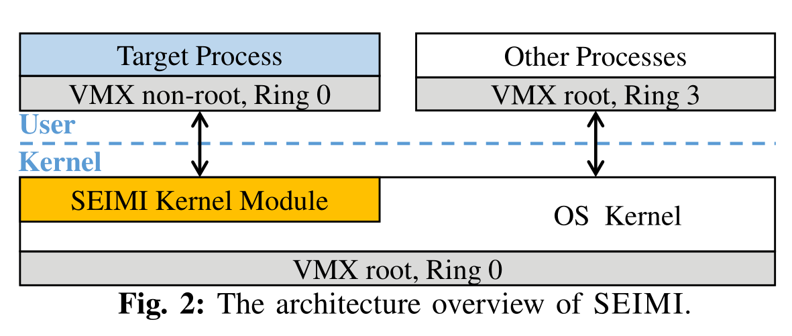

三个关键组件：内存管理、特权指令拦截和事件重定向，确保在 ring 0 安全地执行用户代码，实现基于 SMAP 的内存隔离。

### Memory Management

SEIMI 不需要 guest OS 管理内存，帮助进程管理内存，要满足几点需求：

1. 系统调用由 host 内核处理，因此 guest 和 host 页表中的用户空间布局要保持一致。
2. guest 物理内存直接由 host 管理。
3. SEIMI 应该能够灵活地配置 guest 虚拟地址空间中的用户页和特权页。
4. guest 不能访问到 host 内存。

简单的方案是复制 host 页表中的用户空间部分作为 guest 页表，将其中的非隔离内存空间改为特权页。同时，页表本身也不会出现在 guest 地址空间，也就不会泄露给攻击者。然而这需要复制整个四级页表，跟踪并同步 host 页表的所有更新很复杂且开销较大。

为了降低开销，可以仅复制顶级页目录表，复用下面三级页表。复制 PML4 页，并清空其中的内核空间页表项（#256~#511），用户空间部分（#0~#255）保留。

给定一个虚拟页，如果其相关的各级页表项中的 U/S 位都置位，则此页为用户页。如果有任一页表项 U/S 位为零，则为特权页。要设置 guest 页表中的特权页，将 #0~#254 的 PML4 页表项的 U/S 位清零，即改为特权表项，表示非隔离内存区。而 #255 表项仍为用户表项，保留为隔离内存区。如下图中 a。

为了将相同物理页映射为只读特权页和可写用户页，SEMI 保留 #254 表项，将其指向与 #255 相同的 PDPT 页（三级页表），将 #254 设置为特权表项。这样从 #254 的地址访问就是直接地访问只读特权页，从 #255 的访问就需要经过关闭再开启 SMAP。如下图中 b。

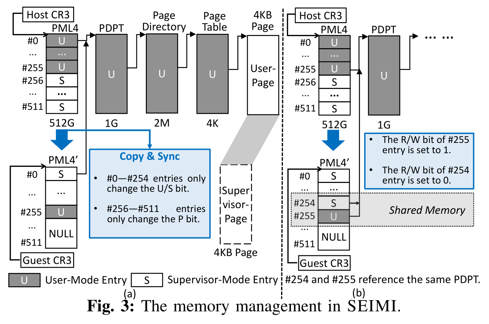

### Intercepting Privileged Instructions

SEIMI 要拦截 VMX non-root ring 0 的所有特权指令，阻止访问特权硬件功能。

识别特权指令：自动过滤和手动验证。找到特权指令或在 ring 0 和 ring 3 功能不同的指令。把每个带有随机操作数的指令嵌入到测试程序，并在 ring 3 运行。通过捕获 GP 异常和无效操作码异常实现自动并完全过滤所有特权指令。然后根据 Intel SDM 确认特权指令并找出在 ring 0 和 ring 3 行为不同的指令。

找出的指令如下表，根据 SEIMI 的拦截方式分为 EXIT-type、INV-type 和 EXP-type。VT-x 支持监控大多数特权指令。对于其他指令，SEIMI 使其正确执行的条件无效，选择开销较低且不影响其他指令的条件。

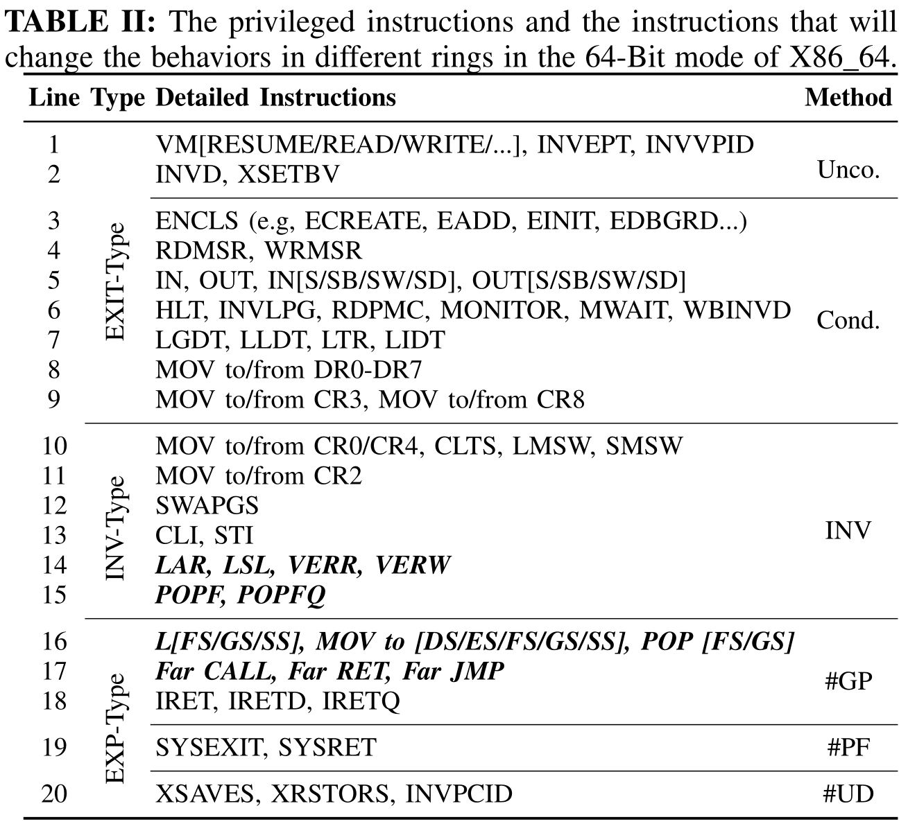

对于 EXIT-type 指令，某些指令需要在 VMCS 中显式地指定触发 VM Exit。

对于 EXP-type 指令，SEIMI 要在其执行过程中触发异常。一些指令可以在 VMCS 中禁用支持，执行会触发 #UD。而上表中的 #GP 类型指令没有拦截支持，它们都与段操作相关，会改变段寄存器。将段描述符表清空，段操作就会触发 #GP。

要保证段描述符清空后程序能正常执行，利用描述符缓存，每个段寄存器都对应一个不可见部分，用于存储段描述符信息。当执行不切换段的指令时，直接从缓存中获取段信息。只有当切换段时，硬件会访问描述符表加载信息。因此可以将正确的描述符信息填入缓存然后再清空描述符表。通过设置 VMCS 中 guest 段寄存器值（包括选择子和描述符信息。VM Entry 时会自动加载，然后清空 GDTR 和 LDTR 的基址和限长字段。这样就不会影响不切换段的指令，仅在切换时会触发异常，陷入到 SEIMI。

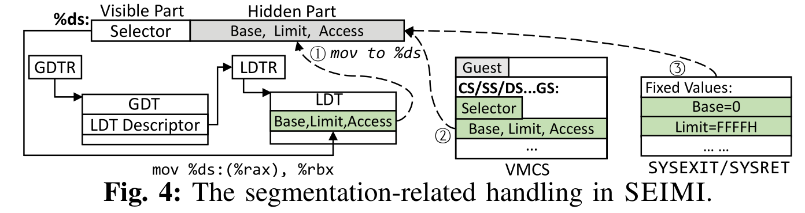

SYSEXIT 和 SYSRET 会切换段并将值填充到缓存，而不访问描述符表。同时会将特权级改为 3，取指时会触发 page fault。

对于 INV-type 指令，解决方案是无效化其执行影响，阻止攻击者使用这些指令获取或修改内核状态。

对于 CR0 和 CR4 相关的指令，可以设置 VMCS 控制 guest 读写。设置掩码和 read-shadows 让 guest 读到 host 指定的内容，guest 写入无法真正修改控制寄存器。

SWAPGS 用于快速交换 GS 和 IA32_KERNEL_GS_BASE MSR 中的基址。SEIMI 将两个寄存器设置为同一值，执行不会有作用。

LAR 和 LSL指令用于获取访问权限和段限长信息。VERR 和 VERW 用于验证段是否可读可写。因为段描述符表已经清空，执行这些指令会触发 descriptor load segment violation，RFLAGS.ZF 将清零。这些指令将会忽略，几乎不会使用。

CLI 和 SLI 会设置 RFLAGS.IF 中断标志位。POPF 和 POPFQ 会修改 RFLAGS 中的 IOPL 和 AC，IOPL 用于控制 I/O 相关指令的执行条件。VMX non-root 的中断和 I/O 指令都会触发无条件的 VM Exit，攻击者修改 IF 和 IOPL 不会影响对中断和 I/O 的行为。而 POPFQ 会开关 SMAP，为此需要确保用户代码中没有此指令或无法操纵 AC 标志位。而 POPFQ 可用于其他用途，本文的方法是在每个 POPFQ 之前插入一个 and 指令，让栈元素中的 AC 标志位始终为 0。

### Redireting and Delivering Kernel Handlers

SYSCALL 指令不会切换 VMX 模式，因此使用 VMCALL 替换 SYSCALL 指令，将 guest 的 IA32_LSTAR MSR 寄存器（用于指定系统调用入口）指令序列 `VMCALL; JMP *%RCX`。当进程执行 SYSCALL 时，跳转到 VMCALL，触发 hypercall，SEIMI 模块根据系统调用表识别 hypercall 并调用响应的系统调用处理程序，将 SYSCALL 的下一条指令地址填入 RCX，VMRESUME 时返回 VMX non-root 模式，执行 JMP 指令跳转继续执行。

现有的进程内隔离机制（基于 MPK 或 MPX）都存在问题：攻击者可以利用系统调用间接访问隔离内存区，因为内核不受隔离机制限制。比如使用 write 或 read 系统调用读写隔离内存内容。为此，对于所有以内存地址和计数为参数的系统调用，SEIMI 会动态地检查指定的内存范围是否与隔离内存区重叠。

通过设置 VMCS 可以让进程内所有中断和异常都陷入到 SEIMI 模块中处理。要注意的是，在共享的只读特权页上的 page fault 地址应该重定位到对应的读写用户页，因为内核中没有相关映射。

SEIMI 支持 Linux 信号机制，在 VM Entry 之前，模块调用 signal_pending 检查信号队列，如果有信号待处理，就保存上下文然后切换到信号处理函数上下文，回到 VMX non-root 执行处理函数函数返回时再陷入到 SEIMI，恢复到最初的上下文。

## Implementation

### SEIMI APIs and Usage

用户使用 `void *sa_alloc(size_t length, bool need_ro, long *offset)` 和 `bool sa_free(void *addr, size_t length)` 分配和释放连续的隔离内存区。参数 `need_ro` 用于指定是否需要分配共享的只读特权页，如果是，其相对读写用户页的偏移通过参数 offset 返回。防护机制可以通过 `addr+offset` 直接读取隔离内存区。使用内联汇编 STAC 和 CLAC 指令开关 SMAP。

SEIMI 将目标进程代码编译链接，模块加载后，开启 VT-x 并将内核置于 VMX root 模式。

### The Start and Exit of the Target Process

Linux 用户程序都是从 execve 系统调用开始，SEIMI 使用 ftrace 框架拦截 execve 以监控目标进程启动。对于目标进程，先调用原始的系统调用初始化进程，然后使用目标进程的上下文创建并初始化 vCPU，并将 RPL 设置为 0。然后执行 VMLAUNCH 指令将目标进程放到 VMX non-root ring 0 执行。

SEIMI 通过拦截内核 API `do_group_exit` 监控进程退出，退出时回强制进程陷入并释放 vCPU。

为支持多线程、多进程的应用，SEIMI 拦截 clone 系统调用，为子线程和进程创建并初始化 vCPU，然后在 VMX non-root 模式执行它们。每个 vCPU 都有独立的上下文，因此通过 RFLAGS.AC 切换 SMAP 不会影响其他线程。

### Realizing the Secure Memory Management

内存管理模块对 SEIMI 的安全至关重要。

为避免程序使用隔离内存区，SEIMI 模块拦截内核 `load_elf_binary` 函数，避免将栈或共享库分配到隔离内存区。用户还可能使用 mmap 系统调用分配内存，SEIMI 也会验证这一系统调用避免分配隔离内存。

Linux 通过 vsyscall 的方式加速系统某些系统调用，将 vsyscall 页映射到固定地址 0xFFFFFFFFFF600000，应用调用系统调用时，直接调用 vsyscall 页上的函数。因此需要在 guest 页表的 PML4 页中保留 #511 表项，同时设置下面三级页表，最终指向 vsyscall 页，设置为特权页。

内核可能会更新 PML4 页，需要同步到 guest 页表。为此，模块将 PML4 页设置为只读，在 page fault 处理程序中同步到 guest 页表。实际上内核很少改 PML4。

为了避免目标进行通过 TLB 访问到内核内存，为 guest 和 host 分配 VPID，避免 TLB 误用。

`sa_alloc` 函数中，SEIMI 调用 `do_mmap`，标志为 MAP_FIXED，在 guest PML4 #255 表项的范围内分配可读写的虚拟地址。当需要分配共享只读页时，SEIMI 将 #254 指向与 #255 相同的 PDPT 页，并设置为只读特权页。

## Evaluation

评估 SEIMI 的实用性和性能，四种基于 IH 的防御机制：OCFI、ShadowStack、CPI 和 ASLR-Guard，使用 SEIMI、MPX 和 MPK 保护它们的秘密数据。

Microbenchmark：使用 lmbench 测量 SEIMI 在基本内核操作中引入的开销，为避免域切换的开销，直接在 SEIMI 上运行 lmbench 以仅评估内核操作的开销。结果表明，hypercall 比系统调用开销大得多，进程相关操作开销为 68.37%，上下文切换的开销为 22.51%。文件相关的开销为 33.56%，主要来自于异常处理时的 VM Exit。本地通信操作的开销为 24.23%。

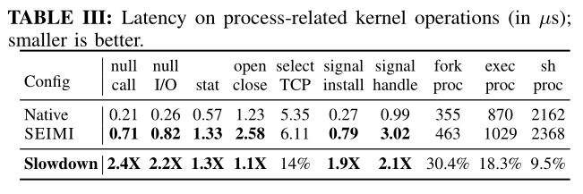

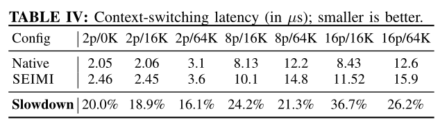

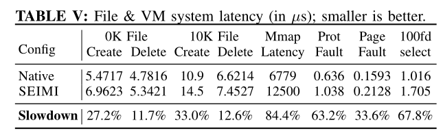

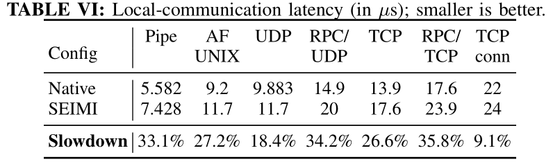

Marcobenchmark：比较三种隔离机制，选择 CPU 密集型的测试 SPEC CPU2006 C/C++，使用 O2 优化，使用 ref 数据集运行。使用四种防御机制 OCFI、SS、CPI 和 AG，与四种隔离用例组合：仅用 IH 保护、MPX、MPK、SEIMI。平均来看，SEIMI 的性能开销远低于基于 MPX 和 MPK 的方案。在某些情况下，基于 MPX 的方案可能优于 SEIMI，两种方案类型不同，地址边界检查和访问权限切换的开销视要保护的工作负载不同。当边界检查频率远大于访问权限切换的频率时，基于域的隔离效果更好。由于 SMAP 切换比 WRPKRU 快得多，所以 SEIMI 相比 MPK 有绝对的优势。

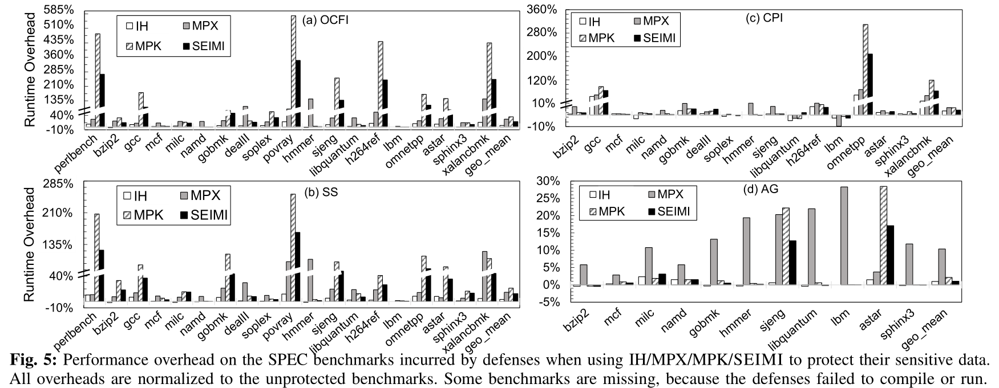

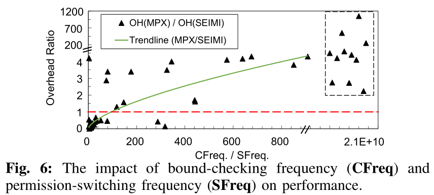

同时还选择了 12 个流行应用程序，包括 web 服务器、数据库和 js 引擎，针对四种防御机制和四种保护用例测试。SEIMI 在绝大多数情况下优于其他方案。

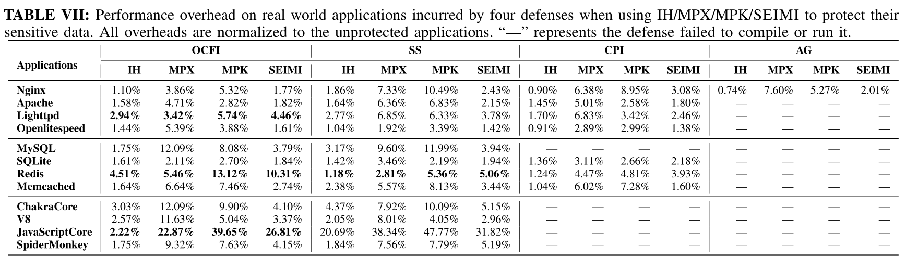

## Discussion

RFLAGS.AC 在用户模式下用于切换数据访问的对齐检查，而在特权模式才用于控制 sMAP。因此，SEIMI 中的进程无法依赖 AC 进行对齐检查。一般来说，出于兼容性问题，绝大多数程序都默认禁用了对齐检查，或者使用其他库实现的对齐检查。

在 VM 中使用 SEIMI 需要嵌套虚拟化，对于 lmbench（进程相关操作），开销会急剧增加。

## Related Work

## Conclusion

SEIMI 使用 SMAP 硬件特性提供高效的进程内内存隔离。使用 VT-x 将用户代码运行在 VMX non-root ring 0，使用多种技术确保用户代码在特权模式的安全执行。实验表明，SEIMI 比现有的隔离技术更高效。