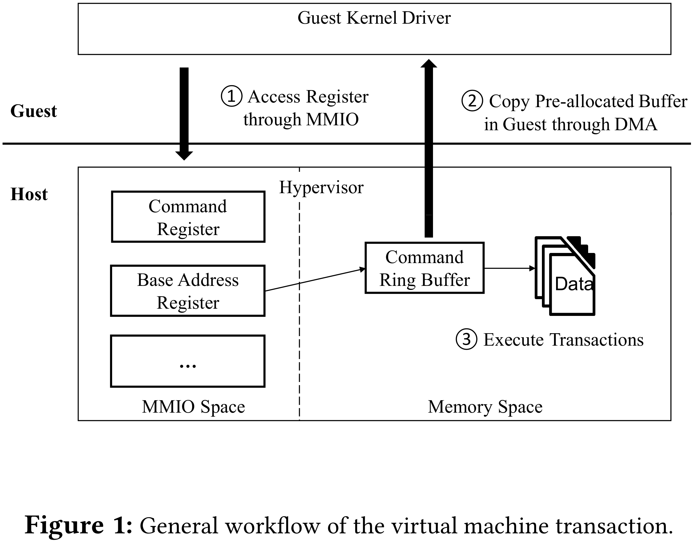
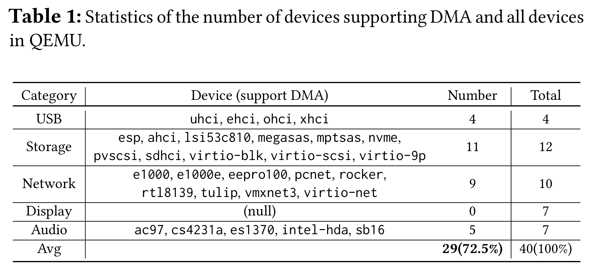
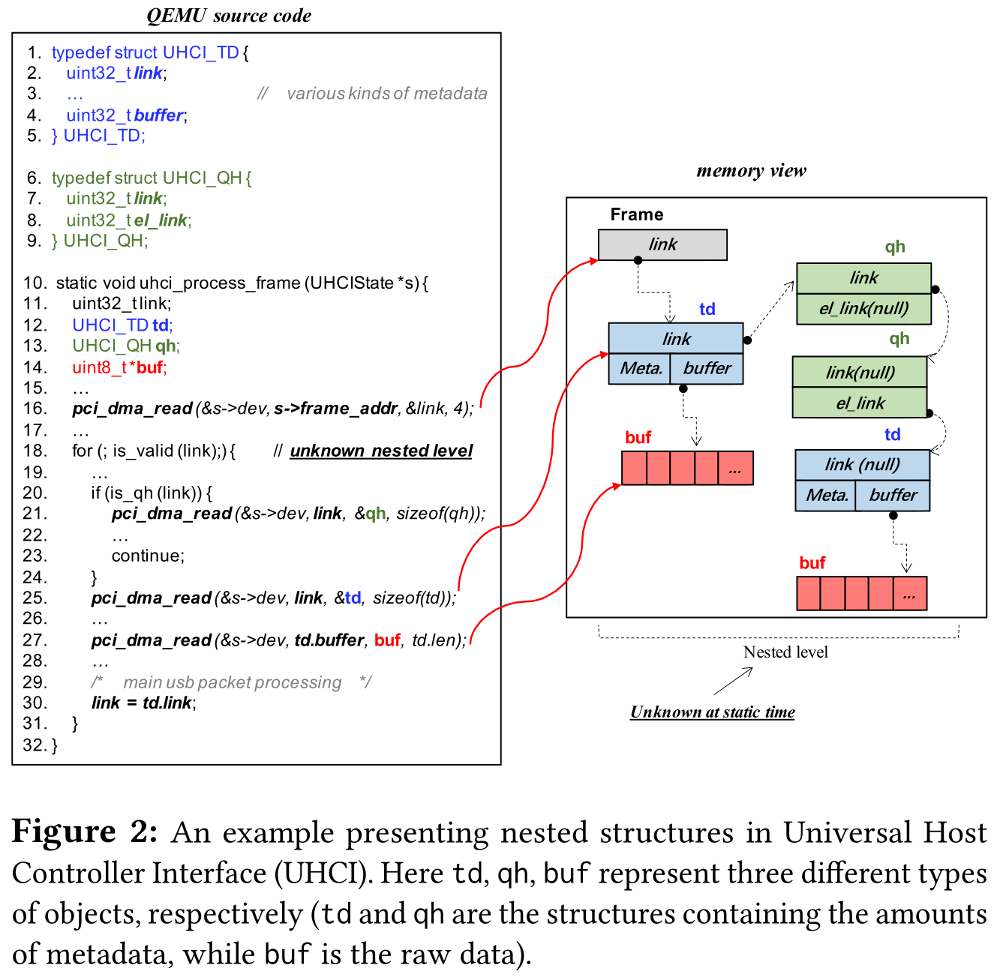
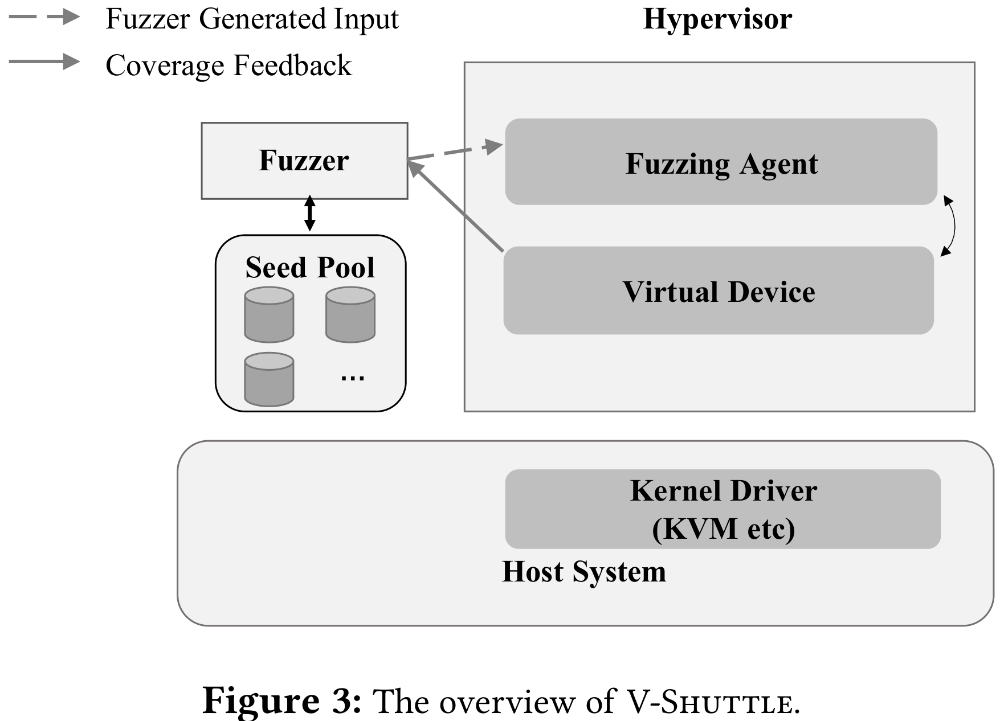
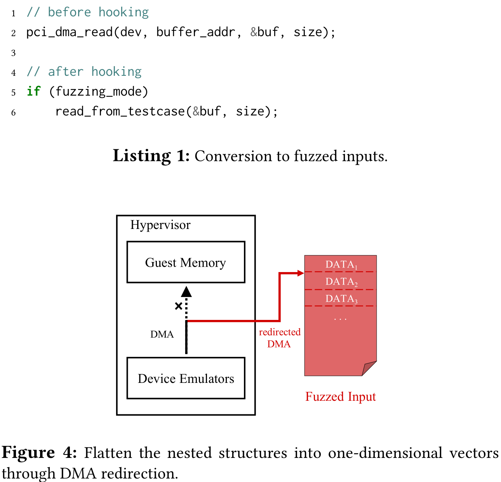
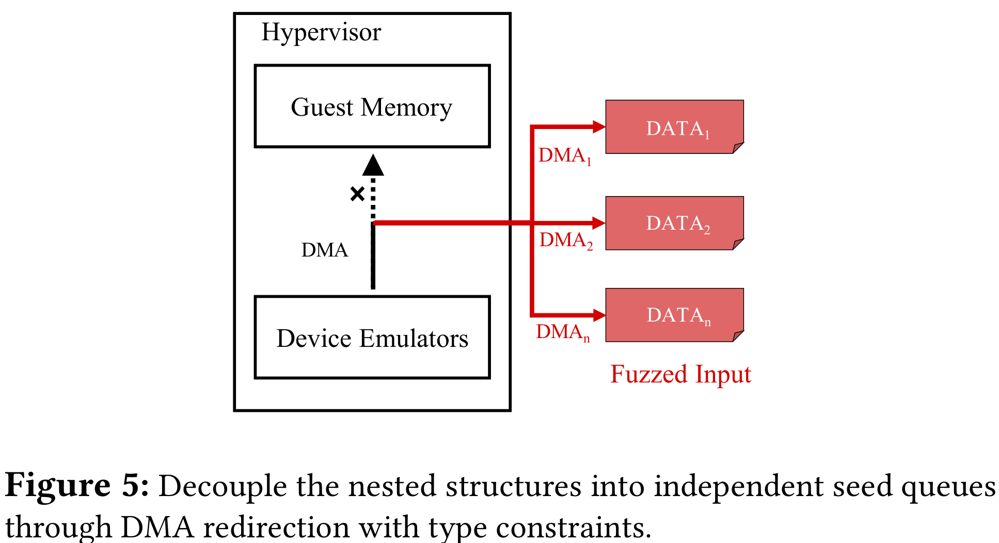
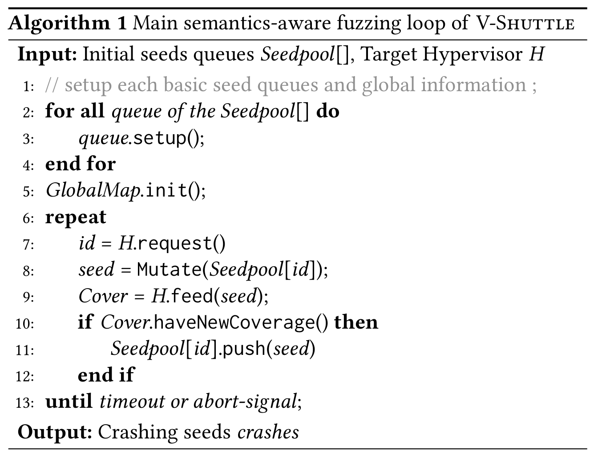
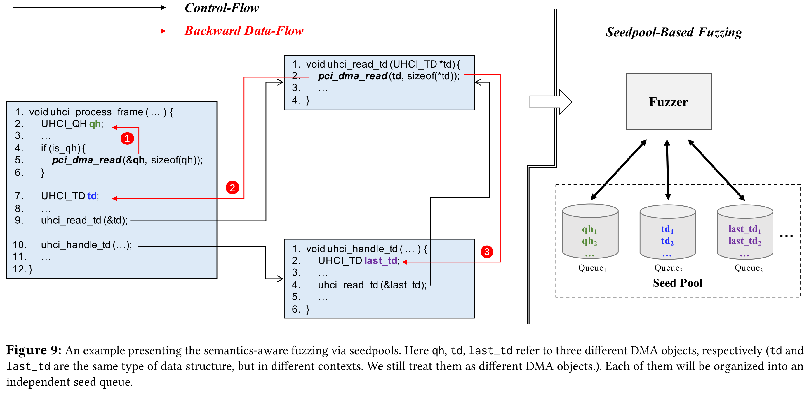
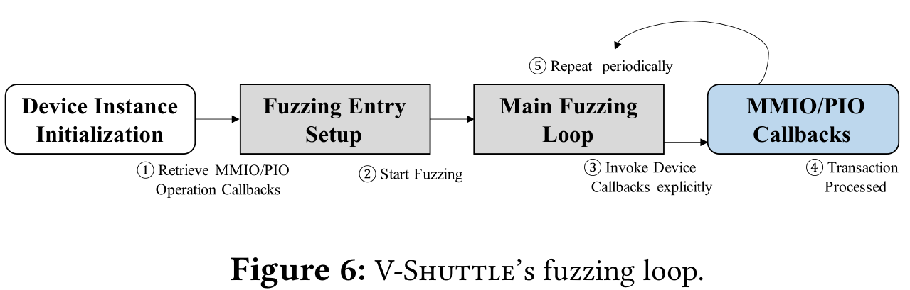
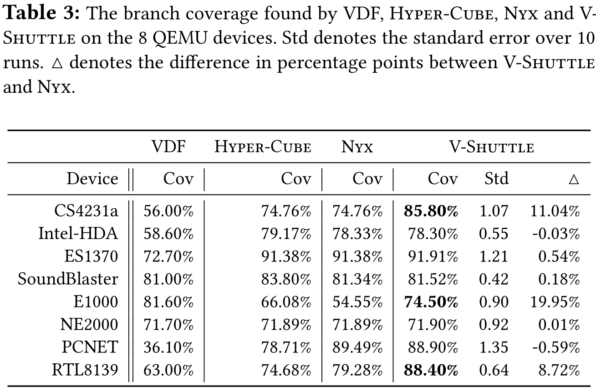

# V-Shuttle: Scalable and Semantics-Aware Hypervisor Virtual Device Fuzzing

[pdf]([CCS%202021]%20V-Shuttle%20Scalable%20and%20Semantics-Aware%20Hypervisor%20Virtual%20Device%20Fuzzing.pdf)

虚拟设备向 guest 暴露接口以进行通信，是 hypervisor 中最脆弱的部分。对 hypervisor 虚拟设备的 fuzzing 存在一定挑战：DMA 传输的数据结构是根据协议规范以嵌套形式构造的。无法理解虚拟设备的协议使得 fuzzing 过程停滞在初始阶段，效率低下。

本文提出了 V-Shuttle 框架，实现可扩展和语义感知的 hypevisor fuzzing。设计 DMA 重定向机制显著减少重构虚拟设备协议结构的人工工作量，使 fuzzing 环境设置自动化和可扩展。提出了一个新的 fuzzing 突变调度机制，称为种子池使虚拟设备 fuzzing 处理语义感知，并加速 fuzzing 提升覆盖率。对 QEMU/KVM 和 VirtualBox 的 fuzzing 找到了 35 个漏洞，17 个 CVE。

## Introduction

DMA 传输的数据高度嵌套，严重阻碍了传统的 fuzzing 扩展覆盖率。即设备标准中的数据结构常以树的形式构建，一个结构中的字段指向另一个结构。这种嵌套结构难以构建，因为需要猜测分层嵌套模式的语义。

现有适用于 hypervisor 的 fuzzing 工具：VDF 是第一个 hypervisor fuzzing，使用 AFL 实现覆盖引导的 fuzzing。Hyper-Cube 基于自定义 OS 设计了多维度、平台独立的 fuzzing 方法，没有使用覆盖引导的 fuzzing，但吞吐量高，优于 VDF。思路相同：将一堆随机值写入接口（MMIO、DMA 等），不理解虚拟设备的协议实现，即如何组织 DMA 传输的数据结构。NYX 理解目标设备的协议，根据用户提供的规范构建结构化的 fuzzing。然而需要大量人工工作，不支持跨设备实现扩展。这也是结构化 fuzzing 的缺点，其有效性很大程度上基于嵌套形式结构的完整性，通常是基于开发者对协议规范的理解手动编写。开发者需要从设备协议中提取所有类型的基本数据结构，包括基本结构之间的连接关系以及每个结构内的指针偏移。将这种劳动密集型的过程应用到 hypervisor fuzzing 即耗时又易错。因此，现有的 fuzzing 无法有效地测试虚拟设备。

为解决以上的挑战，本文提出 V-Shuttle，一个可扩展、语义感知的 hypervisor fuzzing 框架，通过解耦嵌套结构并启用类型感知实现全自动 fuzzing 方法。具体来说，将拦截对 DMA 对象的每次访问，并将访问从指针重定向到可控的 fuzzing 输入，消除 hypervisor 对数据结构的寻址，确保每个 DMA 请求都能获取 fuzzing 输入。然后通过将不同 DMA 对象类型组织为不同类别，并使用 seedpool 维护不同类别的种子序列，从而执行细粒度语义感知的 fuzzing。该方法为每个 DMA 请求提供语义有效的数据（fuzzing 种子），提高 fuzzing 效率。

基于 AFL 实现，在 16 个 QEMU 设备上测试，V-Shuttle 是真正可扩展和自动的，可以探索 hypervisor 中的深层次代码，由于以往的结构感知的 fuzzing，因为根据标准手动构造的过程容易出错。更高的覆盖率。

本文贡献：

- DMA 研究，分析 VM 环境下的设备和驱动交互，揭示了 DMA 传输数据的嵌套结构特征。
- 设计并实现了 V-Shuttle，可扩展、语义感知的 hypervisor fuzzing 框架，可以自动化解耦嵌套结构，引导 fuzzing 探索难以触发的代码。
- 发现 35 个未知漏洞，17 个 CVE。

## Background and Motivation

虚拟设备由 hypervisor 模拟，guest 可以使用任意数据访问虚拟设备。

虚拟设备向 guest 暴露三个主要交互接口：MMIO、PIO 和 DMA。guest 驱动通过 MMIO 或 PIO 执行设备初始化工作，如设备状态设置和地址寄存器初始化，针对 guest 预分配缓冲区。初始化完成后，设备准备处理数据，这阶段主要使用 DMA 交互。数据处理是设备的主要功能，包含大部分代码，更容易引入安全风险。

为了表现 hypervisor 中虚拟设备对 DMA 的广泛使用，静态分析了 QEMU 中支持 DMA 通信设备占比。选择五类设备，手动分析其中是否存在 DMA 传输机制。除显示设备外，几乎所有设备都必须使用 DMA 传输复杂的数据结构，特别是存储和网络。所以说，DMA 在 hypervisor 中广泛使用，hypervisor fuzzing 需要更加关注 DMA 相关代码。

虚拟设备与 guest 驱动的通信是通过与 DMA 相关的特定 API 进行的。而通过 DMA 传输的数据对象通常被构造成嵌套结构（结构 A 中包含执行结构 B 的指针），这种嵌套特性是多层、多类型的，hypervisor 以层级或树状结构组织。出于以下两个原因，这种特性阻碍了 fuzzing 对 hypervisor 代码的探索。

嵌套形式构造：数据结构的层次结构复杂，以树的形式，节点是数据结构，通过指针建立链接，需要设备标准相关知识。而每个节点视为元数据和指针的结合，指针在节点中的偏移不确定，突变可能使指针无效。指针值通常固定，不希望发生突变。缺乏节点级的语义。因此，fuzzer 需要理解数据组织的语义（分层嵌套模式），并了解每个节点（哪个字段是指针）中的内部语义。

节点类型感知：设备支持各种数据类型，需要了解嵌套节点的细粒度语义知识。嵌套结构由不同类型的节点链接而成，每个节点都包含一个或多个指向不同数据类型的指针。很多精确的指向关系只有在运行时才能知道，即同一指针可能引用多个类型数据，实际值依赖于其他字段。因此 fuzzing 生成的节点随机组合无法满足语义要求。在节点级别，fuzzer 需要从给定节点提取指针，了解指针语义。

没有关于复杂嵌套结构的先验知识，传统的 fuzzing 无法正确生产数据结构。以 USB_UHCI 协议为例，指针引用数据结构的不同将影响控制流。对此种结构的 fuzzing，可能会因无效的内存访问而停止，或难以触发递归定义结构的深层逻辑。

处理嵌套结构的一个简单方法是使用结构感知技术，开发者创建一个能够精确捕获设备标准的模型，基于模型的方法遵循预定义规则生产相应结构。然而结构感知的显著缺陷就是耗时且易出错，需要人工提取结构定义，实现也不一定完全符合规范。因此需要一套自动化的嵌套结构处理方法。

## V-Shuttle Design

V-Shuttle 是一个可扩展、语义感知的轻量级 hypervisor fuzzing 框架，结合了覆盖引导 fuzzing 和静态分析。针对 hypervisor 的特定挑战，设计两种方法：DMA 重定向和通过种子池语义感知。

威胁模型：攻击者是 guest 中的特权用户，符合常见的云计算场景。

下图为 V-Shuttle 架构，利用集成到 hypervisor 中的 fuzzing agent 向虚拟设备提供随机输入，不断向虚拟设备发送读写请求。

Fuzzer 在 hypervisor 之外，使用持久模式做 in-process fuzzing，不会因为为每个新输入都重启新实例。因为开销大，且 hypervisor 是事件驱动的，支持长期运行的交互。这样即提高性能，也有助于探索深度交互状态。

Fuzzing agent 是核心组件，驱动与 fuzzer 和虚拟设备交互的循环，管理 DMA/MMIO 分配上下文。将来自 geust 的左右数据交互都重定向到 fuzzing 输入。agent 模拟攻击者控制的恶意 guest 内核驱动，拦截所有来自设备的 DMA 和 I/O 读写指令。每个读写操作都被分到 agent 实现的注册功能，将 fuzzer 生产的数据返回给设备。agent 是集成在 hypervisor 中的通用组件，适用于几乎所有设备，在新设备上部署时不需要额外的人工。

### DMA 重定向

为解决嵌套结构给 fuzzing 随机生产带来的困难，提出了 DMA 重定向方法。拦截设备对 guest 内存的访问，将嵌套结构平坦化。V-Shuttle hook hypervisor 的 DMA 机制，将 DMA 传输转换为读取 fuzzing 输入。选择 DMA 相关的 API，使用宏定义，替换为读文件。这样所有的读内存都可以重定向到基于文件的 fuzzing 输入。以此消除了 DMA 中的寻址操作，无论指针指向何处，都可以使用传统的覆盖引导生产的 fuzzing 输入来响应。V-Shuttle 没有操纵写入数据，因为虚拟设备更容易被来自 guest 的输入攻击。运行时，对于 DMA 读请求，首先确保 DMA 读 API 调用来自于目标设备，然后从 fuzzer 生产的种子文件中获取数据，而不是读内存。

V-Shuttle 将所有嵌套结构转换为一维向量，同时保持嵌套语义。每次 fuzzing 迭代中，fuzzer 生产突变的 DMA 数据序列，然后设备从 DMA 序列中按序获取块。所有包含 DMA 请求的代码路径都能被平滑地覆盖，而不会卡在读取内存的地方。

### 通过种子池实现语义感知 fuzzing

以上的方法将平坦化嵌套结构，但是在组织 DMA 序列时没考虑节点类型，效率低。而节点类型往往是动态的，DMA 请求的组合序列在不同 fuzzing 迭代中差异较大，简单地将节点序列混合导致语义丢失。

为此，提出了细粒度的语义感知 fuzzing 方法，为 fuzzing 引擎提供类型感知，以便其根据请求的数据类型动态生成针对性测试用例。

首先，改进 DMA 重定向，将嵌套结构解耦为独立节点。然后实现基于种子池的 fuzzing 引擎，维护多个种子队列，每个节点一个。在类型的指导下，V-Shuttle 执行语义感知 fuzzing。这种设计基于：每个节点的语义是独立的，没有依赖关系。因此解耦不会破坏嵌套结构的语义，可以很好地权衡语义粒度和部署成本，hypervisor 中不同类型的数据结构数量有限（几十个）。

静态分析，标记 DMA 对象。恢复 DMA 操作指示的类型信息，如 `pci_dma_read` 函数传输的对象类型就是不确定的。定义一个 DMA 对象 host 结构通过 DMA 保存 guest 数据副本，每个 DMA 对象代表一个节点类型。为了标记所有对象，V-Shuttle 对 hypervisor 源码进行静态分析，利用实时变量分析（数据流分析）。以 DMA 操作的 host buffer 字段为源头，进行后向数据流分析。收集所有的 DMA 对象后，为每个对象分配一个 id，以此帮助在运行时识别 DMA 节点类型。

基于标记对象，V-Shuttle 可以理解 fuzzing 迭代中执行 DMA 传输时所需的节点类型。在之前的 DMA 重定向基础上引入了类型约束，确保根据节点类型从种子队列获取数据。将嵌套结构解耦，然后按照聚类。

为了处理多对象输入，扩展了 AFL，支持多种子队列并行，成为种子池。fuzzer 可以为每种输入在每个种子队列单独执行突变。通过覆盖率反馈，fuzzer 可以快速了解设备的结构和模式，学习如何生产针对每种类型对象的输入。即使程序在执行中动态获取不同类型数据，fuzzer 也可以在相应的种子队列上提供语义有效的输入。所有种子队列都是独立的，适用相同的突变策略。所有基本队列共享一个全局覆盖图，任何显示新分支的种子都会添加到其所属种子队列中。每个种子队列发展自己的模式，利用覆盖率引导的 fuzzer 的自学能力，支持相应类型的输入。

V-Shuttle 将运行时类型感知与种子池相结合，fuzzing 过程以 C/S 模型运行，V-Shuttle 作为服务器处理 hypervisor 的 DMA 请求。fuzzing 主循环包括以下几步：

- 创建基本种子队列并初始化全局覆盖率图
- 等待来自目标 hypervisor 的 DMA 请求，请求中指示了所需数据类型
- 从相应种子队列中选择种子并突变生产新的候选种子
- 将种子传给目标程序，跟踪覆盖率信息，如果候选种子探索到新的覆盖率范围，那么它就会被添加到所属种子队列。

算法收敛后，可以为每种 DMA 对象提供语义有效的输入，从而提升 fuzzing 效率。复现阶段，V-Shuttle 通过保存当前访问种子与之前访问种子的引用，自动恢复来自不同种子池的种子之间的链接，从而获得可靠且可复现的 crash。

以 USB-UHCI 为例：

### 轻量级 fuzzing 循环

以前的 hypervisor fuzzing 通常使用 guest OS 中的 agent，存在一些局限性。VM Exits 带来开销，也增加了实现的复杂性和通信不稳定性。

而 V-Shuttle 采用轻量级设计来驱动 fuzzing 循环，将 agent 集成到 hypervisor 中。Hypervisor 是事件驱动的，控制流由来自 guest OS 的事件驱动。V-Shuttle hook 了hypervisor 初始化 MMIO/PIO 的 API。当设备在 VM 启动阶段被初始化时，V-Shuttle 检索 MMIO/PIO 操作回调函数，将其作为 fuzzing 入口点，以此驱动 fuzzer 和设备之间的 fuzzing 循环。V-Shuttle 使用 fuzzer 生产的数据显式调用回调函数。最后回到开始，重复以上。fuzzer 和 agent 都在 host 中运行，共享输入文件和覆盖位图很简单，使得 V-Shuttle 更轻量级。对新设备进行 fuzzing 也可以自动设置 fuzzing 要求，而不需要人工。

## Evaluation

围绕以下问题展开评估：

- 是否可扩展
- 盲 fuzzing、结构化 fuzzing、V-Shuttle 和语义感知的 V-Shuttle 的性能
- 相比最新的 fuzzing 攻击 Nyx, Hyper-Cube, VDF 的性能提升
- 挖洞能力

### 可扩展性

在十几个 QEMU 虚拟设备上用 V-Shuttle，包括 USB、网络、音频、存储等。记录初始覆盖率和使用 V-Shuttle 24H 后的覆盖率，大幅提升。

以写随机数据到接口的 fuzzing 作为 baseline，性能可与传统 fuzzing 媲美。

### 有效性

V-Shuttle 主框架（没有语义感知）和语义感知模式都在没有人工工作的情况下，展现了出色的覆盖率改进。语义感知性能更好，收敛速度快。

### 与其他 fuzzer 的比较

大多明显优于 VDF；相比 Nyx，一些设备使用 DMA 较少，改进空间小。而在复杂设备，相比 Nyx 可以明显提高，设备加密网络数据包时，集中使用了嵌套结构，DMA 重定向起主要作用。

### 漏洞探索

新漏洞：找到了 35 个新漏洞，17 个 CVE。

同时也可以在合理的迭代次数内发现已有漏洞。

### V-Shuttle 部署和应用

在蚂蚁云上部署。部署到新的 hypervisor，需要做的就是对目标设备执行静态分析，收集 DMA 对象，通过简单配置、插桩并编译就可以将 agent 集成到 hypervisor。

## Discussion

V-Shuttle 需要手动重构 PoC，因为 fuzzer 集成在 hypervisor 的 host 进程，需要从种子序列恢复 PoC。给定崩溃回溯和访问日志，手动构造 PoC，后续要探索自动化方法。

对于闭源的 hypervisor，无法支持，可能需要二进制 patch 或动态插桩。

V-Shuttle 在每次迭代后并未重启 hypervisor，而系统内部状态的累计可能导致覆盖指导的不稳定性。