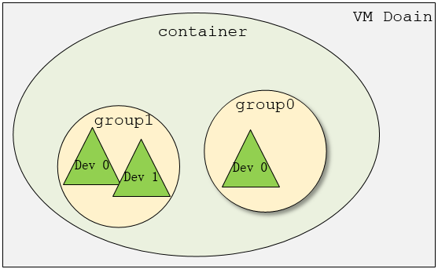
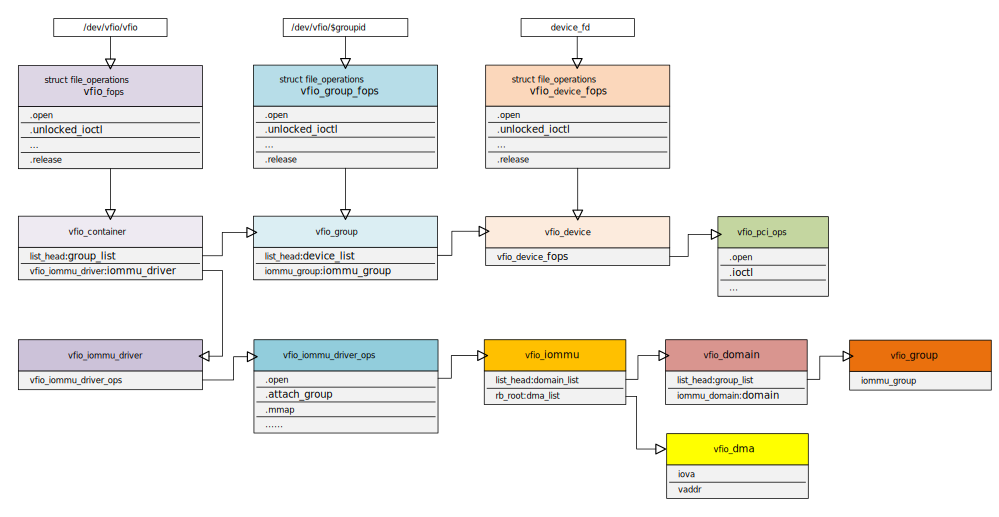
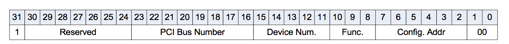
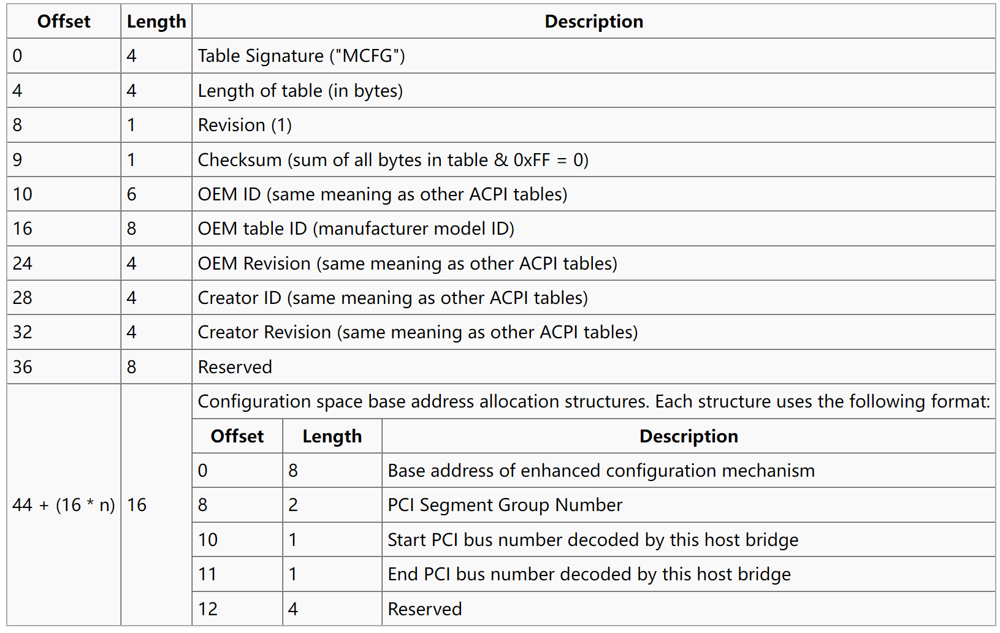
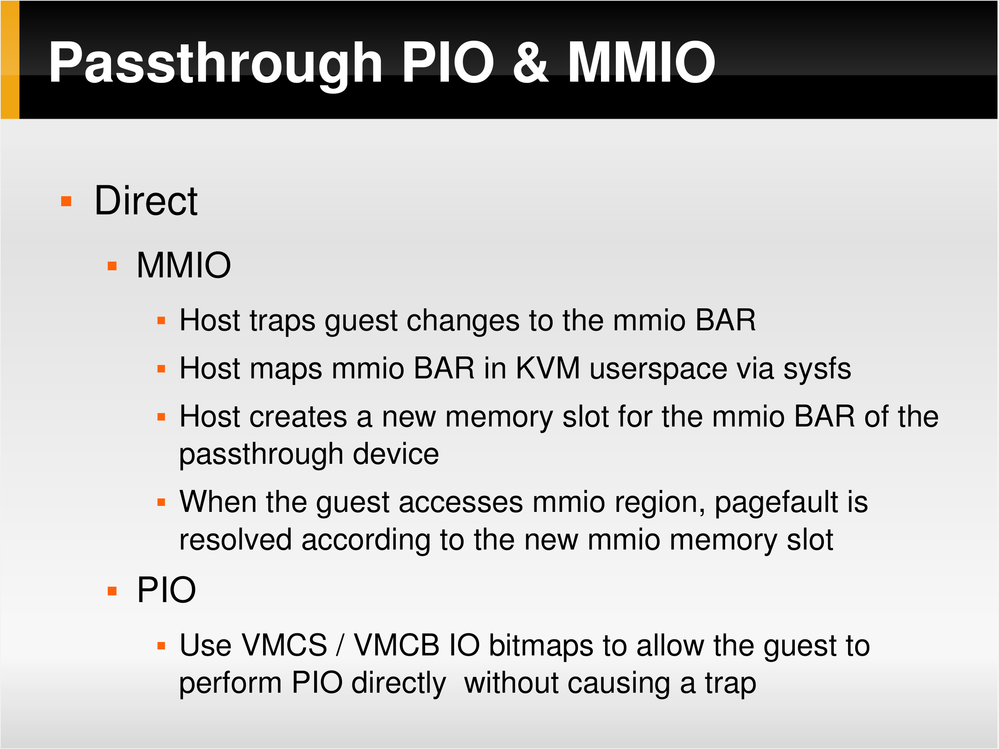

# Virtual Function I/O

[VFIO 概述\_OnePiece-CSDN 博客\_vfio](https://blog.csdn.net/hx_op/article/details/104029622)

[VFIO Introduction · kernelgo](https://kernelgo.org/vfio-introduction.html)

[Insight Into VFIO · kernelgo](https://kernelgo.org/vfio-insight.html)

[VFIO - “Virtual Function I/O” — The Linux Kernel documentation](https://www.kernel.org/doc/html/latest/driver-api/vfio.html)

[Modern Virtualization - Yizhou Shan's Home Page (lastweek.io)](http://lastweek.io/notes/virt/)

[PCI Device Passthrough for KVM](http://www.linux-kvm.org/images/d/d0/KvmForum2008%24kdf2008_14.pdf)

[To Trap or Not To Trap: The PCI Passthrough](https://www.donglizhang.org/virt-passthrough.pdf)


VFIO 要点：

- VFIO 是一种现代化的设备直通方案，充分利用了 VT-d/AMD-Vi 提供的 DMA 重映射和中断重映射特性，保证直通设备的 DMA 安全性同时可以达到接近物理设备的 I/O 性能。

  - 使用 DMA 重映射为每个 domain 建立独立的 IOMMU 页表，将直通设备的 DMA 访问限制在地址空间之内，保证安全性。
  - 使用中断重映射和 posted interrupt 实现中断隔离和中断投递。

- VFIO 框架

  - 最上层是 VFIO Interface，向用户态提供统一访问的接口，用户态通过约定的 ioctl 设置和调用 VFIO 的各种能力。
  - 中间层是 vfio_iommu 和 vfio_pci，前者是 VFIO 对 IOMMU 层的统一封装，主要实现 DMA 重映射的功能，即管理 IOMMU 页表；后者是 VFIO 对 PCI 设备驱动的统一封装，和用户态进程配合完成设备访问，包括 PCI 配置空间模拟、PCI Bar 空间重定向、中断重映射等。
  - 最下层是硬件驱动层，iommu driver 是平台相关的实现，vfio_pci 会调用 host 上的 pci_bus driver 实现设备注册和注销等操作。

  ```
  +-------------------------------------------+
  |                                           |
  |             VFIO Interface                |
  |                                           |
  +---------------------+---------------------+
  |                     |                     |
  |     vfio_iommu      |      vfio_pci       |
  |                     |                     |
  +---------------------+---------------------+
  |                     |                     |
  |    iommu driver     |    pci_bus driver   |
  |                     |                     |
  +---------------------+---------------------+
  ```

- 三个基本概念 device、group 和 container

  - group 是 iommu 能进行 DMA 隔离的最小硬件单元，设备直通时一个 group 里的设备必须都直通给一个虚拟机。
  - device 就是要操作的硬件设备，一个 multi-function 设备，其上所有的 function 设备都要放到同一个 group。
  - container 是和地址空间关联的概念，可以理解为一个 VM Domain 的物理内存空间。
  - 从下图可以看出，一个或多个 device 从属于某个 group，而一个或多个 group 又从属于一个 container。要将要给 device 直通给 VM，首先要找到其从属的 iommu group，然后将整个 group 加入到 container 中即可

  

- VFIO 数据结构

  

- VFIO 对直通设备 I/O 地址空间的访问：
  
  - 对于 PIO 访问，通过设置 VMCS 的 I/O bitmap 控制 guest 访问陷入，然后通过转换表（模拟的方式）将 PIO 操作转发到真实物理设备上。
  - 对于 MMIO 访问，通过 EPT 将虚拟机的 MMIO 地址映射到物理设备的 MMIO 地址空间，guest 访问 MMIO 不需要陷入。
  - PCI 配置空间是用来报告设备 I/O 信息的区域，可以通过 PIO 或 MMIO 方式（PCIE 之后可以通过 MMIO 访问）访问。设备直通中的配置空间并不直接呈现给 guest 而是由 VFIO 配合 QEMU 模拟。
  
  !!! question

      Q：既然配置空间可以通过 MMIO 访问，那这一部分是否也应该陷入由 QEMU 模拟？

      PCI 配置空间为 256 bytes，仅支持 PIO 方式访问。I/O 端口地址空间的 0xCF8 ~ 0xCFF 预留给了 PCI，前 32 位为 CONFIG_ADDRESS，格式如下，后 32 位为 CONFIG_DATA。

      

      PCIe 将配置空间扩展到 4096 bytes，其中扩展的部分无法使用以上的 PIO 方式访问，使用 MMIO 方式访问，称为 Enhanced Configuration Access Mechanism, ECAM。映射的内存空间由 ACPI MCFG 表指定，格式如下。

      

      访问时首先通过设备 PCI 段组号和总线找到对应的映射空间，获取起始地址和起始总线号。然后根据 BDF 信息使用以下的公式计算地址：

      `pa = START_PA + (Bus - START_BUS) << 20 | Dev << 15 | Func << 12`

      可能的解决方案：

      VM 的 ACPI 是由 QEMU 模拟的，那么 QEMU 是否可以控制或知晓 PCIe 配置空间映射的内存空间，从而在申请内存时告知 KVM，通过配置 EPT 陷入。

      

      
    
  - 直通设备 MMIO（BAR 空间）映射：
    1. 查询设备 BAR 空间信息
    2. 将设备的 BAR 空间 MMIO 重映射到 QEMU 的虚拟地址空间
    3. 将该段虚拟地址标记为 RAM 类型注册给虚拟机

- QEMU VFIO 初始化：

  