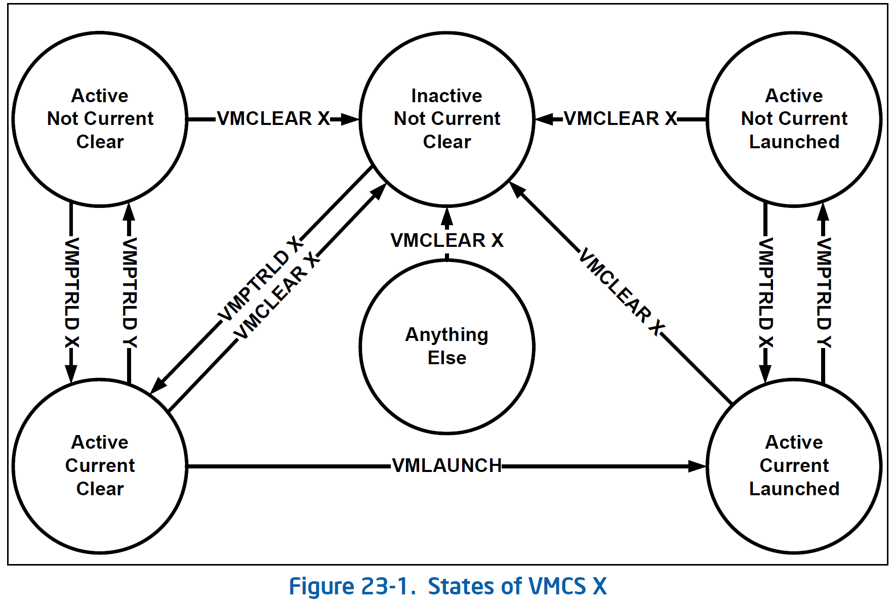
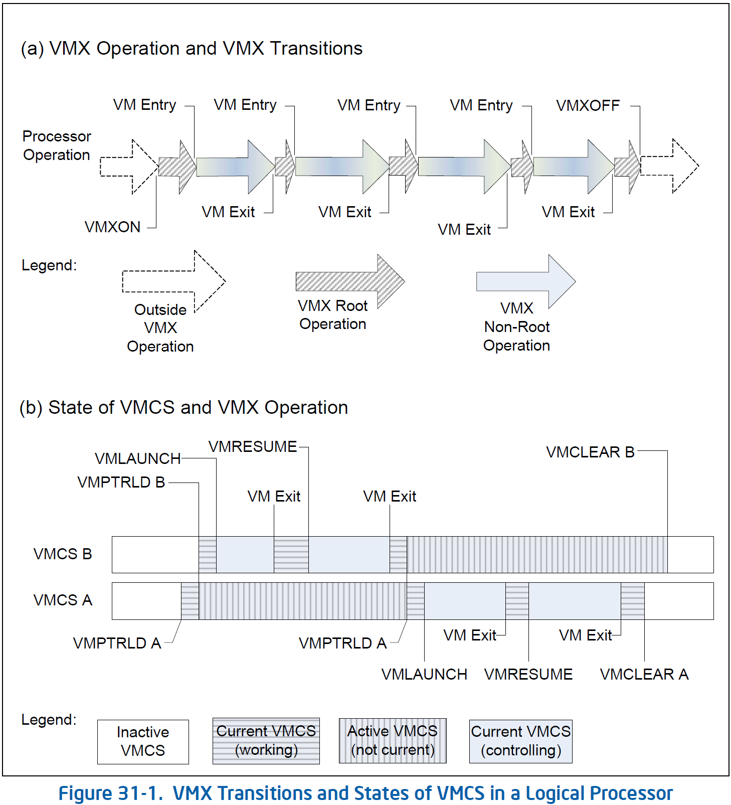
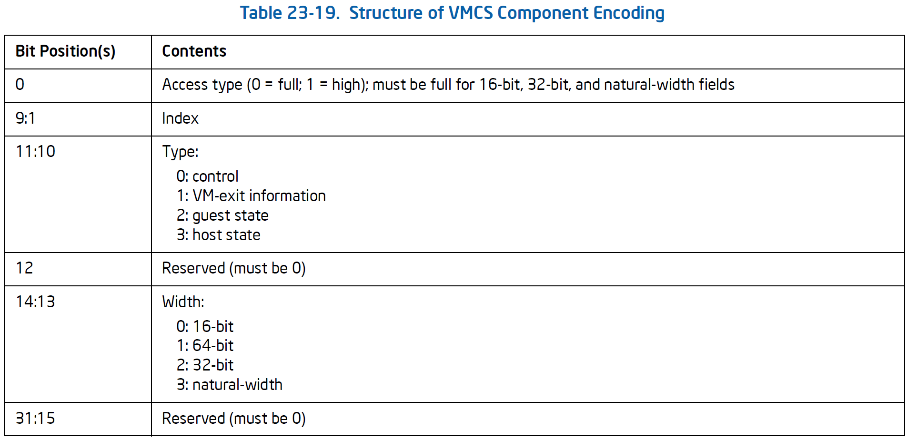

# VMCS

!!! tldr

    VMCS 的 guest state area 中没有保存通用寄存器，而是交给 KVM 保存，这里就分析 KVM 的这部分处理逻辑。然后再结合手册总结 VMCS 的相关信息。

## VMCS in SDM

### VMCS 状态

VMCS 的 launch state 决定应该对这个 VMCS 使用哪个 VM Entry 指令：

- vmlaunch 要求 VMCS 状态为 clear
- vmresume 要求 vm 状态为 launched

!!! todo

    之后还要结合手册详细看一下 VMX 指令的功能。

逻辑处理器在相应的 VMCS 区域维护 VMCS 的状态，按以下的方式管理：

- 如果 current VMCS 的状态为 clear，成功执行 vmlaunch 指令之后，状态变为 launched
- vmclear 指令的内存地址操作数为 VMCS 地址，指令执行后，那个 VMCS 的状态变为 clear
- 无法通过任何方式修改或获取 VMCS 的状态，即使是 vmwrite 和 vmread 也不行

下图展示了 VMCS 的不同状态，X 和 Y 是两个 VMCS：

- `vmptrld X` 使 X 变成 current&active
- `vmptrld Y` 使 X 变成 not current
- 如果 X 是 current VMCS 且状态为 clear，`vmlaunch X` 使其变成 launched
- `vmclear X` 使 X 变成 inactive&not current&clear

所谓 active、inactive，其实就是对当前逻辑处理器是否可用，而在 acive 中，同一时刻 current VMCS 仅有一个，VMX 指令的目标都是当前 VMCS 所代表的 vCPU。而 clear 或 launched，是指 VMCS 对应的 vCPU 是否在当前逻辑处理器上执行过，如果在同一处理器上恢复执行，也就是 launched 状态恢复，直接 vmresume 即可，而当迁移到另外的处理器时，就需要先 vmclear 将状态置为 clear，然后在目标处理器上执行 vmptrld 建立联系，vmlaunch 恢复执行。





### VMCS 软件使用注意事项

首先，要确保一个 VMCS 同一时间只能在一个逻辑处理器上处于 active 状态，否则会损坏。如果需要在逻辑处理器之间迁移就需要先执行 vmclear。

软件应该使用 vmread 和 vmwrite 指令访问 current VMCS 中的字段，不应该对 active VMCS 做普通访存操作，因为 VMCS 数据的存储结构是特定于实现的，未在架构上定义，同时逻辑处理器在处理器上而不是 VMCS 区域维护 active VMCS 的一些数据。这就导致：

- 直接读 VMCS 区域可能无法可靠地反映 VMCS 状态
- 直接写 VMCS 无法保证对 VMCS 产生决定性影响，反而可能导致 VMCS 损坏。

VMM 在 vmptrld 之前可以把 VMCS 区域从页表中删除，直到 vmclear。

以上提到的损坏，包括：

- VM Entry 因无法解释的原因失败
- 处理器可能无法运行 non-root 模式，导致未预期的 VM Exits。
- VM Exit 可能加载不需要的处理器状态，将其保存到 VMCS，或导致处理器关闭。

另外要注意的是，通过 vmread 和 vmwrite 访问 VMCS 时的操作数并不是简单地偏移，而是 32-bit 编码：



vmclear 会初始化 VMCS 中特定于架构的信息，因此在第一次使用 vmptrld 之前要执行 vmclear。

一些结构，如 I/O bitmap，其指针在 VMCS 中，而结构本身不在，所以只能用普通访存。软件需要确保只有在没有 current VMCS 在 non-root 模式引用它们时才能修改这些结构，否则可能导致无法预测的行为。当然，注入 virtual-APIC page、posted interrupt descriptor 这类结构除外。

### VMCS 类型：ordinary and shadow

VMCS 有两种，普通和 shadow，取决于 VMCS 区域的前 4-byte 的 bit-31，置 1 则为 shadow，同时还需要开启 VM-execution control 的 VMCS shadowing。普通和 shadow VMCS 有以下几点区别：

- shadow VMCS 无法用于 VM Entry，会报错。
- non-root 模式的 vmread 和 vmwrite 会访问 shadow VMCS
  - 未开启 VMCS shadowing 会触发 VM Exit
  - 开启 VMCS shadowing，会访问 current VMCS 中 VMCS link pointer 指向的 VMCS
  - VM entry 要确保 link pointer 指向的 VMCS 为 shadow

root 模式下两种 VMCS 都可以被 vmread 和 vmwrite 访问。软件无法修改 active VMCS 的 shadow 标识位。

!!! todo

    找相关资料的时候发现，2020.05 版的 Intel SDM 有几个章节在后续版本中被删除了

    - Virtual-Machine Monitor Programming Considerations
    - Virtualization Of System Resources
    - Handling Boundary Conditions In A Virtual Machine Monitor

    特别是其中第一章讲的内容还是挺有用的，VMM 编程注意事项，之后可以整理一下。


## KVM 状态保存与回复

QEMU/KVM 中 vCPU 运行（进入 VM）流程为：

```c
// QEMU 
ioctl(cpu, KVM_RUN, 0) ->
// KVM
kvm_arch_vcpu_ioctl_run ->
  vcpu_run ->
    vcpu_enter_guest ->
      static_call(kvm_x86_run) -> 
        vmx_vcpu_run -> 
          vmx_vcpu_enter_exit ->
            __vmx_vcpu_run(vmx, &vcpu->arch.regs, vmx->loaded_vmcs->launched) (arch/x86/kvm/vmx/vmenter.S)
```

!!! faq

    Q: static_call 是如何调用 vmx_vcpu_run 的？

    涉及 Linux 5.10 新引入的 static_call 机制，详见 [static_call.md](../linux_kernel/static_call.md)

中间涉及到一些准备工作和检查，这里忽略。进入 *vmenter.S* 后，就进入真正的入口 `__vmx_vcpu_run`，第二个参数 `regs` 就是由 KVM 保存的通用寄存器。下面就详细分析在进入/退出 non-root 模式时由 KVM 实现的状态（VMCS 中没有的，即通用寄存器）保存和恢复。

!!! hint

    [64 位调用约定](https://en.wikipedia.org/wiki/X86_calling_conventions#x86-64_calling_conventions)

    System V AMD64 ABI 将前六个整型或指针参数使用依次使用寄存器 RDI, RSI, RDX, RCX, R8, R9。

```c
SYM_FUNC_START(__vmx_vcpu_run)
	push %_ASM_BP
	mov  %_ASM_SP, %_ASM_BP
#ifdef CONFIG_X86_64
	push %r15
	push %r14
	push %r13
	push %r12
#else
	push %edi
	push %esi
#endif
	push %_ASM_BX

	/*
	 * Save @regs, _ASM_ARG2 may be modified by vmx_update_host_rsp() and
	 * @regs is needed after VM-Exit to save the guest's register values.
	 */
	push %_ASM_ARG2

	/* Copy @launched to BL, _ASM_ARG3 is volatile. */
	mov %_ASM_ARG3B, %bl

	/* Adjust RSP to account for the CALL to vmx_vmenter(). */
	lea -WORD_SIZE(%_ASM_SP), %_ASM_ARG2
	call vmx_update_host_rsp

	/* Load @regs to RAX. */
	mov (%_ASM_SP), %_ASM_AX

	/* Check if vmlaunch or vmresume is needed */
	testb %bl, %bl

	/* Load guest registers.  Don't clobber flags. */
	mov VCPU_RCX(%_ASM_AX), %_ASM_CX
	mov VCPU_RDX(%_ASM_AX), %_ASM_DX
	mov VCPU_RBX(%_ASM_AX), %_ASM_BX
	mov VCPU_RBP(%_ASM_AX), %_ASM_BP
	mov VCPU_RSI(%_ASM_AX), %_ASM_SI
	mov VCPU_RDI(%_ASM_AX), %_ASM_DI
#ifdef CONFIG_X86_64
	mov VCPU_R8 (%_ASM_AX),  %r8
	mov VCPU_R9 (%_ASM_AX),  %r9
	mov VCPU_R10(%_ASM_AX), %r10
	mov VCPU_R11(%_ASM_AX), %r11
	mov VCPU_R12(%_ASM_AX), %r12
	mov VCPU_R13(%_ASM_AX), %r13
	mov VCPU_R14(%_ASM_AX), %r14
	mov VCPU_R15(%_ASM_AX), %r15
#endif
	/* Load guest RAX.  This kills the @regs pointer! */
	mov VCPU_RAX(%_ASM_AX), %_ASM_AX

	/* Enter guest mode */
	call vmx_vmenter
```

!!! hint

    关于 `SYM_FUNC_START` 这个宏，详见 [assembler annotations1](../linux_kernel/asm_annotations.md)

在调用 `vmx_vmenter` 进入 guest 之前，要做的就是保存 host 状态并加载由 KVM 保存的 guest 状态，主要是 VMCS 中没有的通用寄存器。

首先将 host 寄存器压栈保存，然后从 `vcpu->arch.regs` 数组恢复 guest 寄存器。另外就是 `vmx->loaded_vmcs->lauched` 变量，会决定 VM Entry 的方式是 vmresume 还是 vmlaunch，区别在于是否在同一物理 CPU 上运行。

```c
SYM_FUNC_START_LOCAL(vmx_vmenter)
	/* EFLAGS.ZF is set if VMCS.LAUNCHED == 0 */
	je 2f

1:	vmresume
	ret

2:	vmlaunch
	ret

3:	cmpb $0, kvm_rebooting
	je 4f
	ret
4:	ud2

	_ASM_EXTABLE(1b, 3b)
	_ASM_EXTABLE(2b, 3b)

SYM_FUNC_END(vmx_vmenter)
```

!!! todo

    这里的 `__ASM_EXTABLE` 涉及 exception table 机制，即如果 1b 和 2b 处发生异常，就跳转到 3b 处。后面可以详细看看

而当成功完成 VM Entry 之后，当 VM Exit 时，控制流会跳转到 `vmx_vmexit`，这是因为 VMCS 中的 host RIP 被设置到此处。

```c
// arch/x86/kvm/vmx/vmx.c
void vmx_set_constant_host_state(struct vcpu_vmx *vmx) {
  ...
	vmcs_writel(HOST_RIP, (unsigned long)vmx_vmexit); /* 22.2.5 */
  ...
}

// arch/x86/kvm/vmx/vmenter.S
SYM_FUNC_START(vmx_vmexit)
#ifdef CONFIG_RETPOLINE
	ALTERNATIVE "jmp .Lvmexit_skip_rsb", "", X86_FEATURE_RETPOLINE
	/* Preserve guest's RAX, it's used to stuff the RSB. */
	push %_ASM_AX

	/* IMPORTANT: Stuff the RSB immediately after VM-Exit, before RET! */
	FILL_RETURN_BUFFER %_ASM_AX, RSB_CLEAR_LOOPS, X86_FEATURE_RETPOLINE

	/* Clear RFLAGS.CF and RFLAGS.ZF to preserve VM-Exit, i.e. !VM-Fail. */
	or $1, %_ASM_AX

	pop %_ASM_AX
.Lvmexit_skip_rsb:
#endif
	ret
SYM_FUNC_END(vmx_vmexit)
```

这里要做的就是在 VM Exit 后的第一时间填充覆盖 RSB，防御对 VM 的 Spectre-type 攻击。host 栈没变，之后的 ret 返回到 `__vmx_vcpu_run` 中继续执行，这里要做的就是保存 guest 状态并从栈中恢复 host 状态。之后就返回继续执行 `vmx_vcpu_run` 的后半部分，根据 exit_reason 处理 VM Exit 等。
