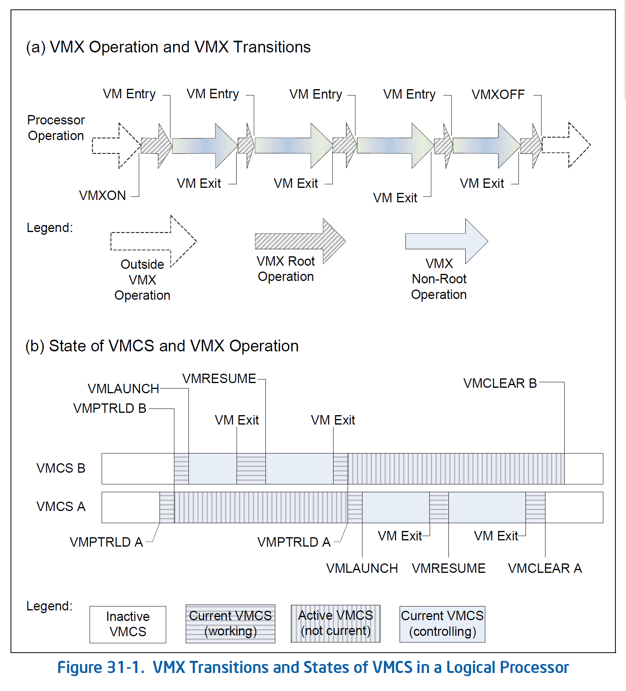

# Virtual-Machine Monitor Programming in Intel SDM

[Intel SDM Vol.3 Chapter 31 & 32 & 33 Version: May 2020](https://1drv.ms/b/s!AuWwiE4LJl7mpzqmLOuYe_48LoDI?e=H1XdmB)

!!! tldr

    找 VMCS 相关资料的时候发现，May 2020 版的 Intel SDM 相比最新的版本多出几章，讲述了 VMM 编程注意事项、系统资源虚拟化和边界条件处理，在此记录。

## Virtual-Machine Monitor Programming Considerations

### VMX System Programming Overview

Virtual Machine Monitor, VMM 是管理虚拟机的软件，本章描述了 VMM 编程的一些注意事项。

每个 VM 的行为就像一台完整的物理机，可以允许操作系统和应用程序。VMM 运行在最高特权级，拥有底层系统硬件的完全所有权。VMM 控制创建 VM、将控制权转移到 VM 以及 guest 和 host 之间转换的情况。VMM 允许 VM 共享底层硬件并提供 VM 间隔离。VM 中的软件不知道 guest 和 host 之间可能发生的任何转换。

### Supporting Processor Operating Modes in Guest Environment

通常，VMM 使用 VM Entry 将控制权转移给 VM。VMCS 中指定了定义允许 VM 隔离执行的边界条件。

处理器可以将 CR0 和 CR4 中的某些位固定为特定值，不支持其他值。首先要求的就是 CR0.PE 和 CR0.PG 为 1，这意味着 VM Entry 只能进入开启分页并处于保护模式或虚拟 8086 模式的 guest。Guest 在其他操作模式的执行需要由 VMM 特殊处理。

一个例子就是 guest 在实模式下运行。VMM 有两种方式支持 guest 实模式运行：

- 在 VMM 中使用快速指令集仿真器
- 利用实模式和虚拟 8086 模式的相似性，在虚拟 8086 容器中执行 guest。在监视器中实现虚拟 8086 容器任务，模拟实模式 guest 状态和指令。或在虚拟 8086 模式执行 guest，VM Entry 时将 RFLAGS.VM 置位。访问虚拟 8086 容器之外的特权状态的实模式代码会陷入到 VMM 进行仿真。

另一种例子就是 guest 运行在禁用分页的保护模式，VM 通过一对一映射页表支持 guest 执行。

#### Using Unrestricted Guest Mode

设置 VMCS 执行控制字段 unrestricted guest 允许 VM 运行在实模式和未分页的保护模式。VMM 必须使用 EPT 虚拟化 guest 内存。

64 位 VMM 将 unrestricted guest 置位时要注意：

- 推荐开启 load IA32_EFER 和 save IA32_EFER，如果不置位且 CR0.PG=0，VM Entry 时 IA32_EFER.LME（Long Mode Enable）会保持不变，host 值保留在 guest 中。
- 支持 unrestricted guest 的处理器会在 VM Exit 时保存 guest IA32_EFER.LMA（Long Mode Active）值到 VM Entry 控制中的 IA-32e mode guest。

### Managing VMCS Regions and Pointers

使用 VMCS、相关的 VMCS 指针和 VMCS 区域时，VMM 必须遵守必要的程序。它也不能假定内存或缓存中 VMCS 区域的持久性状态。

进入 VMX 模式之前，VMM 分配一个 VMXON 区域。一个 VMM 可以管理多个虚拟机，有多个 active VMCS。每个 VM 需要一个唯一的 VMCS 区域，VMM 本身需要一个 VMXON 区域。

VMM 读 IA32_VMX_BASIC MSR 获取 VMCS 区域大小，然后创建 4K 对齐的物理内存区域。每个 VMCS 区域都要使用与处理器 VMX capability MSR 相同的 VMCS 修订标识符（在最开头）初始化。

!!! note

    软件不得直接读取或写入 VMCS 数据区，因为其格式没有在架构上定义。Intel 建议 VMM 在加载之前删除所有到 VMCS 区域的地址映射。

进入 VMX 模式之前，系统软件不需要对 VMXON 区域做特殊准备，只需将其地址作为操作数提供给 VMXON 指令。进入 VMX root 模式后，VMM 需要准备 VMCS 字段，以控制 VM 执行。VMM 使用 VMPTRLD 指令使指定 VMCS 成为 current VMCS。VMCS 数据字段只能通过 VMREAD 和 VMWRITE 指令读取和写入。

VMCS 的每个字段都有 32 位编码标识，作为 VMREAD 和 VMWRITE 的操作数。VM Entry 之前，VMM 必须正确初始化 current VMCS 的所有字段。

VMX non-root 模式的 current VMCS 成为 controlling VMCS，而处理器不在 VMX non-root 模式的 current VMCS 称为 working VMCS。

!!! note

    处理器可以通过维护 active VMCS（执行过 VMPTRLD）的状态来优化 VMX 操作。在将控制权交给其他可能不通知 VMM 而将处理器断电或离开 VMX 模式的系统软件之前，VMM 需要使用 VMCLEAR 清除所有 active VMCS。确保所有处理器缓存的 VMCS 数据都写回内存，且没有其他软件可以破坏当前 VMM 的 VMCS数据。还建议 VMM 在执行 VMCLEAR 后执行 VMXOFF。


IA32_VMX_BASIC 报告了处理器用于访问 VMCS 或通过 VMCS 中指针引用的数据结构的内存类型。软件必须将 VMCS 结构维护在缓存一致性的内存。软件必须将 I/O 位图、MSR 位图、VM Exit MSR 存储区域、VM Exit MSR 加载区域和 VM Entry MSR 加载区域映射到写回类型。也可以映射为不可缓存类型，但会对性能有较大影响。

### Using VMX Instructions

VMX 指令仅允许在 VMX root 模式运行，在 non-root 模式执行会触发 VM Exit。



执行 VMX 指令时会执行一系列检查，对故障进行明确的错误处理。在加载 guest 状态之前检测到的 VMX 指令执行失败由处理器处理：

- 如果 working VMCS 指针无效，将 RFLAGS.CF 置位，指令失败。
- 如果 working VMCS 指针有效，RFLAGS.ZF 置位，且将适当的错误码保存到 working VMCS 的 VM 指令错误字段。

软件通过检查 RFLAGS.CF 和 RFLAGS.ZF 决定 VMX 指令执行成功或失败。

下面是关于使用 VM Entry 指令（VMLAUNCH 和 VMRESUME）的详细信息：

- 如果 working VMCS 指针有效，其状态可能导致 VM Entry 指令失败。RFLAGS.ZF 置位以及以下的值之一会保存到 VM 指令错误字段：
  - 4:VMLAUNCH with non-clear VMCS：错误发生时，软件通过执行 VMRESUME 避免错误。
  - 5:VMRESUME with non-launched VMCS：错误发生时，软件通过执行 VMLAUNCH 避免错误。
  - 6:VMRESUME after VMXOFF：错误发生时，软件执行以下的指令序列避免错误（如果软件已知 working VMCS 指针，则不需要 VMPTRSRT）：
    
    ```
    VMPTRST working VMCS pointer
    VMCLEAR working VMCS pointer
    VMPTRLD working VMCS pointer
    VMLAUNCH
    ```
  - 如果以上错误都没发生，处理器会检查 VMX 控制和 host 状态区域。如果检查失败，VM Entry 指令失败。RFLAGS.ZF 置位或 7（VM Entry 时控制字段无效）或 8（VM Entry 时 host 状态字段无效）保存在 VM 指令错误字段。
  - VM Entry 指令（VMRESUME 或 VMLAUNCH）完成对常规检查和对 VM 控制和 host 状态区域检查后，加载 guest 状态时发生的任何错误（错误 guest 状态和错误 MSR 加载）都会让处理器从 working VMCS 的 host 状态区域加载状态，就像发生 VM Exit。
  - 当然，此错误行为与 VM Exit 存在不同，不会将 guest 状态保存到 guest 状态区域。VMM 可以通过检查 working VMCS 的 exit reason 字段的 bit-31 以检测 VM Exit handler 是否由这样的错误调用，并通过 exit qualification 字段进一步识别故障。

### VMM Setup & Tear Down

在进入 VMX 模式之前，VMM 需要确保处理器运行在开启分页的保护模式。下面描述了 CPL=0 的 VMM 进入 VMX root 模式所需的最小步骤。

- 使用 CPUID 检查 VMX 处理器支持。
- 通过 VMX capability MSR 确定处理器支持的 VMX 能力。
- 根据 IA32_VMX_BASIC MSR 指定的大小创建非分页的 4K 对齐 VMXON 内存区域。软件应该读能力 MSR 确定 VMXON 区域的物理地址宽度，确保整个 VMXON 区域都可以通过该宽度的地址寻址。软件必须确保 VMXON 区域是缓存一致性内存。
- 使用能力 MSR 报告的 VMCS 修订标识符初始化 VMXON 区域中的修订标识符。清除 VMXON 区域前 4-byte 的 31-bit。
- 确保当前处理器操作模式满足所需的 CR0 固定为（CR0.PE=1, CR0.PG=1）。其他需要的 CR0 固定位可以通过 IA32_VMX_CR0_FIXED0 和 IA32_VMX_CR0_FIXED1 MSR 检测。
- 通过设置 CR4.VMXE=1 启用 VMX 模式。确保生成的 CR4 值对应 IA32_VMX_CR4_FIXED0 和 IA32_VMX_CR4_FIXED1 MSR 报告的固定位。
- 确保正确变成 IA32_FEATURE_CONTROL MSR，其锁定为 bit-0 置位。MSR 通常由 BIOS 使用 WRMSR 配置。
- 执行 VMXON，以 VMXON 区域物理地址为操作数。检查 RFLAGS.CF=0 即 VMXON 执行成功。

以上步骤成功执行后，处理器处于 VMX root 模式。

VMM 执行在 VMX root 模式且 CPL=0，通过执行 VMXOFF 离开 VMX 模式，检查 RFLAGS.CF=0 且 RFLAGS.ZF=0 验证执行成功。

如果 SMM 监视器配置为在 VMX 模式中为 SMI 提供入伍，在执行 VMXOFF 离开 VMX 模式之前，需要卸载 SMM 监视器，否则会 VMXOFF 失败。

#### Algorithms for Determining VMX Capabilities

如前所述，VMM 通过读 VMX 功能 MSR 确定处理器支持的 VMX 功能。

某些 VMX 控制字段需要保留并设置为处理器定义的特定值，大多数默认设置为 0，使用 default1 描述默认设置为 1 的控制字段。包括 pin-based VM 执行控制、基于处理器的主 VM 执行控制、VM Exit 控制和 VM Entry 控制。所有基于处理器的第二 VM 执行控制都不是 default1 类别。

未来的处理器可能会为一个或多个保留控制字段定义新功能，处理器不想使用功能就可以将控制字段设置为默认。

能力 MSR：IA32_VMX_PINBASED_CTLS, IA32_VMX_PROCBASED_CTLS, IA32_VMX_EXIT_CTLS, IA32_VMX_ENTRY_CTLS 分别报告了各部分控制字段允许的设置。然而，它们始终报告 default1 类型的控制字段必须为 1。如果逻辑处理器允许 default1 类型的控制字段为 0，则通过 IA32_VMX_BASIC MSR 的 bit-55 置位来指示。此时上面的这些 MSR 都将汇报允许设置所有字段。

软件通过以下算法之一来确定正确的默认控制字段设置：
