# VMX Instruction Reference

[Intel SDM Vol.3C Chapter 29]()

!!! tldr

    总结整理 VMX 扩展指令集。

## Overview

VMX 支持处理器硬件虚拟化，系统软件层充当多个 guest 软件环境的 host。VMX 指令集扩展包括五个管理 VMCS 的指令，四个管理 VMX 操作的指令，两个 TLB 管理指令和两个由 guest 软件使用的指令。

VMCS 维护指令总结：

- `vmptrld m64`：以 64 位内存地址为源操作数，使操作数引用的 VMCS 处于 active 和 current 状态，将该操作数加载到 current VMCS 指针，基于引用的 VMCS 区域中的 VMCS 数据区建立 current VMCS。引用的 VMCS 处于 active 状态，逻辑处理器可以在处理器上维护 VMCS 中的一些数据。
- `vmptrst m64`：以 64 位内存地址为目标操作数，将 current VMCS 指针存到目标操作数。
- `vmclear m64`：以 64 位内存地址为操作数，将操作数引用的 VMCS 状态设置为 clear&inactive，确保 VMCS 的数据被写入引用的 VMCS 区域中的 VMCS 数据区。如果操作数与 current VMCS 指针相同，则该指针无效。
- `vmread r/m64, r64 | vmread r/m32, r32`：从 VMCS 读取字段（字段编码在寄存器操作数中给出），并将其存储到另一个寄存器或内存地址目标操作数中。
- `vmwrite r/m64, r64 | vmwrite r/m32, r32`：向 VMCS 写入字段（字段编码由寄存器操作数给出），源操作数由另一个寄存器或内存地址操作数指定。

VMX 管理指令总结：

- `vmlaunch/vmresume`：启动 current VMCS 对应的虚拟机，触发 VM Entry，控制流转换到虚拟机。
- `vmxoff`：处理器离开 VMX 操作模式。
- `vmxon m64`：以 64 位内存地址为源操作数，使逻辑处理器进入 VMX root 模式，并使用操作数引用的内存内容支持 VMX 模式。

VMX 特定的 TLB 管理指令总结：

- `invept r64, m128 | invept r32, m128`：使 EPT 派生的 TLB 和分页结构缓存中的条目无效。
- `invvpid 64, m128 | invvpid r32, m128`：使基于 VPID 的 TLB 和分页结构缓存条目无效。

guest 可用的指令总结：

- `vmcall`：VMX non-root 模式的软件可以调用 VMM 服务，触发 VM Exit，控制流转换到 VMM。
- `vmfunc`：VMX non-root 模式的软件在不触发 VM Exit 的情况下调用 VM 功能（由 VMX root 模式中的软件启用和配置的处理器功能）。

## Conventions

VMX 指令操作使用 Vmexit 伪函数，指示逻辑处理器触发 VM Exit。还是用伪函数 VMsucceed, VMfail, VMfailInvalid 和 VMfailValid。这些伪函数通过在 RFLAGS 中设置或请求标志位，在某些情况下写入 VM 指令错误字段来表示指令成功或失败。

```
VMsucceed:
  CF := 0;
  PF := 0;
  AF := 0;
  ZF := 0;
  SF := 0;
  OF := 0;

VMfail(ErrorNumber):
  IF VMCS pointer is valid
    THEN VMfailValid(ErrorNumber);
    ELSE VMfailInvalid;
  FI;

VMfailInvalid:
  CF := 1;
  PF := 0;
  AF := 0;
  ZF := 0;
  SF := 0;
  OF := 0;

VMfailValid(ErrorNumber):// executed only if there is a current VMCS
  CF := 0;
  PF := 0;
  AF := 0;
  ZF := 1;
  SF := 0;
  OF := 0;
  Set the VM-instruction error field to ErrorNumber;

```

## VMX Instructions

VMX 指令的细节描述。

### INVEPT: Invalidate Tranlations Derviced from EPT

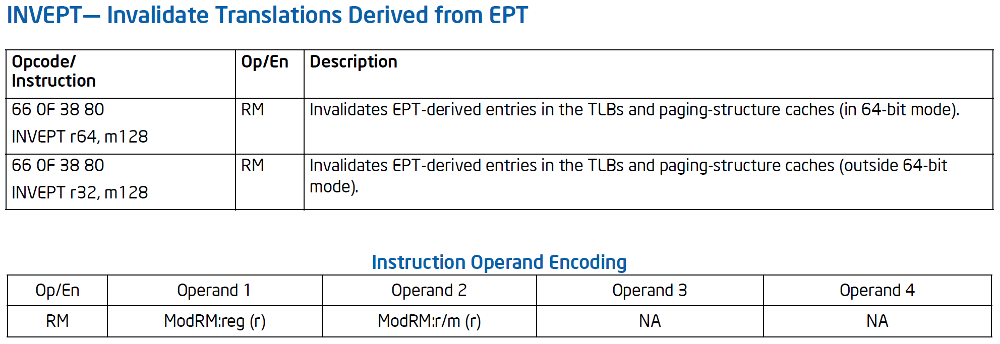

使 EPT 派生的 TLB 和分页结构缓存中的映射无效，基于寄存器操作数中指定的 INVEPT 类型和内存操作数中指定的 INVEPT 描述符。

INVEPT 类型有两种：

- 单个上下文无效：INVEPT 类型为 1，逻辑处理器使与 INVEPT 描述符中指定的 EPTP 指针 51-12 位相关联的所有映射无效。
- 全局无效：INVEPT 类型为 2，逻辑处理器将与所有 EPTP 相关联的映射无效。
- 对于不支持的 INVEPT 类型，指令失败。

INVEPT 使指示的 EPTP 的所有指定映射无效，无视这些映射可能与之关联的 VPID 和 PCID 值。

INVEPT 描述符包含 128 位，其中低 64 位为 EPTP 值。

### INVVPID： Invalidate Translations Based on VPID

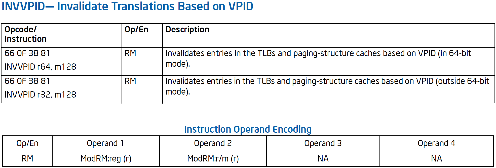

使基于 VPID 的 TLB 和分页结构缓存中的映射无效，基于寄存器操作数指定的 INVVPID 类型和内存操作数中指定的 INVVPID 描述符。

INVVPID 类型有两种：

- 单个地址失效：INVVPID 类型为 0，逻辑处理器使 INVVPID 描述符中指定的线性地址和 VPID 的映射无效。
- 单个上下文无效：INVVPID 类型为 1，逻辑处理器使 INVVPID 描述符中指定的 VPID 标记的所有映射无效。
- 所有上下文无效：INVVPID 类型为 2，逻辑处理器使除 VPID 0000H 外所有 VPID 标记的所有映射无效。
- 单个上下文无效，保留全局转换：INVVPID 为 3，逻辑处理器使 INVVPID 描述符中指定的 VPID 标记的所有映射无效，全局转换除外。
- 对于不支持的 INVVPID 类型，指令失败。

INVVPID 使指示的 VPID 的所有指定映射无效，无视这些映射可能与之关联的 EPTP 和 PCID 值。

INVVPID 描述符包含 128 位，高 64 位为线性地址，低 16 位为 VPID。

### VMCALL: Call to VM Monitor

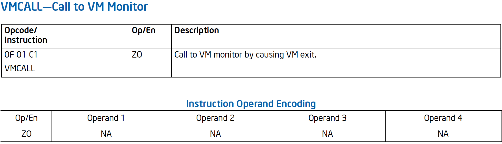

指令允许 guest 软件向底层 VMM 调用服务，此类调用的详细信息是特定于 VMM 的；指令仅导致 VM Exit，注册适当的 exit reason。

在 VMX root 模式使用此指令会调用 SMM Monitor，将激活系统管理中断 SMI 和系统管理模式 SMM，如果尚未激活。

### VMCLEAR: Clear VMCS

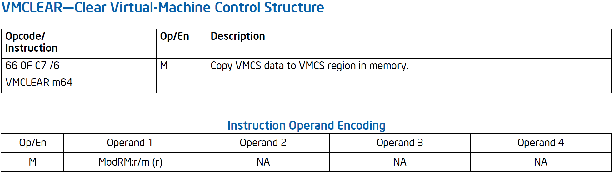

指令适用于 VMCS 区域位于操作数中包含的物理地址的 VMCS，确保 VMCS 数据（其中的一些数据正由处理器维护）复制到内存中的 VMCS 区域。还会初始化部分 VMCS，如将状态设置为 clear。

操作数始终为 64 位内存地址，如果操作数与 current VMCS 指针相同，则该指针无效，设置为 FFFFFFFF_FFFFFFFFH。

VMCLEAR 指令可能不会显式地将任何 VMCS 数据写入内存，指令执行之前，数据可能已经驻留在内存中。

### VMFUNC: Invoke VM function

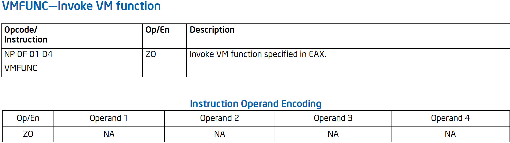

指令允许 VMX non-root 模式软件调用 VM 功能，由 VMX root 模式的软件启用和配置的处理器功能。EAX 值为要调用的特定 VM 功能。

### VMLAUNCH/VMRESUME: Launch/Resume Virtual Machine

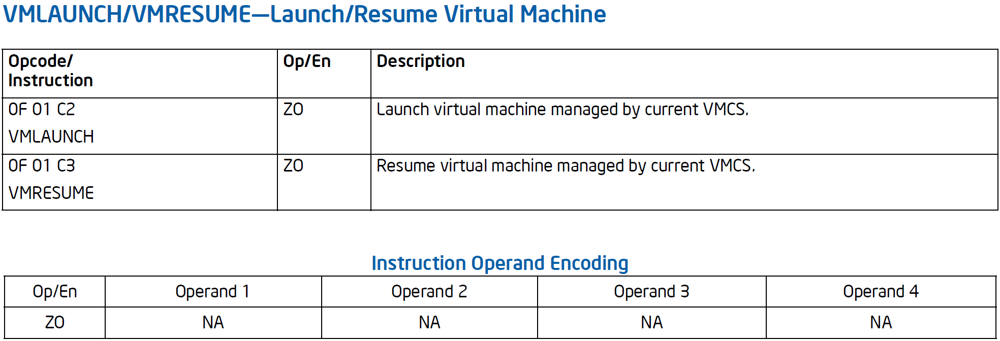

触发作用域 current VMCS 的 VM Entry：

- 如果 current VMCS 状态不是 clear，VMLAUNCH 会失败。指令执行成功会把状态置为 launched。
- 如果 current VMCS 状态不是 launched，VMRESUME 会失败。

VM Entry 中，逻辑处理器会执行一系列一致性检查，未通过对 VMX 控制位或 host 状态区域的检查，会将控制位传递给之后的指令。如果这些通过但对 guest 状态区域中的检查失败，则逻辑处理器将从 VMCS 的 host 状态区域加载状态，将控制权传递给 host 状态区域中的 RIP 字段指向的指令。

当 MOV SS 和 POP SS 屏蔽了事件时，不允许 VM Entry。

### VMPTRLD: Load Pointer to VMCS

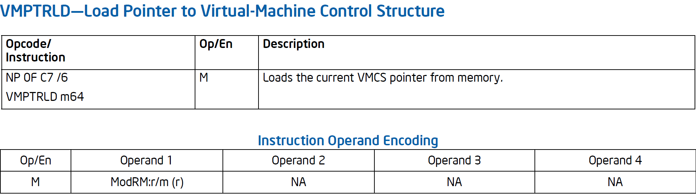

将 current VMCS 指针标记为有效，并将指令操作数中的物理地址加载到其中。操作数未正确对齐、设置不支持的物理地址位或等于 VMXON 指针，则指令失败。此外，如果操作数引用的内存中的 32 位数据与处理器支持的 VMCS 修订标识符不匹配，则指令失败。

操作数始终为 64 位内存地址。

### VMPTRST: Store Pointer to VMCS

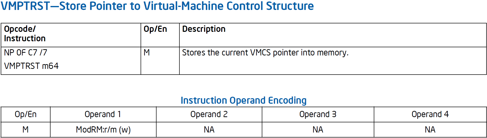

将 current VMCS 指针存到指定的内存地址，操作数始终为 64 位内存地址。

### VMREAD: Read Field from VMCS

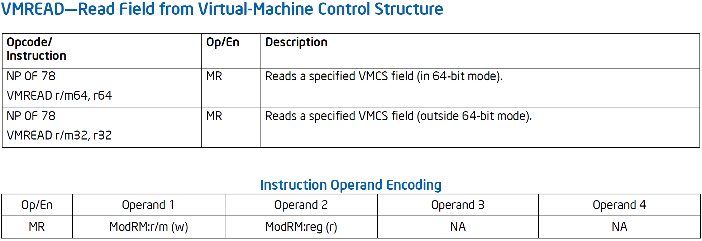

从 VMCS 中读取指定字段并将其存储到指定的目标操作数（寄存器或内存）中。VMX root 模式下，指令从 current VMCS 读取，在 VMX non-root 模式下，指令从 current VMCS 的 VMCS link 指针字段引用的 VMCS 读取。

VMCS 字段由寄存器源操作数中包含的 VMCS 字段编码指定。

只有在 VMCS 指针有效且支持指定的 VMCS 字段之后，才能发生因为访存目标操作数导致的故障。

### VMWRITE: Write Field to VMCS

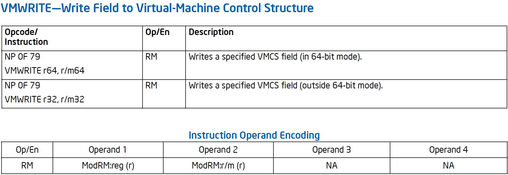

将源操作数（寄存器或内存）的内容写入 VMCS 中的指定字段。在 VMX root 模式中，指令写入 current VMCS，在 VMX non-root 模式中，指令写入 current VMCS 中的 VMCS link 指针字段引用的 VMCS。

VMCS 字段由寄存器目的操作数中包含的 VMCS 字段编码指定。

### VMXOFF: Leave VMX Operation

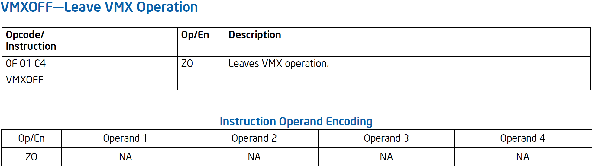

使逻辑处理器离开 VMX 模式，取消阻止初始化信号，有条件地重启 A20M，并清除任何地址范围监控。

### VMXON: Enter VMX Operation

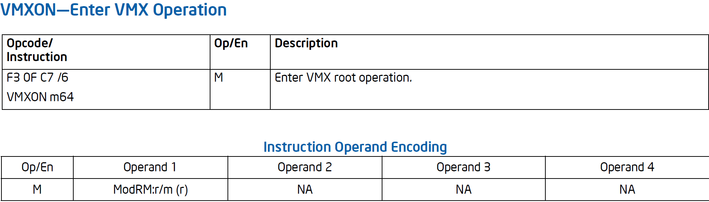

在没有 current VMCS 的情况下将逻辑处理器置于 VMX 模式，组织初始化信号，禁用 A20M，清除由监控指令建立的任何地址范围监控。

指令操作数是引用 VMXON 区域的 4KB 对齐物理地址（VMXON 指针），逻辑处理器用于支持 VMX 操作。操作数始终为 64 位内存地址。

## VM Instruction Error Numbers

对于某些错误情况，VM 指令错误字段将加载错误编号以指示错误来源。

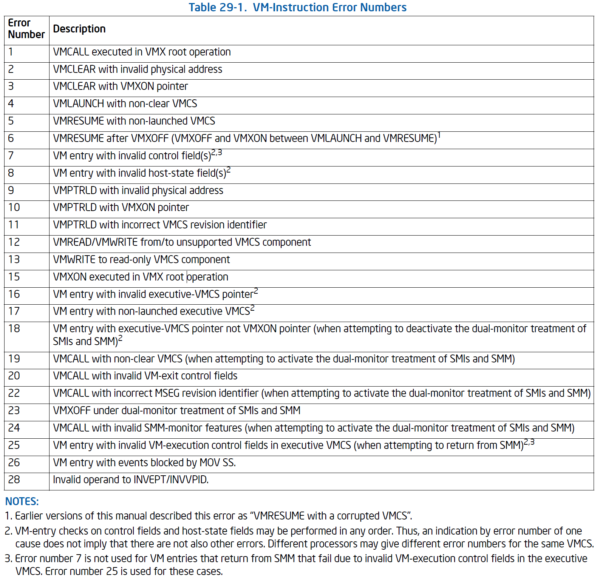