# Intel VT-d

[VT-d DMA Remapping · kernelgo](https://kernelgo.org/dma-remapping.html)

[Shared Virtual Memory for IOMMU](https://lwn.net/Articles/747230/)

[VT-d Interrupt Remapping · kernelgo](https://kernelgo.org/interrupt-remapping.html)

[VT-d Interrupt Remapping - L (liujunming.top)](http://liujunming.top/2020/10/10/VT-d-Interrupt-Remapping/)

[VT-d Posted Interrupt · kernelgo](https://kernelgo.org/posted-interrupt.html)

[VT-d Posted Interrupt - L (liujunming.top)](http://liujunming.top/2020/10/11/VT-d-Posted-Interrupt/)

[Intel VT-d (4) - Interrupt Posting - 知乎](https://zhuanlan.zhihu.com/p/51018597)

[VT-d Posted Interrupts](https://events.static.linuxfound.org/sites/events/files/slides/VT-d%20Posted%20Interrupts-final%20.pdf)

## DMA Remapping

在 [dma_and_iommu](./dma_and_iommu.md) 中说明了 IOMMU 的原理，通过地址转换实现隔离和直通，设备使用 gPA 进行 DMA 操作，由 IOMMU 将其转换为 hPA。Intel VT-d 就是 IOMMU 的硬件实现。

DMA 请求按照是否包含 PASID（进程地址空间标志），分为 with-PASID 和 without-PASID。对于 PASID 相关信息会在之后单独讨论。下面只针对后者，也即是普通的 DMA 请求，仅包含请求类型、地址、大小和设备标识符。

VT-d 提供的 DMA 隔离是以 Domain 为单位的，虚拟化环境下可以认为一个 VM 就是一个 Domain。而直通设备的 DMA 地址空间可能是 VM 的 gPA 空间或其中某个进程的 gVA 空间或软件定义的抽象 IOVA。总之 DMA 重映射就是将设备发起的 DMA 请求转换到对应的 hPA 上。

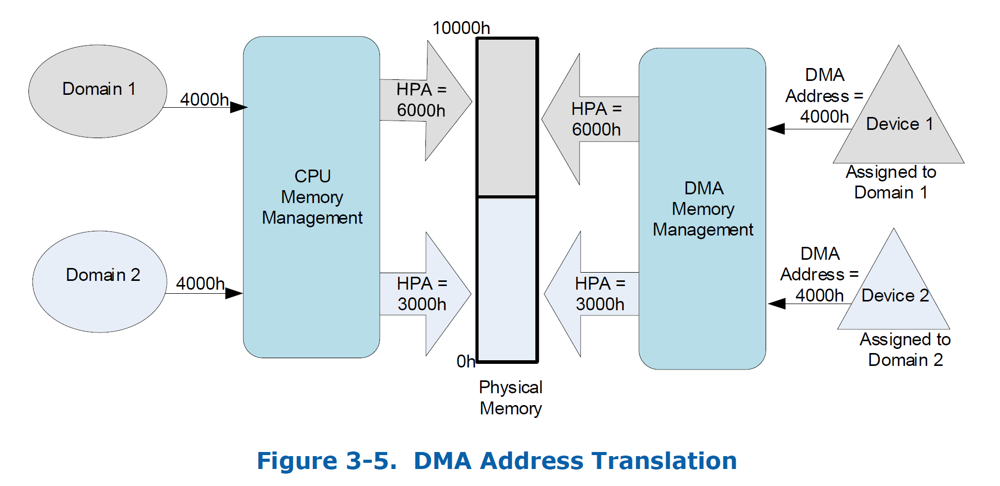

使用 BDF 标志直通设备，引入 Root-table 和 Context-table，通过查询两个表就可以获得最后的 IO 页表。两个页表分别使用 BDF 的高、低八位作为索引。Root-table 的及地址存储在寄存器中，表项包括对应 Context-table 地址和存在标志位。而 Context-table 的表项中包含了标志位和用于 DMA 地址转换的页表地址，称为二级页表。多个设备可能分配到一个 Domain，通过通向二级页表就可实现。

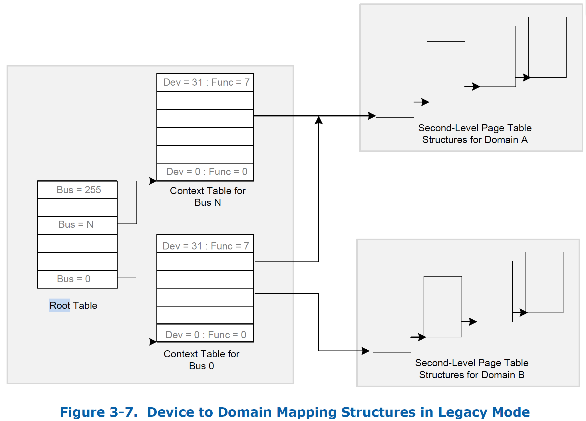

一般的二级页表类似于 EPT，只不过只有设备分配到的 VM 的 HPA 范围。同时也有 IO-TLB 加速地址转换过程。

## Interrupt Remapping

DMA 重映射解决了 DMA 的直通和隔离，而设备完成 DMA 操作之后要向 CPU 发送中断。而直通设备的 MSI 由 guest 分配，设备发送中断时的地址是 gPA，中断无法直接到达 guest。而中断重映射就是，**IOMMU 截获中断，先将其映射到 host 的某个中断，然后再由 VMM 投递到 guest 内部**。

在没有中断重映射机制时，中断请求包括地址和数据字段，地址包含目标 CPU 的 APIC ID，数据包含中断向量号和投递方式。当地址字段的 bit-4 置位时，表示开启重映射。此时的地址字段不在包含目标 CPU APIC ID，而是一个 16 位的索引。bit-3 时 SHV 标志位，用于指示请求是否包含子索引。（引入子索引是为了兼容 MSI 支持对单个地址多个 data 的投递方式）

IOMMU 截获中断请求后，根据索引和子索引（如果有）计算重映射表的索引。每个表项 IRTE 为 16-byte，整个表占用 1M 空间。

以下图为例，中断重映射的流程：

- 当 guest 配置设备的 MSI 时，会陷入到 VMM，得到虚拟中断的向量号为 30，分配对应的物理中断向量 60，VMM 记录 host 中断 60 到 guest 中断 30 的映射。
- 分配 IRTE 并按格式填好属性。
- 按照重映射格式对 MSI 编程，如设置 interrupt_index、设置中断格式标志位。
- 设置 VMCS，物理 CPU 受到中断 60 时陷入。
- VMM 处理陷入，根据映射为 guest 注入 30 中断。
- VM Entry 后，guest 处理 30 中断。

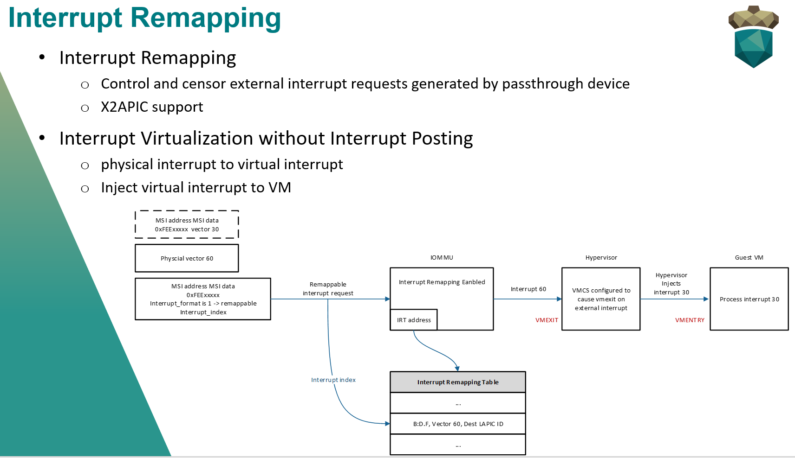

直通设备 MSI 中断的 GSI 和 irqfd 是一对一绑定的， 所以直通设备在向 guest vCPU 投递 MSI 中断的时候首先会被 IOMMU 截获， 中断被重定向到 host IRQ 上，然后通过 irqfd 注入 MSI 中断到虚拟机内部。

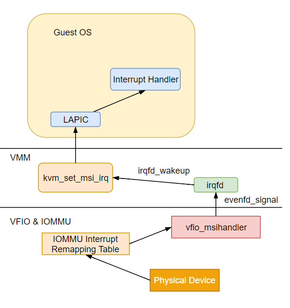

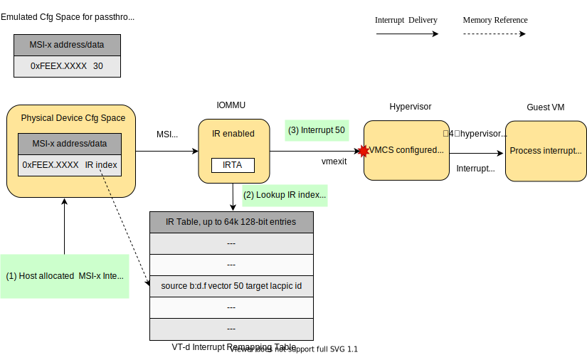

## Posted Interupt

中断重映射改变了设备中断的投递方式，仅以 16 位的 interrupt_index 索引对应的 IRTE，中断处理更灵活。Intel 引入 Interrupt Posting 机制，从硬件层面实现中断隔离和中断自动迁移等特性。

开启 posting 之后，新增了一个 64-byte Posted Interrupt Descriptor, PID，被硬件使用来记录要求 post 的中断请求。描述符包括中断位图、目标 CPU 的 APIC ID、标志位等。

- PIR 域就是位图，用于记录中断向量号。
- Outstanding Notification, ON 域，由硬件自动更新，用于表示是否有 pending 的中断请求。
- Supress Notification, SN 域，表示 non-urgent 中断请求的通知时间是否要被抑制。
- Notification Vector, NV 域，用于指定产生 posted-interrupt 通知时间的中断向量号。
- NDST，用于指定要投递的目标物理 CPU 的 APIC ID。

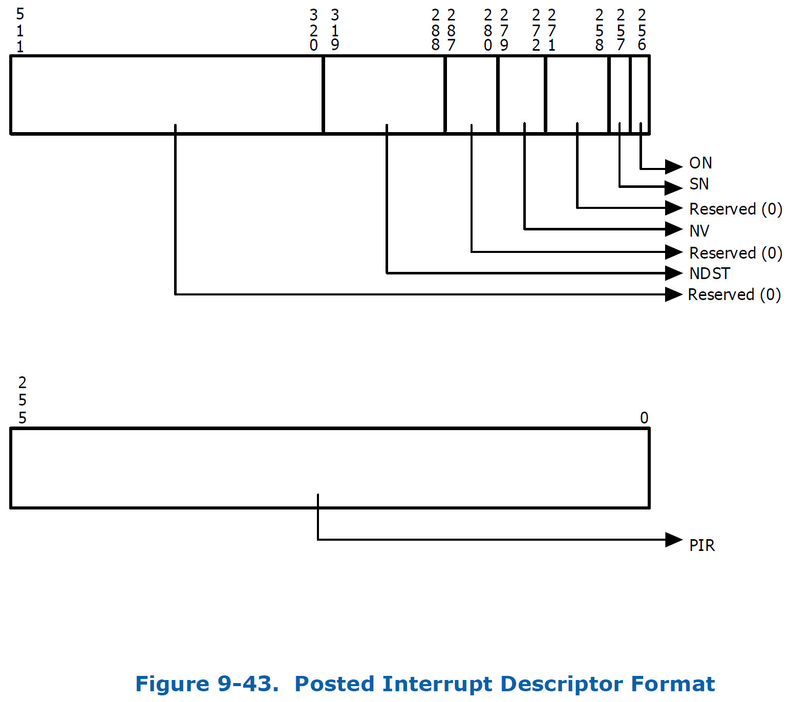

当中断请求索引到的 IRTE 的 Mode 标志位置位，表示此请求按照 posting 方式处理。

IRTE 相比 remapping 格式也增加了几个域：

- PID 地址域
- Urgent 域，用来标志中断请求是否要实时处理
- 指定要 post 的向量号的 vector 域

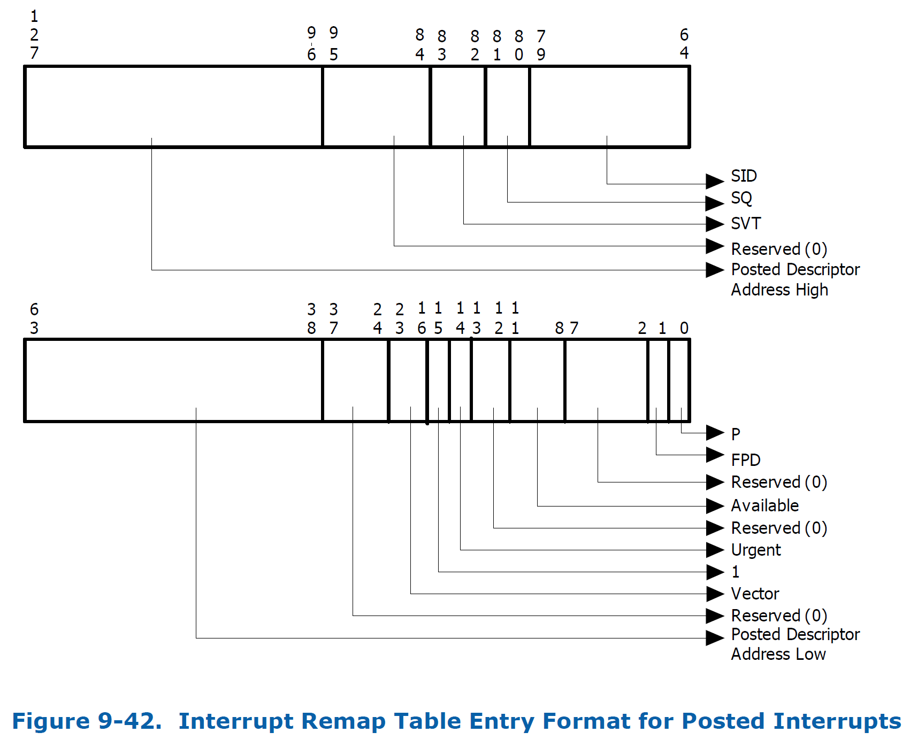

当直通设备投递一个中断后，中断请求会被IOMMU硬件截获，硬件首先会去查询 irq 对应的 IRTE 并从 IRTE 中提取记录的 Posted Interrupt Descriptor 地址和 vector 信息，然后更新 PIR 域和 ON 域，并且将 vector 信息写入到 VCPU 的 vAPIC Page 中，直接给处于 non-root 模式的 VCPU 注入一个中断，整个过程不需要 VMM 的介入从而十分高效。

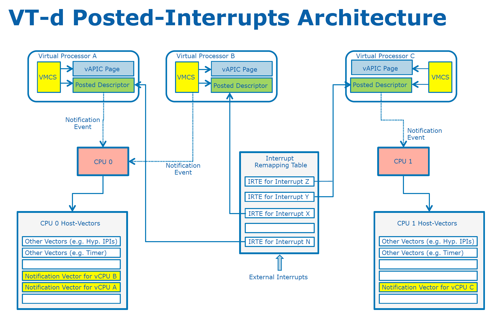

VT-d 硬件中断处理流程：当 VT-d 硬件接收到其下 I/O 设备传递过来的中断请求时，会先查看自己的中断重定向功能是否打开，如果没有打开则，直接上传给 LAPIC。如果中断重定向功能打开，则会查看中断请求的格式，如果是不可重定向格式，则直接将中断请求提交给 LAPIC。如果是可重定向的格式，则会根据算法计算 interrupt_index 值，对中断重定向表进行索引找到相应的 IRTE。然后，查看 IRTE 中的 interrupt mode，如果为0，则该 IRTE 的格式为 remapped，即立即根据 IRTE 的信息产生一个新的中断请求，提交到 LAPIC。如果 interrupt mode为 1，则表示该 IRTE 的格式为 posted，根据 IRTE 中提供的 PI 描述符的地址，读取内容，并根据其 ON、URG 和 SN 的设置判断是否需要立即产生一个 notification event，如果不需要，则只是将该中断信息记录到描述符位图中，等待 VMM 的后续处理。如果需要，则根据描述符（会提供目标 APIC ID、vector、传输模式和触发模式等信息）产生一个 notification event，同时将 ON 置位。

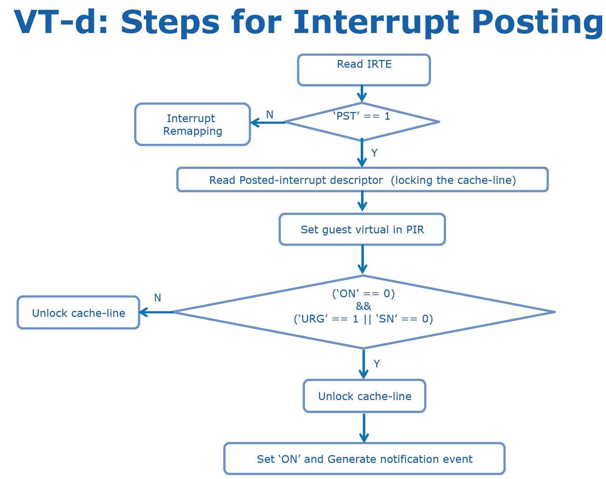

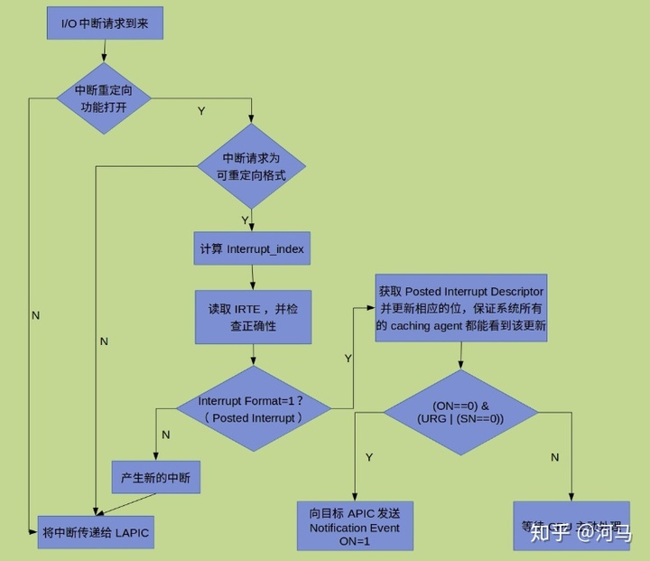

### Interrupt Posting 软件处理

VMM 需要为 posting 做一些额外的工作：

- 为每个 vCPU 分配一个 PID，地址会记录到 VMCS 的相应字段中。
- 为每个物理 CPU 分配两个中断向量用于接收通知事件：
  - Active Notification Vector, ANV，用于 post 通知事件到处于 running 状态的 vCPU，由 guest 接受此 IPI 中断。
  - Wake-up Notification Vector, WNV，用于 post 通知事件到处于 blocked 的 vCPU 上，由 host 接受此 IPI 中断。
- VM 的 APIC 都是由 kvm 模拟，VMM 能够知道每个 vCPU 的向量号分配情况。
- 对于每个直通设备的中断：
  - VMM 会为每个中断分配一个 IRTE，并把对应的 guest 分配的向量号填入 IRTE 的 vector 域。
  - VMM 会将每个 vCPU 对应的 PID 地址填入中断源的对应 IRTE 地址域。
  - 如果中断需要立即处理，VMM 还会将中断源对应的 IRTE 中的 URG 域置位。
- VMM 为 vCPU 开启 APICv 特性，包括 virtual-interrupt delivery 和 process posted interrupts，并将 vCPU 的 VMCS 中的 posted interrupt vector 域设置为 ANV，并将申请的 PID 地址配置到 VMCS 的 posted interrupt descriptor address 字段告知 vCPU 它的 PID 在哪。（这些都在 vCPU 初始化时完成）
- VMM 按以下的方式管理 vCPU 的调度状态：
  - vCPU 被调度器选中运行时，其状态为 Active，VMM 需要将 PID 的 NV 域更新为 ANV 的值。此时 vCPU 接受的 posted interrupt 会被直接复制到 virtual-APIC page 中，guest 在 non-root 模式直接处理中断，不需要 VMM 参与。
  - 当 vCPU 被抢占时（如时间片到期），需要将 PID 的 SN 域置位，vCPU 状态为 Preempted。此 vCPU 上的 non-urgent 事件会被接受，但是不会产生通知事件。而如果此时有 URG 的中断，VMM 也会将 PID 的 NV 域更新为 WNV，VMM 就可以将 URG 中断投递给处于 not-running 状态的 vCPU，并进行适当的软件处理。（抢占其他 vCPU）
  - 当 vCPU 执行了 hlt 指令，或触发了 ple，VMM 也会干预进来将 vCPU block，将状态标志为 hlted。VMM 需要把 vCPU 对应的 PID 设置为 WNV，当中断请求 post 到此 vCPU 时，VMM 能够接受 wake-up notification event 并作出适当的操作。（立即调度此 vCPU）
- 当 vCPU 重新进入 non-root 或从 hlt 恢复时，VMM 会对 vCPU 上 pending 的 posted interrupt 进行处理：
  - 将 PID 的 NV 域设置为 ANV
  - 扫描 PID 的 PIR 域检测是否有 pending 状态的 posted interrupt 
  - 如果有 pending 的，VMM 会在 LAPIC 上生成一个向量号为 ANV 的 self-IPI（此时还未真正 enter guest，CPU 处于关中断状态）。vCPU 打开中断，准备进入到 non-root 模式时，就会立即受到一个 self-IPI，硬件就会把它当作 posted interrupt 通知事件处理，立即从 LAPIC 读取 pending 的中断并进行处理。guest 对于 posted interrupt 的处理完全下放到硬件。
- VMM 还可以将 posted interrupt 应用到模拟设备产生的虚拟设备中断。只需 VMM 执行原子操作 post 一个虚拟中断到 PID，并给 PID 中的 NDST 的逻辑 CPU 发送一个 IPI 作为通知事件告知有 posted interrupt 到来。（这里其实就是 VT-x Posted Interrupt）
- 当 vCPU 在不同的物理 CPU 上迁移时，VMM 会更新 vCPU 的 PID 的 NDST 域，改为 vCPU 要迁移的目标物理 CPU 的 APIC ID，也就完成了中断迁移。

ANV 和 WNV 的作用：

- ANV：当 vCPU 处于 runnable 状态（已经被调度器选中，但还没进入 non-root），收到设备中断，就需要 ANV 事件告知。vCPU 进入 non-root 模式时就可以立即处理这个中断。
- WNV：当 vCPU 被 block 时，进入休眠，没有特殊事件不会被调度器调度，这时候来中断就是用 WNV 通知，唤醒 vCPU 参与调度，及时处理中断。

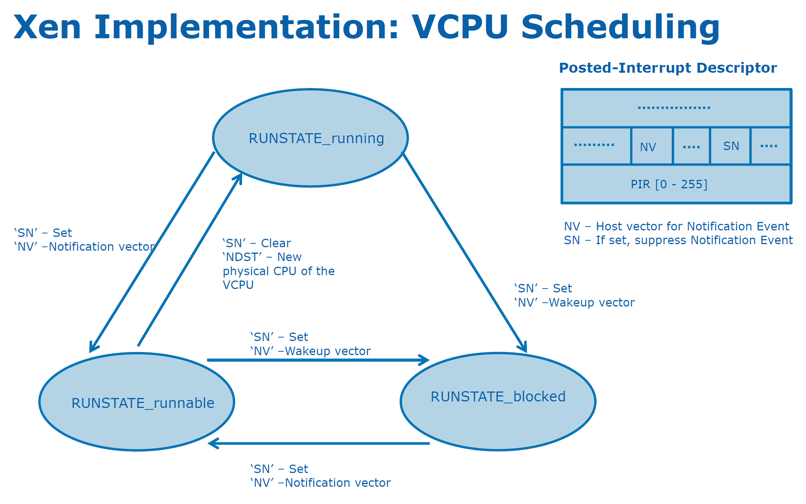