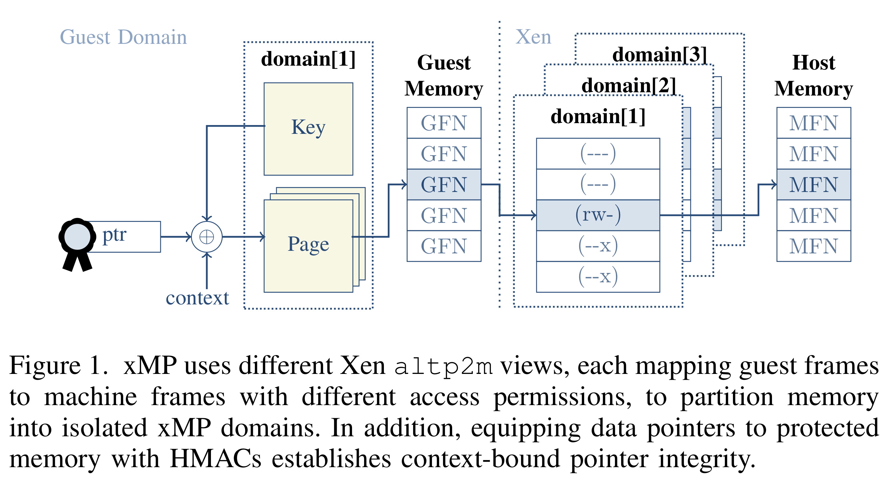
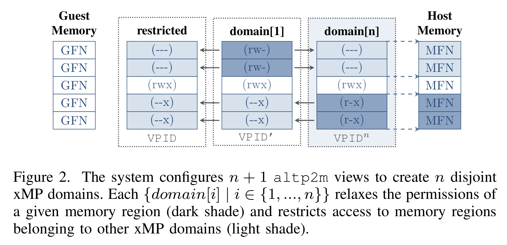
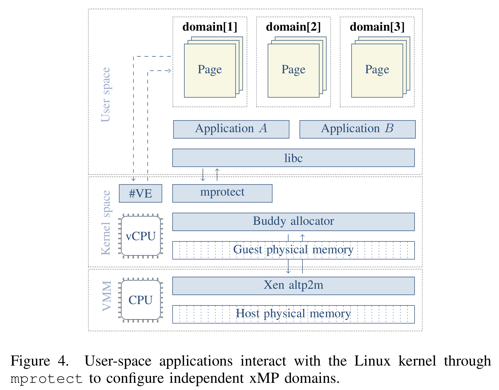
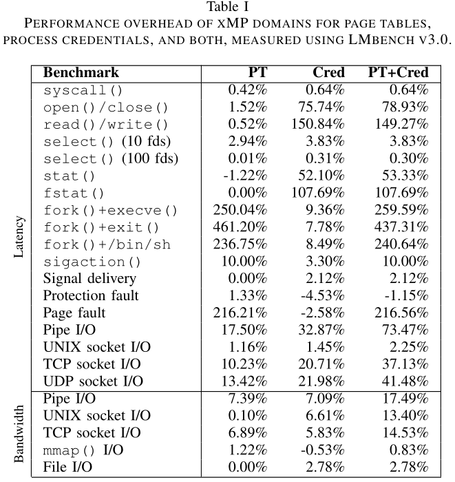
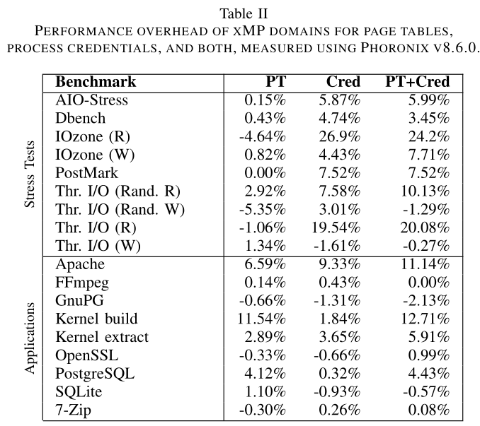
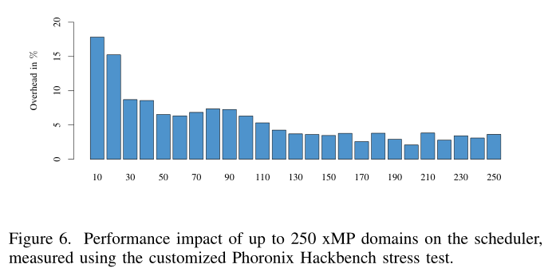

# xMP: Selective Memory Protection for Kernel and User Space

[pdf]([S&P%202020]%20xMP%20Selective%20Memory%20Protection%20for%20Kernel%20and%20User%20Space.pdf)

本文针对 x86 架构在内存隔离方面的缺点，利用虚拟化构建了针对面向数据攻击的有效防御措施，成为 xMP，提供 guest 内部的选择性内存保护原语，VM 可以将用户或内核空间的敏感数据隔离到不相交的 xMP 域。将 Xen altp2m 子系统和 Linux 内存管理系统连接，为虚拟机提供自定义策略的灵活性。与传统方法不同的是，xMP 在初始化后就不需要 hypervisor 介入。为确保内核中管理信息和指向隔离域敏感数据指针的完整性，xMP 将带有哈希的指针绑定到不可变上下文，完整性验证仅在正确上下文中成功。实验表明，xMP 提供针对面向数据攻击的有效保护，引入了最小的开销。

## Introduction

代码复用攻击用 gadget 链劫持应用控制流。而面向数据攻击不改变控制流，而是要修改非控制数据使应用程序服从攻击者意图。攻击者利用内存损坏漏洞实现任意读写程序数据，将面向数据的 gadget 拼接在一起，攻击者可以泄露敏感数据或提权。

面向数据攻击的缓解措施：数据流完整性和在编程语言中引入内存安全，都引入较高的性能开销，缺乏实用性或兼容性。另一种思路是利用隔离技术管理敏感数据访问，而现有的方法通常仅限于用户空间，且仅保护单个数据结构或依赖于 hypervisor 执行策略。

本文利用 Intel 处理器虚拟化扩展构建选择性内存保护原语，利用 EPTP switching 功能在 VM 内部管理不同 gPA 视图，而不需要与 hypervisor 交互。扩展了 XEN altp2m 和 Linux 内存管理系统，通过隔离不相交的 xMP 域中的敏感数据，克服 MMU 的有限访问权限，实现对用户或内核空间敏感数据的选择性保护。用于任意读写能力的攻击者没进入相应的 xMP 域就无法访问 xMP 保护的数据。此外，还为内核管理信息和指向 xMP 域的敏感数据指针配备了校验码，其完整性绑定到特定上下文，阻止了对 xMP 保护的数据的面向数据攻击。

本文贡献：

- 扩展 Linux 内核，实现 xMP，guest 内部的内存隔离原语。
- 结合 Intel EPTP switching 和 Xen altp2m 控制不同的 gPA 视图，隔离不相交的 xMP 域。
- 使用 xMP 保护易被忽视的 Linux 页表和进程凭证（process credential），以及用户程序中的敏感数据，开销最小。
- 将 xMP 整合到 Linux namespace 框架，形成了针对面向数据攻击的 hypervisor 辅助的系统级虚拟化保护基础。

## Backgroud

### The Xen altp2m Subsystem

VMM 利用二级地址转换 SLAT 管理 VM 内存。Xen 的 physical-to-machine, p2m 子系统使用 SLAT 定义 guest 对所有 vCPU 感知的物理内存视图。安全机制可以使用 p2m 对单个页帧访问限制的支持实施 gPA 访问策略。然而，通过单一的全局视图保护数据，开销很大，且在多 vCPU 环境下易出现竞争条件。例如，guest 请求将某些页设置读保护，VMM 设置 SLAT 表，非法读就会陷入到 VMM。当合法的 guest 需要访问时，VMM 暂时取消读权限限制，这就可能导致其他 vCPU 在 VMM 不可知的情况下读取敏感数据。

Xen 的 alt2pm 通过维护并切换多个视图解决以上问题。每个视图可以单独分配个每个 vCPU，因此可以安全地放开某个视图的权限，而不会影响其他 vCPU 的活动视图。事实上，altp2m 是通过切换到另一个限制较少视图的方式放开权限的。altp2m 引入了快速改变 gPA 视图的方法，但也需要硬件支持为 guest 提供隔离选定内存区域的原语。

### In-Guest EPT Management

引入 Xen altp2m 是为了支持 Intel VT-x 中的 EPTP switching。VM 可以使用 VMFUNC 指令在 VMM 不介入的情况下切换 EPT。Intel 使用 VMCS 维护 vCPU 的 host 和 VM 状态，其中有一个 EPTP 字段指向 EPT 根，最多支持 512 个 EPTP，guest 可以使用 VMFUNC 在这些 EPTP 中切换，指示系统按需隔离和放开对选定内存区域的权限。

此外，虚拟化异常 #VE 允许 guest agent 接管 EPT 管理任务。guest 可以注册一个专用的异常处理程序，负责处理 EPT violation，而不陷入到 VMM。

!!! todo

    虚拟化异常 #VE 相关，详见 Intel SDM 24.5.7。

## Threat Model

假设通过 DEP 或其他策略保护系统免受代码注入攻击，同时开启内核和用户空间 ASLR。开启 SMAP/SMEP 保护内核免受 ret2usr 攻击。其他增强特性，如 KPTI、堆栈保护、工具链增强等都与 xMP 正交。假设针对代码复用攻击的保护措施可以防止攻击者实现任意代码执行。专注于泄露或修改敏感数据的攻击，将内存损坏漏洞转换为任意读写原语。攻击者利用攻击原语实现面向数据攻击。

## Design

保护敏感数据的实用机制有以下几点要求：

1. 将敏感内核和用户空间内存区域划分为独立的域。
2. 通过细粒度访问控制功能隔离内存域。
3. 指向内存与的指针的上下文指定的完整性。

x86 可以通过分段和分页划分内存，但缺乏有效隔离内存的细粒度访问控制能力。

之前的工作通过利用未使用的、更高特权级来隔离用户空间内存，而内核内存的隔离主要是通过软件故障隔离 SFI 实现，通过 page fault handler 将选定的不存在页面解释为不可读。在多线程或进程之前共享的内存权限切换会引入竞争条件，每次切换需要遍历页表，开销较大。x86 缺乏对不可变指针的支持，ARMv8.3 引入了指针校验码 PAC，而 x86 尚未支持，不符合要求 2 和 3。

本文引入 xMP 原语弥补空缺，利用虚拟化定义高效内存隔离域，实现内核和用户空间的细粒度内存权限，同时保护域指针完整性。在 x86 和 Xen 上实现了 xMP，向后兼容旧应用，且对其透明。

### Memory Partitioning through xMP Domains

应用程序需要多个无法同时访问的不相交内存域。使用 Xen altp2m 提供不相交的 xMP 域，每个域有两种状态，根据需要配置权限。保护状态下，执行最严格的权限，防止数据泄露或修改；放开状态下，权限会暂时放松，允许合法访问受保护数据。

直接方法是将 altp2m 与每个 xMP 域相关联，但在同一时刻只能激活单个 altp2m 视图。围在每个 altp2m 视图中实施所有 xMP 域的访问控制，在所有视图之间传播每个域的权限。使用一个专门的视图（受限视图）统一所有 xMP 域的内存访问限制，将此视图作为每个 vCPU 的默认值。然后使用第二个视图放开一个给定 xMP 域的限制，允许合法访问其数据，使用 xMP 域 id 标识这个视图。系统切换到某个视图，就是放开对应 id 的 xMP 域访问限制，所有其他域都处于受保护状态。

因此，n 个 xMP 域需要定义 n+1 个 altp2m 视图。下图展示了 xMP 域 n 作为当前域的环境。以此将 gPA 划分为多个域，对每个域实施细粒度内存限制，满足要求 1。

### Isolation of xMP Domains

建立内存隔离原语，使 guest 能够对 gPA 页帧实施细粒度权限。扩展了 Xen 接口，允许在 guest 内部使用 altp2m。具体来说，为 Linux 内核实现了一个 API，允许使用现有的 hypercall 与 Xen altp2m 子系统交互，使 VMM 代表 VM 配置请求访问权限的页帧。出于性能原因，扩展 Xen 实现了新的 hypercall（其实可以由一组现有 hypercall 替换），将 guest 页帧放到 xMP 域中。最后，将 altp2m 与 Intel EPTP switching 和 #VE 结合使用，以允许 guest agent 接管 EPT 管理任务。最大限度地减少了 VMM 干预，从而提高了性能，同时为从 guest 内部定义新的内存访问策略提供了灵活性。

Guest 内处理敏感数据的应用，可以使用内存划分原语利用 altp2m 分配一个 xMP 域保护数据。仅在该 xMP 域对应的视图中保留访问权限。这样，此视图外部的未授权读写都会违反访问权限。任何非法访问都会陷入到 guest 内的 #VE handler，而不是 VMM，生成段错误。合法访问时，guest 执行 VMFUNC 切换到限制较少的域为请求提供服务，应用完成请求后，在使用 VMFUNC 切换回受限视图。

此方案结合了定义策略的灵活性和细粒度访问权限，满足要求 2。

### Context-bound Pointer Integrity

要确保指向 xMP 域中敏感数据的指针的完整性，否则，攻击者可以利用内存损坏漏洞，将指针重定向到受保护域之外的攻击者控制的对象，或现有的 xMP 域中的高特权对象。

x86 缺乏指针完整性支持，软件保护指针。利用 Linux 内核的 SipHash 实现计算密钥哈希消息认证码 HMAC，用于认证所选指针。SipHash 针对短输入做了优化，性能更高，使用 128 位密钥，攻击者只有一次机会，认证错误程序就会崩溃。

为确保指针不会被非法重定向到现有对象，将指针绑定到一个唯一且不可变的特定上下文。task_struct 结构用于保存线程上下文信息，且在系统上每个线程都是唯一的。因此将指针绑定到给定线程的 task_struct 实例的地址。

复用虚拟地址中未使用的高位，将生成的 HMAC 截断为 15 位，只用最高位区分内核还是用户。以此确保指针只能在正确的上下文使用。

密钥存在 xMP 域，在当前域设置为只读，其他域不可访问。此外，设置 Xen altp2m 每个 xMP 域的相同 gPA 映射到不同的 sPA，以便 guest 内核使用当前域的密钥。还可以通过内核链接器脚本为密钥保留特定的内存页，允许内核将密钥地址作为立即数操作数。利用 VMM 建立一个可信路径生成密钥并将其位置配置到 VM，通过重定位信息。特别是利用内核映像相关的重定位条目，可以用密钥虚拟地址替换占位符。

## Implementation

扩展了 Linux 内存管理系统，建立内存隔离能力，允许用户将选定内存区划分为隔离的 xMP 域。系统启动时，内核解析了 BIOS/UEFI 提供的 e820 物理内存映射后，内存控制移交给其他核心组件，包括：buddy allocator（管理物理内存）、slab allocator（在内核空间的 physmap 区域分配物理连续的内存，通常通过 kmalloc）和 vmalloc allocator（放回内核空间的一个单独区域的内存，虚拟连续但物理分散的）。kmalloc 和 vmalloc 都是用 buddy 分配器获取物理内存。

buddy 用于管理连续的物理页帧，slab 管理 sub-page 粒度的内存（更细粒度），vmalloc 仅支持多页分配。为提供最大的灵活性，扩展了 buddy 和 slab 有选择地将分配的页转移到专用的 xMP 域中。而 vmalloc 由 buddy 透明支持。由此，可以隔离任意页面或整个 slab 缓存。还为引用隔离内存中对象的指针生成上下文绑定的身份认证代码，满足了所有要求。

!!! todo

    之后要看一下 Linux 内核的内存管理子系统，buddy、slab、slub。

### Buddy Allocator

Linux 内存分配器使用 get-free-page, GFP 标志指定分配条件、内存区域、分配方式等。添加分配标志 __GFP_XMP 告知分配器，同时将 xMP 域 id 编码到分配标志，分配器就可以通知 Xen altp2m 将分配的内存放到特定的 xMP 域中。使用分配标志中的 8 个空闲位区分 xMP 域，要支持更多的域需要重新定义 gfp_t 结构。将分配的页加入 xMP 域时，将 PG_xmp 标志添加到页结构体的 flags 字段，方便以后回收 xMP 保护的页。

### Slab Allocator

slab 在 buddy 基础上将页细分位小的子页面大小的对象，减少 buddy 引入的内部碎片。slab 维护 slab cache，专用于相同大小的频繁使用的内核对象。例如，内核为所有的 task_struct 结构体实例使用 cache，使得内核更高效地分配和是否对象，无需为每个内核对象显式地分配和释放内存。Linux 使用了三种 slab 分配器实现：SLOB、SLAB 和 SLUB，后者是现在 Linux 内核中的默认 slab 分配器。

每个 slab cache 将连续页组合到所谓的 slab 中，划分为小内存对象。忽略 slab 架构细节，分配器在专门的页管理 slab，这种设计允许使用底层的 buddy 分配器将选定的 slab 划分到隔离的 xMP 域中。为此，扩展了 slab 实现，可以在 slab cache 创建时提供 __GFP_XMP 标志和 xMP 域索引。因此，每次 slab cache 请求请求页面时，buddy 分配器会将分配的内存转移到指定的 xMP 域中。

### Switches across Execution Contexts

Linux 内核是可抢占的，高度并行的系统，必须在上下文切换或中断时保留进程或线程特定的状态。为了应对上下文切换，并防止其他进程访问隔离内存，需要将线程的 xMP 域索引保存到持久状态中。

Linux 使用 task_struct 保存线程状态，添加字段 xmp_index_kernel，表示线程在当前时间点的 xMP 域。将此字段用于存储内核空间中使用的 xMP 域状态，默认为受限视图。仅在线程进入或退出 xMP 域时更新此字段。内核可以安全地中断线程，保留其开放的 xMP 域，并调度不同线程。同时还扩展了调度器，在每次上下文切换时切换到对应的 xMP 域。为了避免切换到可能无效的 xmp_index_kernel，将此索引域与 task_struct 实例的地址绑定。这样就可以在进入 xMP 与之前验证索引的完整性和上下文。攻击者在不知道密钥的情况下也就无法重用不同线程的代码。

中断可以在任意点暂停线程执行。本文的原型中，将所有的中断处理程序起始位置都添加了切换到受限视图。这样就可以防止潜在的易受攻击的中断处理程序非法访问受保护内存。一旦内核将控制权返回到中断的线程，访问隔离内存时会触发访问 violation，线程将陷入到 guest 中的 #VE handler，而不是陷入到 VMM。#VE handler 会验证 xmp_index_kernel 的 HMAC 验证线程资格和上下文绑定的完整性。

以上的设置不支持嵌套 xMP 域（同时开启多个域），域状态会被覆盖。可以在进程上下文解决线程的这一需求，但是在中断上下文仍存在问题，原因在于中断上下文复用被中断线程的 task_struct。

软中断需要内核调度执行，由内核选择时间，暂停进程执行，复用其上下文处理挂起的软中断 softirq。Read-Copy-Update, RCU 通过 callback 释放 xMP 域内存时，需要进入相关的域，而软中断复用任意线程的上下文，但线程的 xmp_index_kernel 与要进入的域无关。为此，设计了 callback-free 的 RCU 特性，内核使用专门的线程处理工作。

### User Space API

添加了四个新的系统调用，进程可以在用户空间使用 xMP。应用程序可以动态分配和维护不相交的 xMP 域。通过将进程 xMP 域完整性绑定到线程上下文，攻击者无法影响其状态。

类似于 MPK 的支持，实现了 sys_xmp_{alloc, free, mprotect} 系统调用，使用 altp2m hypercall 支持在用户空间分配和维护不同的 xMP 域。mprotect 用于隔离目标虚拟内存区域，并标记，便于回收释放。

并没有在用户空间直接使用 VMFUNC 指令，而是添加额外的系统调用 sys_xmp_enter，进入已分配的 xMP 域，更新当前活动的 xMP 域状态，保存到 mm_struct 的 xmp_index_user 字段，该字段对每个线程都是唯一的。将 xMP 索引绑定到 mm_struct 地址，以验证完整性。删除用户空间的 VMFUNC 指令，避免非法切换到任意 xMP 域。

## Use Cases

### Protecting Page Tables

阻止非法修改页表内容或指针，同时还要允许内核从授权位置更新页表。除了早期内核启动阶段的初始页表，内核都是用 buddy 分配器为页表分配内存。将每个页表页移动到专门的 xMP 域，授予当前域读写权限，其他域为只读。初始页表是静态分配的，可以手动通知 Xen altp2m 将对于的 gPA 放入同一 xMP 域。对于处理 page fault 和创建终止进程的内核组件，授予权限，允许其执行时暂时进入 xMP 域。

扩展了内核进程和线程创建功能，使用 HMAC 保护每个 pgd 指针的完整性，在从 CR3 获取值时验证。无法将 pgd 与特定线程上下文绑定，因为内核线程继承被中断用户线程的 mm_struct。攻击者能做的就是交换带有有效认证码的 pgd 指针，但这只能导致应用崩溃。

### Protecting Process Credentials

Linux 内核凭证 credential 描述了不同对象的属性，内核可以用它实施访问控制和能力管理。因此它也称为面向数据提权攻击的目标。阻止非法重写进程凭证 cred 或重定向 cred 指针提权。除了引用计数和密钥环，进程凭证在初始化并提交后不会改变。线程只能修改自己的凭证。将内核内存保护原语与 LSM hook 结合，阻止攻击者破坏进程凭证。将每个 cred 指针绑定到相关的 task_struct，在 LSM hook 中检查完整性和上下文。

## Evaluation

内核内存隔离：保护页表和 cred，使用 lmbench 和 Phoronix 测量微观和宏观基准。

实现了 xMP namespace 来隔离进程页表，支持 256 个 Xen altp2m 视图。

在本文的威胁模型下，攻击者可以：修改感兴趣的数据结构；重定向数据结构指针到注入的攻击者控制的实例；重定向数据结构指针到更高特权的现有实例。xMP 可以抵抗全部的三种攻击。

## Conclusion

xMP 是针对面向数据攻击的新型防御措施，基于 Intel 虚拟化扩展实现选择性内存隔离原语，保护内核和用户空间中的敏感数据结构。为指向隔离内存的数据指针配备 HMAC，阻止非法指针重定向。